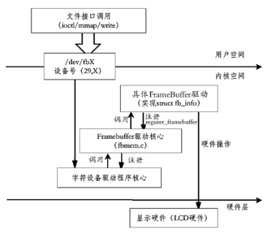

在 Linux 系统中，标准的设备显示驱动是 FrameBuffer。直观地说，FrameBuffer 驱动程序是 PC 系统中的显卡驱动程序。

FrameBuffer 驱动是一个字符设备，此驱动通常在文件系统的设备节点中的位置如下：

```
/dev/fbx
```

FrameBuffer 驱动的主设备号是 29，次设备号用递增数字生成。每个系统可以有多个显示设备，分别使用 `/dev/fb0`、`/dev/fb1` 和 `/dev/fb2` 等来表示。

在用户空间中，通常 FrameBuffer 驱动使用 ioctl 和 mmap 等文件系统接口进行操作，其中 ioctl 用于获得和设置信息，mmap 可以将 FrameBuffer 的内存映射到用户空间。另外 FrameBuffer 驱动直接指出 Write 操作，可以直接用写的方式输出显示内容。



<center>显示驱动 FrameBuffer 的架构图</center>

