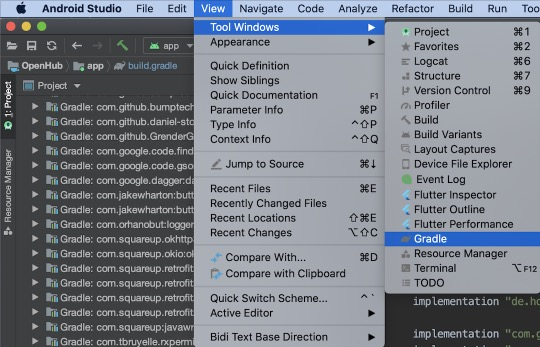
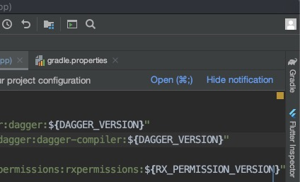
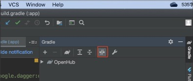

<center><font size="5"><b>AndroidStudio3.6关闭离线模式</b></font></center>

当编译项目时，报如下错误，就表示着当前Gradle处于离线模式，导致无法下载依赖库：

```
No cached version available for offline mode
```

下面是关闭Gradle离线模式的方法：

1. 打开Gradle面板

方法一：`View -> Tool Windows -> Gradle`



方法二：点击AndroidStudio右侧侧边栏上的 `Gradle` 按钮。



2. 关闭离线模式。

    点击下图中红色方框圈住的按钮，取消其选中状态。



