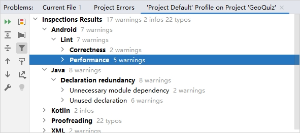

`Android Lint`（或 `Lint`）是 `Android` 应用代码的**静态分析器**。作为一个特殊程序，它能在不运行代码的情况下检查代码错误。凭着对 `Android` 框架的熟练掌握，`Android Lint` 能深入检查代码，找出编译器无法发现的问题。大多数情况下，`Android Lint` 检查出的问题值得重视。

假如想主动查看项目中的所有潜在问题，可以选择 `Code` -> `Inspect Code...` 菜单项手动运行 `Lint`。在被问及检查项目的哪部分时，选择 `Whole project`。

检查完毕，所有的潜在问题都会在检查工具窗口按类别列出。展开 `Android Lint` 类别，可以看到具体的 `Lint` 信息。

