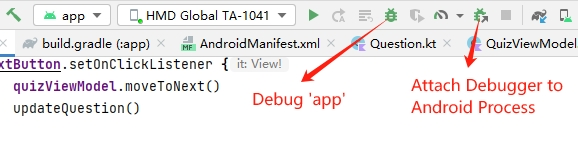
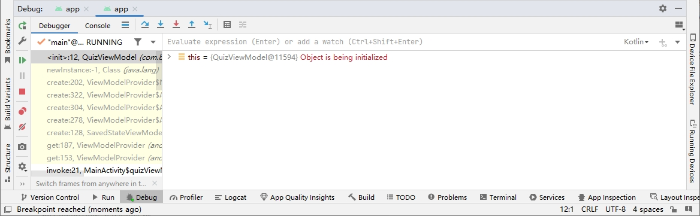
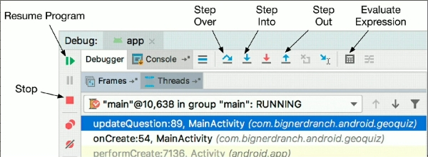

为启用代码调试器并触发已设置的断点，我们需要调试运行而不是直接运行应用。要调试运行应用，点击 `Run` 按钮旁边的 `Debug` 按钮，或选择 `Run` -> `Debug 'app'` 菜单项。设备会报告说正在等待调试器加载，然后继续运行。

某些时候，你可能不想重新运行应用而直接调试运行中的应用。可以通过在上图中点击 `Attach Debugger to Android Process` 按钮，或选择 `Run` -> `Attach to process...` 菜单项，你可以加载调试器调试运行中的应用。

应用在断点处停止运行。这时，由 `Frames` 和 `Variables` 视图组成的 `Debug` 工具窗口出现在了屏幕底部。如果 `Debug` 工具窗口没有自动打开，点击 `Android Studio` 窗口底部的 `Debug` 按钮即可。

使用 `Debug` 工具窗口顶部的箭头按钮可单步执行应用代码。调试过程中，可以使用 `Evaluate Expression` 按钮按需执行简单的 `Kotlin` 语句。

