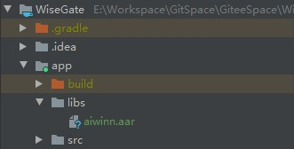

1. 首先在 project 目录下的 libs 中，将需要的 aar 包拷贝进去。



2. 配置 build.gradle 文件。

```
dependencies {
    ...
    implementation fileTree(dir: "libs", include: ["*.jar","*.aar"])
    ...
}
```

3. 同步 gradle，这样就可以在扩展包中看到该 aar 了。

