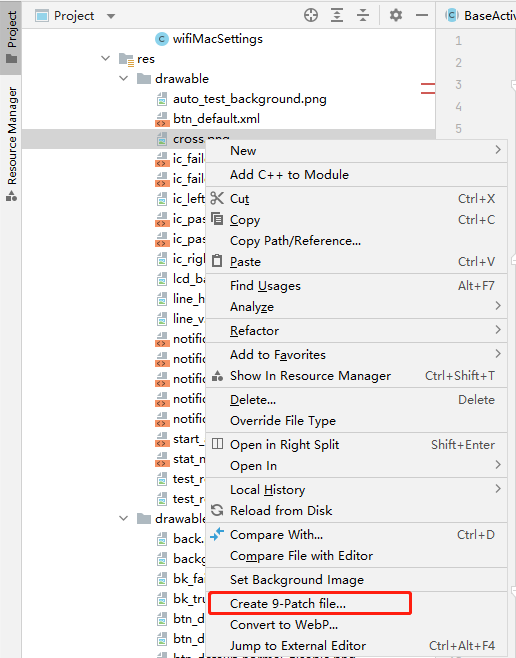
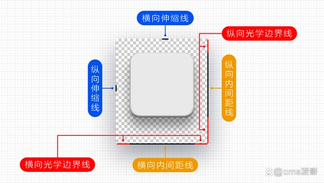

> 注意：图片周围必须预留 1 像素的空白，不然无法制作点九图（需要在该空白处画点九图线条。

1. 使用 Photoshop 修改图片，如果图片没有预留 1 像素空白，则需要修改图片画布大小增加该空白。如果按照上面做后还是无法在 AndroidStudio 中绘制点九图，则需要使用 Photoshop 在图片上绘制点九图线条，然后保存成带 `.9` 的图片名称。如果对 Photoshop 修改的点九图线条不满意可以将其添加到 AndroidStudio 中进行修改。

2. 如果图片可以使用 AndroidStudio 生成点九图，可以按照如下方法操作：

   + 选择要生成的图片。

   + 单击鼠标右键在弹出的菜单中选择 `Create 9-Patch file...` 菜单。

     

3. 点九图线条说明如下图

   