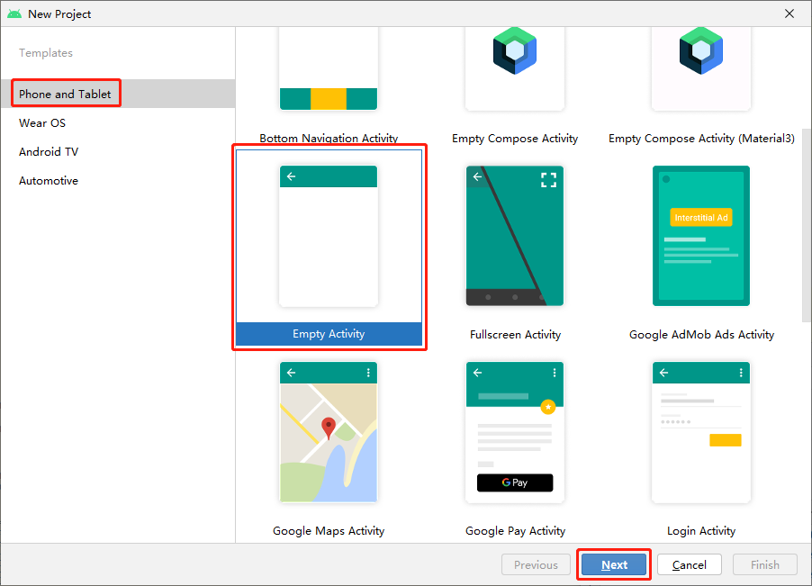
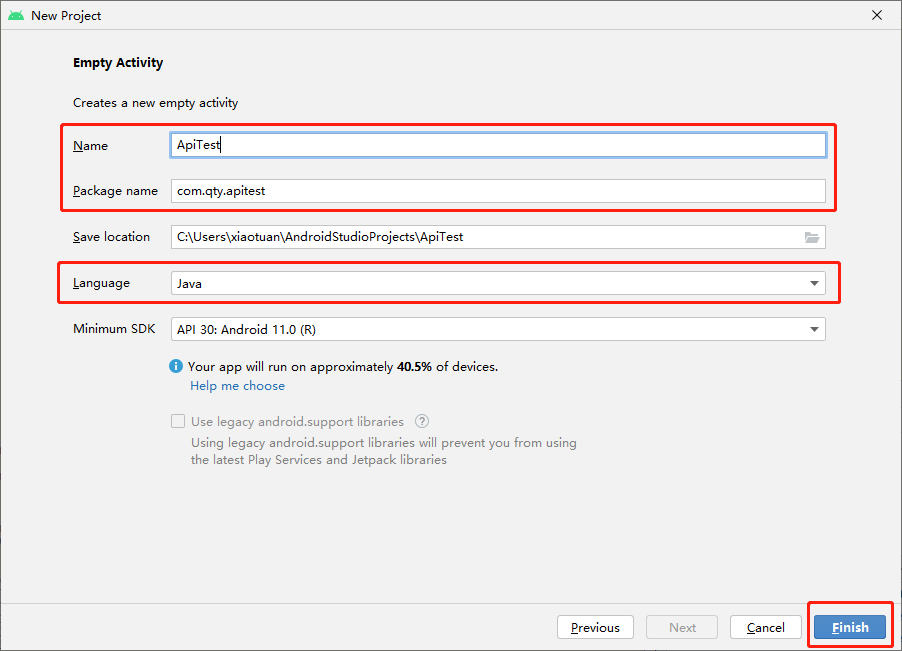
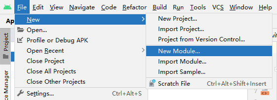
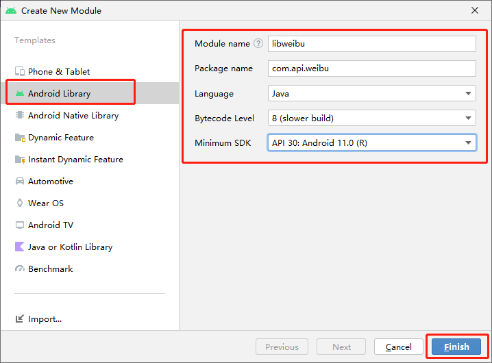
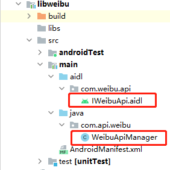
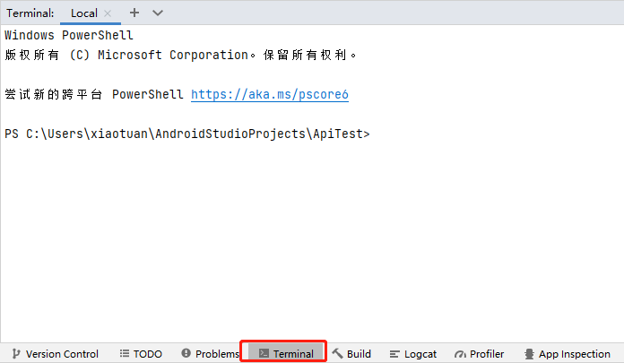
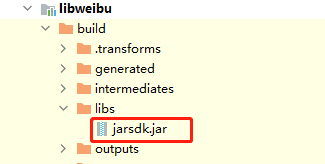

[toc]

### 1. 创建工程





### 2. 创建 Module





### 3. 创建 Module 代码



**IWeibuApi.aidl**

```java
package com.weibu.api;

import java.util.List;

interface IWeibuApi {
    /**
     * 获取安装应用白名单列表
     *
     * @return 返回安装应用白名单列表
     */
    List<String> getInstallWriteList();
    /**
     * 设置安装应用白名单列表
     *
     * @param packageNames  要设置的白名单列表，该列表会覆盖原先的白名单列表
     */
    void setInstallWriteList(in List<String> packageNames);
    /**
     * 静默安装指定路径的 apk
     *
     * @param apkPath  要安装的 apk 的文件路径
     */
    void silentInstall(String apkPath);
    /**
     * 静默卸载指定包名的应用
     *
     * @param packageName 要卸载的应用包名
     */
    void silentUnstall(String packageName);
    /**
     * 禁用指定包名列表的应用
     *
     * @param packageNames 要禁用的应用包名列表
     */
    void disableApplication(in List<String> packageNames);
    /**
     *  启用指定包名列表的应用
     *
     *  @param packageNames 要启用的应用包名列表
     */
    void enableApplication(in List<String> packageNames);
}
```

**WeibuApiManager.java**

```java
package com.api.weibu;

import android.content.ComponentName;
import android.content.Context;
import android.content.Intent;
import android.content.ServiceConnection;
import android.os.IBinder;
import android.os.RemoteException;
import android.util.Log;

import com.weibu.api.IWeibuApi;

import java.util.List;

public class WeibuApiManager {

    private static final String TAG = "WeibuApiManager";

    private Context mContext;
    private IWeibuApi mService;

    public WeibuApiManager(Context context) {
        mContext = context;
        bindService();
    }

    public void release() {
        mContext.unbindService(mConn);
    }

    public List<String> getInstallWriteList() {
        List<String> whiteList = null;
        if (mService != null) {
            try {
                whiteList = mService.getInstallWriteList();
            } catch (RemoteException e) {
                Log.e(TAG, "getInstallWriteList=>error: ", e);
            }
        } else {
            Log.w(TAG, "getInstallWriteList=>Service is null.");
        }
        return whiteList;
    }

    public void setInstallWriteList(List<String> packageNames) {
        if (mService != null) {
            try {
                mService.setInstallWriteList(packageNames);
            } catch (RemoteException e) {
                Log.e(TAG, "setInstallWriteList=>error: ", e);
            }
        } else {
            Log.w(TAG, "setInstallWriteList=>Service is null.");
        }
    }

    public void silentInstall(String apkPath) {
        if (mService != null) {
            try {
                mService.silentInstall(apkPath);
            } catch (RemoteException e) {
                Log.e(TAG, "silentInstall=>error: ", e);
            }
        } else {
            Log.w(TAG, "silentInstall=>Service is null.");
        }
    }

    public void silentUnstall(String packageName) {
        if (mService != null) {
            try {
                mService.silentUnstall(packageName);
            } catch (RemoteException e) {
                Log.e(TAG, "silentUnstall=>error: ", e);
            }
        } else {
            Log.w(TAG, "silentUnstall=>Service is null.");
        }
    }

    public void disableApplication(List<String> packageNames) {
        if (mService != null) {
            try {
                mService.disableApplication(packageNames);
            } catch (RemoteException e) {
                Log.e(TAG, "disableApplication=>error: ", e);
            }
        } else {
            Log.w(TAG, "disableApplication=>Service is null.");
        }
    }

    public void enableApplication(List<String> packageNames) {
        if (mService != null) {
            try {
                mService.disableApplication(packageNames);
            } catch (RemoteException e) {
                Log.e(TAG, "enableApplication=>error: ", e);
            }
        } else {
            Log.w(TAG, "enableApplication=>Service is null.");
        }
    }

    private void bindService() {
        Intent service = new Intent();
        service.setComponent(new ComponentName("com.weibu.api", "com.weibu.api.WeibuService"));
        mContext.bindService(service, mConn, Context.BIND_AUTO_CREATE);
    }

    private ServiceConnection mConn = new ServiceConnection() {
        @Override
        public void onServiceConnected(ComponentName componentName, IBinder iBinder) {
            Log.d(TAG, "onServiceConnected=>iBinder: " + iBinder);
            mService = IWeibuApi.Stub.asInterface(iBinder);
        }

        @Override
        public void onServiceDisconnected(ComponentName componentName) {
            Log.d(TAG, "onServiceDisconnected()...");
        }
    };
}
```

### 3. 修改 Module 的 build.gradle 文件

在 Module 的 build.gradle 文件末尾添加如下代码：

```
//Copy类型
task makeJar(type: Copy) {
    //删除存在的
    delete 'build/libs/jarsdk.jar'
    //设置拷贝的文件
    // from('build/intermediates/bundles/release/')
    from('build/intermediates/aar_main_jar/release/')
    //打进jar包后的文件目录
    into('build/libs/')
    //将classes.jar放入build/libs/目录下
    //include ,exclude参数来设置过滤
    //（我们只关心classes.jar这个文件）
    include('classes.jar')
    //重命名
    rename ('classes.jar', 'jarsdk.jar')
}

makeJar.dependsOn(build)
//在终端执行生成JAR包
```

最后内容如下：

```
plugins {
	......
}

android {
	......
}

dependencies {
	......
}

//Copy类型
task makeJar(type: Copy) {
    //删除存在的
    delete 'build/libs/jarsdk.jar'
    //设置拷贝的文件
    // from('build/intermediates/bundles/release/')
    from('build/intermediates/aar_main_jar/release/')
    //打进jar包后的文件目录
    into('build/libs/')
    //将classes.jar放入build/libs/目录下
    //include ,exclude参数来设置过滤
    //（我们只关心classes.jar这个文件）
    include('classes.jar')
    //重命名
    rename ('classes.jar', 'jarsdk.jar')
}

makeJar.dependsOn(build)
//在终端执行生成JAR包
```

### 4. 执行生成 jar 命令

打开 AndroidStudio 界面底部的终端选项（Terminal）：



在终端中输入如下命令：

```shell
PS C:\Users\xiaotuan\AndroidStudioProjects\ApiTest> .\gradlew.bat makeJar
Starting a Gradle Daemon, 2 incompatible and 3 stopped Daemons could not be reused, use --status for details

BUILD SUCCESSFUL in 34s
69 actionable tasks: 51 executed, 18 up-to-date
```

> 注意：执行上面命令需要 Java 11 版本。

### 5. 提取 jar 文件

生成的 jar 文件位于：

