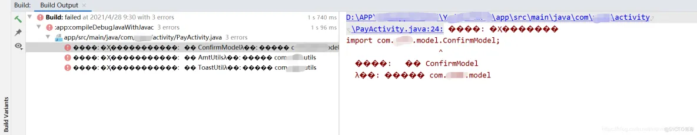
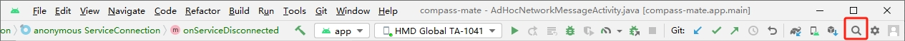
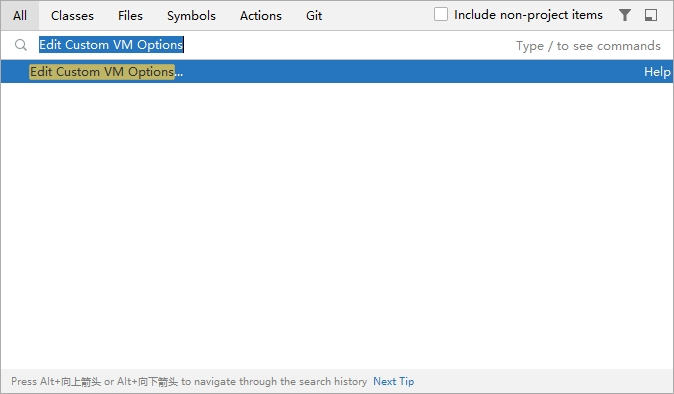
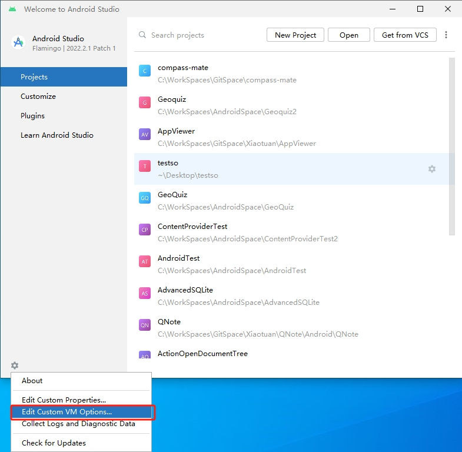

乱码如下图：



解决方法：

点击 `AndroidStudio` 右上角的搜索按钮，如下图所示：



在弹出的搜索框中输入 `Edit Custom VM Options`，然按 <kbd>Enter</kbd> 键：



> 提示：
>
> 也可以在 `AndroidStudio` 的欢迎界面中点击左下角的设置按钮，选择 `Edit Custom VM Options...` 菜单。
>
> 

在打开的 `studio64.exe.vmoptions` 编辑窗口中输入如下代码：

```
-Dfile.encoding=UTF-8
```

保存并重新启动 `AndroidStudio` 即可解决。