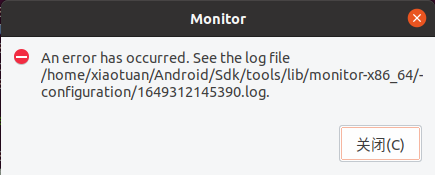

[toc]

### 1. 问题描述

在 `android_sdk_root_directory/tools/` 目录下有一个 `monitor.bat` 脚本，双击该脚本会弹出如下对话框，程序无法继续运行。

### 2. 问题分析

运行环境中使用的是 Java 11，切换 Java 8 后，程序可以运行。由此可知应该是 monitor.bat 不支持高版本的 Java。

### 3. 解决办法

1. 安装 Java 8 。
2. 设置 Java 8 为当前系统的 Java 环境变量。