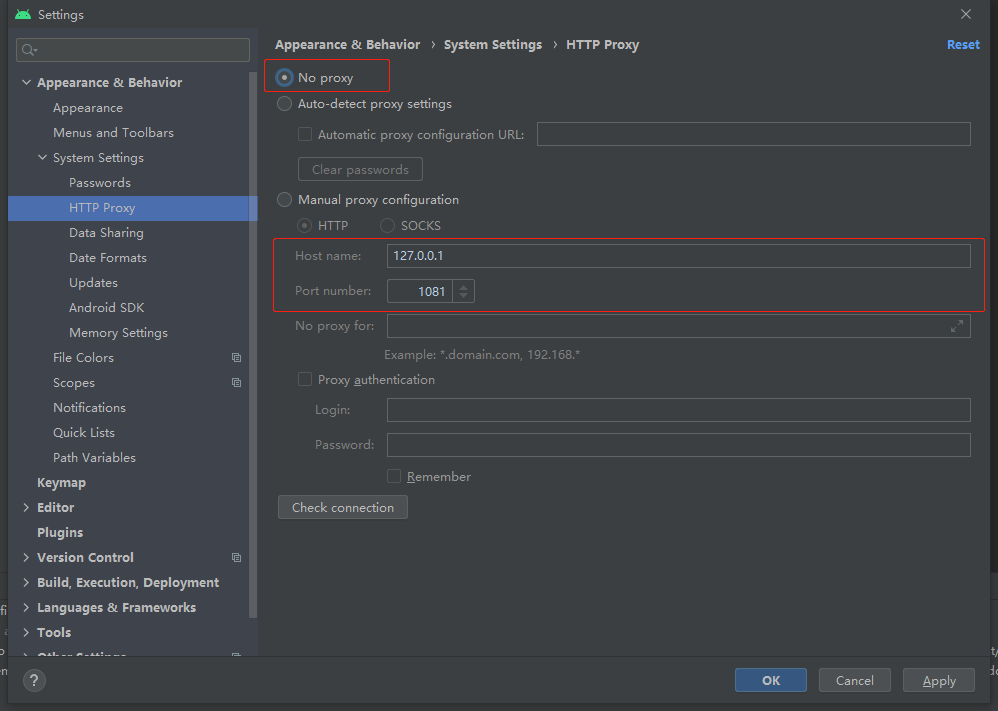

在 AndroidStudio 中设置代理再关闭，这时创建一个新工程，在工程同步时，会报代理错误。这是因为我们是通过选择 `No proxy` 的方式来关闭 AndroidStudio 的代理的，代理信息还是存在的。因此 gradle 的代理信息也是存在的，但是并没有任何开关可以关闭 gradle 的代理。因此在 gradle 访问网络时，还是会通过代理访问网络，这时如果没有开启代理程序，将会无法访问网络。



**解决办法：**

清除 gradle  的代理信息即可，需要清理工程的 gradle 代理信息和全局的代理信息。

1. 清除工程的 gradle 代理信息。

   打开工程根目录下的 `gradle.properties` 文件，删除里面的代理信息即可。

   ```properties
   ## For more details on how to configure your build environment visit
   # http://www.gradle.org/docs/current/userguide/build_environment.html
   #
   # Specifies the JVM arguments used for the daemon process.
   # The setting is particularly useful for tweaking memory settings.
   # Default value: -Xmx1024m -XX:MaxPermSize=256m
   # org.gradle.jvmargs=-Xmx2048m -XX:MaxPermSize=512m -XX:+HeapDumpOnOutOfMemoryError -Dfile.encoding=UTF-8
   #
   # When configured, Gradle will run in incubating parallel mode.
   # This option should only be used with decoupled projects. More details, visit
   # http://www.gradle.org/docs/current/userguide/multi_project_builds.html#sec:decoupled_projects
   # org.gradle.parallel=true
   #Tue Aug 25 11:51:41 CST 2020
   systemProp.http.proxyHost=127.0.0.1
   systemProp.http.proxyPort=1081
   systemProp.https.proxyHost=127.0.0.1
   systemProp.https.proxyPort=1081
   ```

2. 清除全局的 gradle 代理信息。

   全局的 gradle 代理信息配置文件路径为：`C:\Users\用户名\.gradle\gradle.properties`，打开该配置文件，并删除里面的代理配置信息即可：

   ```properties
   ## For more details on how to configure your build environment visit
   # http://www.gradle.org/docs/current/userguide/build_environment.html
   #
   # Specifies the JVM arguments used for the daemon process.
   # The setting is particularly useful for tweaking memory settings.
   # Default value: -Xmx1024m -XX:MaxPermSize=256m
   # org.gradle.jvmargs=-Xmx2048m -XX:MaxPermSize=512m -XX:+HeapDumpOnOutOfMemoryError -Dfile.encoding=UTF-8
   #
   # When configured, Gradle will run in incubating parallel mode.
   # This option should only be used with decoupled projects. More details, visit
   # http://www.gradle.org/docs/current/userguide/multi_project_builds.html#sec:decoupled_projects
   # org.gradle.parallel=true
   #Tue Aug 25 11:51:41 CST 2020
   systemProp.http.proxyHost=127.0.0.1
   systemProp.http.proxyPort=1081
   systemProp.https.proxyHost=127.0.0.1
   systemProp.https.proxyPort=1081
   ```

   

