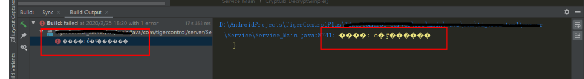
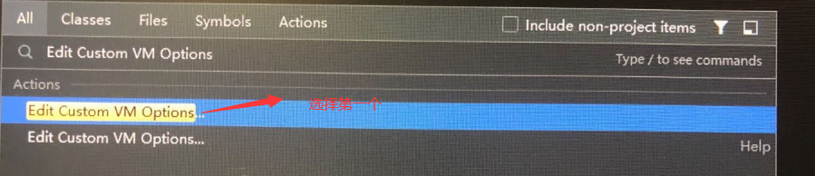

如下build output 输出的是乱码

解决方案1：

双击shift，在里面输入如下，并且点击第一个

然后在里面输入-Dfile.encoding=UTF-8

最后直接重启AndroidStudio，如果还没有效果，那么就直接重启下电脑吧。

**依据方式1修改后的反馈问题**

部分朋友反馈说，根本方式1修改后，AndroidStudio 没法启动了。

你要检查一下-Dfile.encoding=UTF-8是不是哪里写错了，因为-Dfile是虚拟机的启动参数，这里要是没写对，比如多了一个空格，或是少写了一个字母，都会直接导致虚拟机无法启动。

**为什么Gradle的乱码要修改java虚拟机的启动参数**

gradle 是一个框架，是一个基于grovvy写的框架，grovvy是运行于java虚拟机的一门编程语言，因此gradle的输出，实际上就是grovvy的输出，这也是为什么gradle的乱码，要修改java 虚拟机的配置

