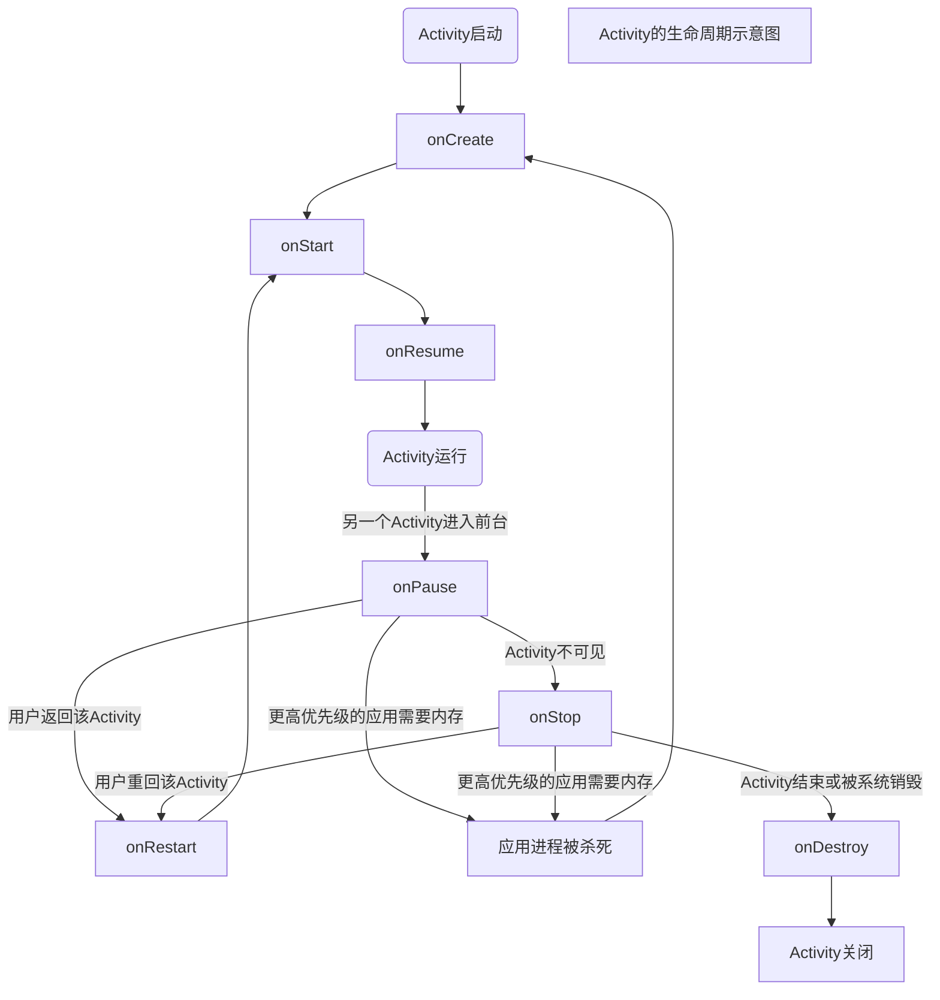
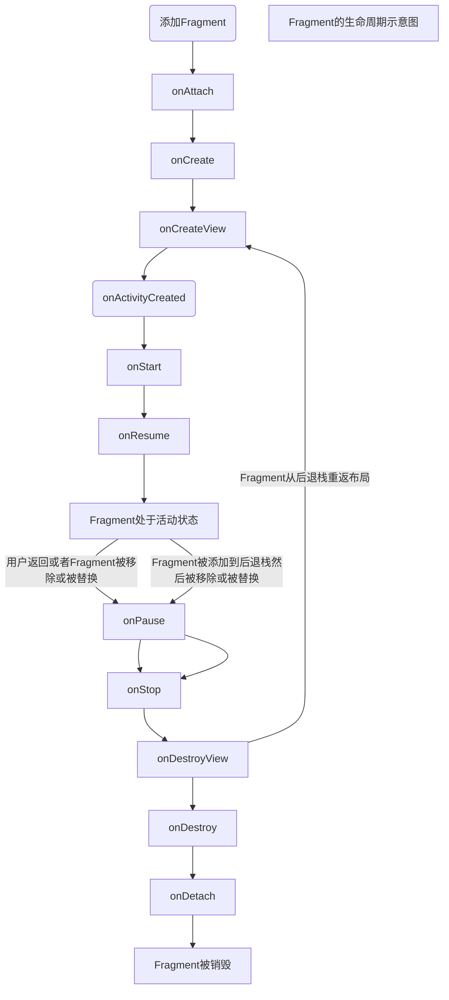

```mermaid
graph TD
A(Activity启动) --> B[onCreate]
	B --> C[onStart]
	C --> D[onResume]
	D --> E(Activity运行)
	E --> |另一个Activity进入前台| F[onPause]
	F --> |用户返回该Activity| G[onRestart]
	G --> C
	F --> |更高优先级的应用需要内存| H[应用进程被杀死]
	H --> B
	F --> |Activity不可见| J[onStop]
	J --> |更高优先级的应用需要内存| H
	J --> |用户重回该Activity| G
	J --> |Activity结束或被系统销毁| K[onDestroy]
	K --> L[Activity关闭]
	M[Activity的生命周期示意图]
```

<b>Activity的生命周期示意图</b>

```mermaid
graph TD
A(添加Fragment) --> B[onAttach]
	B --> C[onCreate]
	C --> D[onCreateView]
	D --> E(onActivityCreated)
	E --> F[onStart]
	F --> G[onResume]
	G --> H[Fragment处于活动状态]
	H --> |用户返回或者Fragment被移除或被替换| J[onPause]
	H --> |Fragment被添加到后退栈然后被移除或被替换| J
	J --> K[onStop]
	J --> K
	K --> L[onDestroyView]
	L --> M[onDestroy]
	L --> |Fragment从后退栈重返布局| D
	M --> N[onDetach]
	N --> O[Fragment被销毁]
	Q[Fragment的生命周期示意图]
```

<b>Fragment的生命周期示意图</b>

