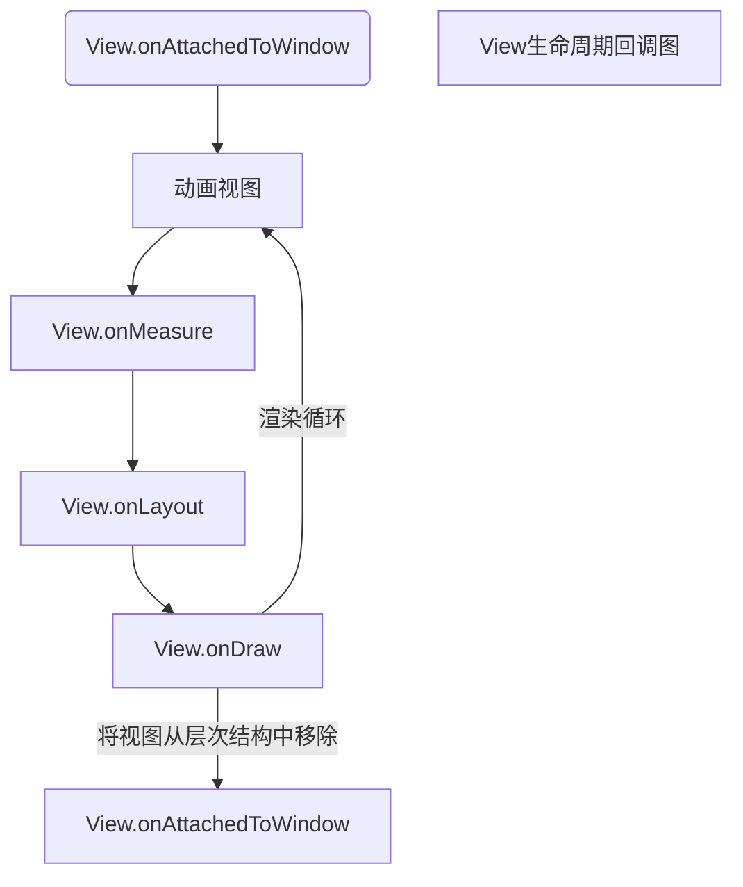

[toc]

### 1. View 的生命周期

当视图被添加到 View 层次结构中时，第一个被回调的函数是 View.onAttachedToWindow() ，这标志着它现在可以加载所需的资源了。构建自定义视图时，开发者应该重载该方法，并在该方法中加载所有资源并初始化视图所需的依赖。基本上，所有耗时的初始化操作都应该放在该方法中。

还有一个匹配的回调名为 View.onDetachedFromWindow()，从 View 层次结构中移除视图时调用这个方法。在这里，开发者需要关注那些需要显式清理的操作，比如所有被加载的资源、启动的 Service，或者其他依赖。

视图被添加到 View 层次结构中之后，它会经过一个循环，该循环首先计算动画，接下来会溢出回调 View.onMeasure()、View.onLayout()、View.onDraw() 等方法。



### 2. 钢琴键盘部件

以下是自定义钢琴键盘 View 代码：

```java
import android.content.Context;
import android.graphics.*;
import android.media.AudioManager;
import android.media.SoundPool;
import android.util.AttributeSet;
import android.util.SparseIntArray;
import android.view.MotionEvent;
import android.view.View;

import java.util.Arrays;

/**
 * @author Erik Hellman
 */
@SuppressWarnings({"UnusedDeclaration", "ConstantConditions", "NullableProblems"})
public class PianoKeyboard extends View {
    public static final String TAG = "PianoKeyboard";
    public static final int MAX_FINGERS = 5;
    public static final int WHITE_KEYS_COUNT = 7;
    public static final int BLACK_KEYS_COUNT = 5;
    public static final float BLACK_TO_WHITE_WIDTH_RATIO = 0.625f;
    public static final float BLACK_TO_WHITE_HEIGHT_RATIO = 0.54f;
    private Paint mWhiteKeyPaint, mBlackKeyPaint, mBlackKeyHitPaint, mWhiteKeyHitPaint;
    // Support up to five fingers
    private Point[] mFingerPoints = new Point[MAX_FINGERS];
    private int[] mFingerTones = new int[MAX_FINGERS];
    private SoundPool mSoundPool;
    private SparseIntArray mToneToIndexMap = new SparseIntArray();
    private Paint mCKeyPaint, mCSharpKeyPaint, mDKeyPaint,
            mDSharpKeyPaint, mEKeyPaint, mFKeyPaint,
            mFSharpKeyPaint, mGKeyPaint, mGSharpKeyPaint,
            mAKeyPaint, mASharpKeyPaint, mBKeyPaint;
    private Rect mCKey = new Rect(), mCSharpKey = new Rect(),
            mDKey = new Rect(), mDSharpKey = new Rect(),
            mEKey = new Rect(), mFKey = new Rect(),
            mFSharpKey = new Rect(), mGKey = new Rect(),
            mGSharpKey = new Rect(), mAKey = new Rect(),
            mASharpKey = new Rect(), mBKey = new Rect();
    private MotionEvent.PointerCoords mPointerCoords;

    public PianoKeyboard(Context context) {
        super(context);
    }

    public PianoKeyboard(Context context, AttributeSet attrs) {
        super(context, attrs);
    }

    public PianoKeyboard(Context context, AttributeSet attrs, int defStyle) {
        super(context, attrs, defStyle);
    }

    @Override
    protected void onAttachedToWindow() {
        super.onAttachedToWindow();
        mPointerCoords = new MotionEvent.PointerCoords();
        Arrays.fill(mFingerPoints, null);
        Arrays.fill(mFingerTones, -1);
        loadKeySamples(getContext());
        setupPaints();
    }

    @Override
    protected void onDetachedFromWindow() {
        super.onDetachedFromWindow();
        releaseKeySamples();
    }

    @Override
    protected void onLayout(boolean changed, int left, int top, int right, int bottom) {
        super.onLayout(changed, left, top, right, bottom);
        int width = getWidth();
        int height = getHeight();
        int whiteKeyWidth = width / WHITE_KEYS_COUNT;
        int blackKeyWidth = (int) (whiteKeyWidth * BLACK_TO_WHITE_WIDTH_RATIO);
        int blackKeyHeight = (int) (height * BLACK_TO_WHITE_HEIGHT_RATIO);
        mCKey.set(0, 0, whiteKeyWidth, height);
        mCSharpKey.set(whiteKeyWidth - (blackKeyWidth / 2), 0,
                whiteKeyWidth + (blackKeyWidth / 2), blackKeyHeight);
        mDKey.set(whiteKeyWidth, 0, 2 * whiteKeyWidth, height);
        mDSharpKey.set(2 * whiteKeyWidth - (blackKeyWidth / 2), 0,
                2 * whiteKeyWidth + (blackKeyWidth / 2), blackKeyHeight);
        mEKey.set(2 * whiteKeyWidth, 0, 3 * whiteKeyWidth, height);
        mFKey.set(3 * whiteKeyWidth, 0, 4 * whiteKeyWidth, height);
        mFSharpKey.set(4 * whiteKeyWidth - (blackKeyWidth / 2), 0,
                4 * whiteKeyWidth + (blackKeyWidth / 2), blackKeyHeight);
        mGKey.set(4 * whiteKeyWidth, 0, 5 * whiteKeyWidth, height);
        mGSharpKey.set(5 * whiteKeyWidth - (blackKeyWidth / 2), 0,
                5 * whiteKeyWidth + (blackKeyWidth / 2), blackKeyHeight);
        mAKey.set(5 * whiteKeyWidth, 0, 6 * whiteKeyWidth, height);
        mASharpKey.set(6 * whiteKeyWidth - (blackKeyWidth / 2), 0,
                6 * whiteKeyWidth + (blackKeyWidth / 2), blackKeyHeight);
        mBKey.set(6 * whiteKeyWidth, 0, 7 * whiteKeyWidth, height);
    }

    @Override
    protected void onDraw(Canvas canvas) {
        super.onDraw(canvas);

        canvas.drawRect(mCKey, mCKeyPaint);
        canvas.drawRect(mDKey, mDKeyPaint);
        canvas.drawRect(mEKey, mEKeyPaint);
        canvas.drawRect(mFKey, mFKeyPaint);
        canvas.drawRect(mGKey, mGKeyPaint);
        canvas.drawRect(mAKey, mAKeyPaint);
        canvas.drawRect(mBKey, mBKeyPaint);

        canvas.drawRect(mCSharpKey, mCSharpKeyPaint);
        canvas.drawRect(mDSharpKey, mDSharpKeyPaint);
        canvas.drawRect(mFSharpKey, mFSharpKeyPaint);
        canvas.drawRect(mGSharpKey, mGSharpKeyPaint);
        canvas.drawRect(mASharpKey, mASharpKeyPaint);
    }

    @Override
    public boolean onTouchEvent(MotionEvent event) {
        int pointerCount = event.getPointerCount();
        int cappedPointerCount = pointerCount > MAX_FINGERS ? MAX_FINGERS : pointerCount;
        int actionIndex = event.getActionIndex();
        int action = event.getActionMasked();
        int id = event.getPointerId(actionIndex);

        if ((action == MotionEvent.ACTION_DOWN || action == MotionEvent.ACTION_POINTER_DOWN) && id < MAX_FINGERS) {
            mFingerPoints[id] = new Point((int) event.getX(actionIndex), (int) event.getY(actionIndex));
        } else if ((action == MotionEvent.ACTION_POINTER_UP || action == MotionEvent.ACTION_UP) && id < MAX_FINGERS) {
            mFingerPoints[id] = null;
            invalidateKey(mFingerTones[id]);
            mFingerTones[id] = -1;
        }

        for (int i = 0; i < cappedPointerCount; i++) {
            int index = event.findPointerIndex(i);
            if (mFingerPoints[i] != null && index != -1) {
                mFingerPoints[i].set((int) event.getX(index), (int) event.getY(index));
                int tone = getToneForPoint(mFingerPoints[i]);
                if (tone != mFingerTones[i] && tone != -1) {
                    invalidateKey(mFingerTones[i]);
                    mFingerTones[i] = tone;
                    invalidateKey(mFingerTones[i]);
                    if (!isKeyDown(i)) {
                        int poolIndex = mToneToIndexMap.get(mFingerTones[i]);
                        event.getPointerCoords(index, mPointerCoords);
                        float volume = mPointerCoords.getAxisValue(MotionEvent.AXIS_PRESSURE);
                        volume = volume > 1f ? 1f : volume;
                        mSoundPool.play(poolIndex, volume, volume, 0, 0, 1f);
                    }
                }
            }
        }

        updatePaints();

        return true;
    }

    private void setupPaints() {
        mWhiteKeyPaint = new Paint();
        mWhiteKeyPaint.setStyle(Paint.Style.STROKE);
        mWhiteKeyPaint.setColor(Color.BLACK);
        mWhiteKeyPaint.setStrokeWidth(3);
        mWhiteKeyPaint.setAntiAlias(true);
        mCKeyPaint = mWhiteKeyPaint;
        mDKeyPaint = mWhiteKeyPaint;
        mEKeyPaint = mWhiteKeyPaint;
        mFKeyPaint = mWhiteKeyPaint;
        mGKeyPaint = mWhiteKeyPaint;
        mAKeyPaint = mWhiteKeyPaint;
        mBKeyPaint = mWhiteKeyPaint;

        mWhiteKeyHitPaint = new Paint(mWhiteKeyPaint);
        mWhiteKeyHitPaint.setColor(Color.LTGRAY);
        mWhiteKeyHitPaint.setStyle(Paint.Style.FILL_AND_STROKE);

        mBlackKeyPaint = new Paint();
        mBlackKeyPaint.setStyle(Paint.Style.FILL_AND_STROKE);
        mBlackKeyPaint.setColor(Color.BLACK);
        mBlackKeyPaint.setAntiAlias(true);
        mCSharpKeyPaint = mBlackKeyPaint;
        mDSharpKeyPaint = mBlackKeyPaint;
        mFSharpKeyPaint = mBlackKeyPaint;
        mGSharpKeyPaint = mBlackKeyPaint;
        mASharpKeyPaint = mBlackKeyPaint;

        mBlackKeyHitPaint = new Paint(mBlackKeyPaint);
        mBlackKeyHitPaint.setColor(Color.DKGRAY);
    }

    private void loadKeySamples(Context context) {
        mSoundPool = new SoundPool(5, AudioManager.STREAM_MUSIC, 0);
        mToneToIndexMap.put(R.raw.c, mSoundPool.load(context, R.raw.c, 1));
        mToneToIndexMap.put(R.raw.c_sharp, mSoundPool.load(context, R.raw.c_sharp, 1));
        mToneToIndexMap.put(R.raw.d, mSoundPool.load(context, R.raw.d, 1));
        mToneToIndexMap.put(R.raw.d_sharp, mSoundPool.load(context, R.raw.d_sharp, 1));
        mToneToIndexMap.put(R.raw.e, mSoundPool.load(context, R.raw.e, 1));
        mToneToIndexMap.put(R.raw.f, mSoundPool.load(context, R.raw.f, 1));
        mToneToIndexMap.put(R.raw.f_sharp, mSoundPool.load(context, R.raw.f_sharp, 1));
        mToneToIndexMap.put(R.raw.g, mSoundPool.load(context, R.raw.g, 1));
        mToneToIndexMap.put(R.raw.g_sharp, mSoundPool.load(context, R.raw.g_sharp, 1));
        mToneToIndexMap.put(R.raw.a, mSoundPool.load(context, R.raw.a, 1));
        mToneToIndexMap.put(R.raw.a_sharp, mSoundPool.load(context, R.raw.a_sharp, 1));
        mToneToIndexMap.put(R.raw.b, mSoundPool.load(context, R.raw.b, 1));
    }

    public void releaseKeySamples() {
        mToneToIndexMap.clear();
        mSoundPool.release();
    }

    private boolean isKeyDown(int finger) {
        int key = getToneForPoint(mFingerPoints[finger]);

        for (int i = 0; i < mFingerPoints.length; i++) {
            if (i != finger) {
                Point fingerPoint = mFingerPoints[i];
                if (fingerPoint != null) {
                    int otherKey = getToneForPoint(fingerPoint);
                    if (otherKey == key) {
                        return true;
                    }
                }
            }
        }

        return false;
    }

    private void invalidateKey(int tone) {
        switch (tone) {
            case R.raw.c:
                invalidate(mCKey);
                break;
            case R.raw.c_sharp:
                invalidate(mCSharpKey);
                break;
            case R.raw.d:
                invalidate(mDKey);
                break;
            case R.raw.d_sharp:
                invalidate(mDSharpKey);
                break;
            case R.raw.e:
                invalidate(mEKey);
                break;
            case R.raw.f:
                invalidate(mFKey);
                break;
            case R.raw.f_sharp:
                invalidate(mFSharpKey);
                break;
            case R.raw.g:
                invalidate(mGKey);
                break;
            case R.raw.g_sharp:
                invalidate(mGSharpKey);
                break;
            case R.raw.a:
                invalidate(mAKey);
                break;
            case R.raw.a_sharp:
                invalidate(mASharpKey);
                break;
            case R.raw.b:
                invalidate(mBKey);
                break;
        }
    }

    private void updatePaints() {
        mCKeyPaint = mWhiteKeyPaint;
        mDKeyPaint = mWhiteKeyPaint;
        mEKeyPaint = mWhiteKeyPaint;
        mFKeyPaint = mWhiteKeyPaint;
        mGKeyPaint = mWhiteKeyPaint;
        mAKeyPaint = mWhiteKeyPaint;
        mBKeyPaint = mWhiteKeyPaint;
        mCSharpKeyPaint = mBlackKeyPaint;
        mDSharpKeyPaint = mBlackKeyPaint;
        mFSharpKeyPaint = mBlackKeyPaint;
        mGSharpKeyPaint = mBlackKeyPaint;
        mASharpKeyPaint = mBlackKeyPaint;

        for (Point fingerPoint : mFingerPoints) {
            if (fingerPoint != null) {
                if (mCSharpKey.contains(fingerPoint.x, fingerPoint.y)) {
                    mCSharpKeyPaint = mBlackKeyHitPaint;
                } else if (mDSharpKey.contains(fingerPoint.x, fingerPoint.y)) {
                    mDSharpKeyPaint = mBlackKeyHitPaint;
                } else if (mFSharpKey.contains(fingerPoint.x, fingerPoint.y)) {
                    mFSharpKeyPaint = mBlackKeyHitPaint;
                } else if (mGSharpKey.contains(fingerPoint.x, fingerPoint.y)) {
                    mGSharpKeyPaint = mBlackKeyHitPaint;
                } else if (mASharpKey.contains(fingerPoint.x, fingerPoint.y)) {
                    mASharpKeyPaint = mBlackKeyHitPaint;
                } else if (mCKey.contains(fingerPoint.x, fingerPoint.y)) {
                    mCKeyPaint = mWhiteKeyHitPaint;
                } else if (mDKey.contains(fingerPoint.x, fingerPoint.y)) {
                    mDKeyPaint = mWhiteKeyHitPaint;
                } else if (mEKey.contains(fingerPoint.x, fingerPoint.y)) {
                    mEKeyPaint = mWhiteKeyHitPaint;
                } else if (mFKey.contains(fingerPoint.x, fingerPoint.y)) {
                    mFKeyPaint = mWhiteKeyHitPaint;
                } else if (mGKey.contains(fingerPoint.x, fingerPoint.y)) {
                    mGKeyPaint = mWhiteKeyHitPaint;
                } else if (mAKey.contains(fingerPoint.x, fingerPoint.y)) {
                    mAKeyPaint = mWhiteKeyHitPaint;
                } else if (mBKey.contains(fingerPoint.x, fingerPoint.y)) {
                    mBKeyPaint = mWhiteKeyHitPaint;
                }
            }
        }
    }

    private int getToneForPoint(Point point) {
        if (mCSharpKey.contains(point.x, point.y))
            return R.raw.c_sharp;
        if (mDSharpKey.contains(point.x, point.y))
            return R.raw.d_sharp;
        if (mFSharpKey.contains(point.x, point.y))
            return R.raw.f_sharp;
        if (mGSharpKey.contains(point.x, point.y))
            return R.raw.g_sharp;
        if (mASharpKey.contains(point.x, point.y))
            return R.raw.a_sharp;

        if (mCKey.contains(point.x, point.y))
            return R.raw.c;
        if (mDKey.contains(point.x, point.y))
            return R.raw.d;
        if (mEKey.contains(point.x, point.y))
            return R.raw.e;
        if (mFKey.contains(point.x, point.y))
            return R.raw.f;
        if (mGKey.contains(point.x, point.y))
            return R.raw.g;
        if (mAKey.contains(point.x, point.y))
            return R.raw.a;
        if (mBKey.contains(point.x, point.y))
            return R.raw.b;

        return -1;
    }
}
```

