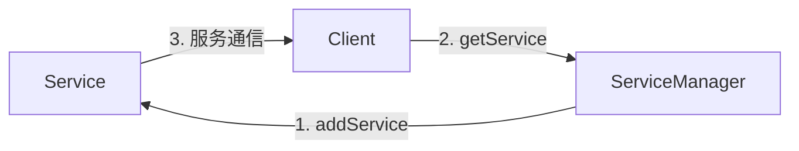

[toc]

### 1. Binder 地址

使用 Binder 通信时，客户端需要知道远程 Binder 对象的地址。然而，Binder 的设计要求只有实现类（比如要调用的 Service）才知道该地址。开发者使用 Intent 解析来进行 Binder 寻址。客户端使用 action 字符串的或者组件名（ComponentName）来构造 Intent 对象，然后使用它初始化与远程应用程序的通信。然而，Intent 只是实际 Binder 地址的抽象描述，为了能够建立通信，还需要翻译成实际的地址。

ServiceManager 是一个特殊的 Binder 节点，它运行在 Android 系统服务内，管理所有的地址解析，是唯一一个有全局地址的 Binder 节点。因为所有的 Android 组件都使用 Binder 进行通信，它们需要使用 ServiceManager 进行注册，通过如上所述的地址来进行通信。



<center><b>图7-2 通过 ServiceManager 进行服务注册和查找</b></center>

客户端要想和 Service 或其他组件通信，需隐式地通过 Intent 查询 ServiceManager 来接收 Binder 地址。

### 2. Binder 事务

在 Android 中，**事务**（transaction）是指从一个进程发生数据到另一个进程。在 Binder 上开启事务首先会在客户端调用 IBinder.transact()，然后 Service 收到 Binder.onTransact() 方法回调，如下所示：

```java
public string performCustomBinderTransaction(IBinder binder, String arg0, int arg1, float arg2) throws RemoteException {
    parcel request = Parcel.obtain();
    Parcel response = Parcel.obtain();
    
    // 生成请求数据
    request.writeString(arg0);
    request.writeInt(arg1);
    request.writeFloat(arg2);
    
    // 执行事务
    binder.transact(IBinder.FIRST_CALL_TRANSACTION, request, response, 0);
    
    // 从响应中读取结果
    String result = response.readString();
    
    // 循环利用对象
    request.recycle();
    response.recycle();
    
    return result;
}
```

前例所示的方法演示了如何在客户端使用 IBinder 引用向 Service 执行自定义的 IBinder 事务。下面的例子会详细讲述 Parcel 对象。它们是简单的数据容器，用来传递事务中使用的数据。

```java
public class CustomBinder extends Binder {
    @Override
    protected boolean onTransact(int code, Parcel request, Parcel response, int flags) throws RemoteException {
        // 读取请求中的数据
        String arg0 = request.readString();
        int arg1 = request.readInt();
        float arg2 = request.readFloat();
        
        String result = buildResult(arg0, arg1, arg2);
        
        // 把结果写入响应 Parcel
        response.writeString(result);
        
        // 成功后返回 true
        return true;
    }
    
    private String buildResult(String arg0, int arg1, float arg2) {
        String result = null;
        // 构建结果
        return result;
    }
}
```

如果在 Service 中实现自定义的 Binder 对象时没有使用 AIDL，开发者还需自己实现 Binder.onTransact() 方法，如上例所示。本例只是简单地使用相关数据填充第二个 Parcel 对象来响应到来的事务。

上面的结果是一个通过 Binder IPC 进行的同步双向调用。也可在客户端执行单向的调用，只需在 IBinder.transact() 调用中把标志位设置为 FLAG_ONEWAY，这样就可以把第二个 Parcel 参数设置为 null。单向调用会提供更好的性能，因为只需对一个 Parcel 对象进行编解码操作。

如果打算发布供其他开发者使用的 API，不建议使用这种底层的方式在两个应用程序间执行事务。然而，如果需要更细粒度地控制数据是如何在应用间发送的，这种方法会更有效。书中的例子只是用来描述 Binder 是如何工作的。大多数情况下，开发者使用 AIDL 或者 Messager。

### 3. Parcel

Binder 事务通常会传递事务数据，如前面例子所述。这种数据被称为 parcel （包裹）。Android 提供了相应的 API，允许开发者为大多数 Java 对象创建 parcel。

Android 中的 Parcel 和 Java SE 中的序列化对象类似。不同之处在于，开发者需要使用 Parcelable 接口实现对象的编解码工作。该接口定义了两个编写 Parcel 对象的方法，以及一个静态的不可被复写的 Creator 对象，该对象用来从 Parcel 中读取相应的对象，如下所示：

```java
public class CustomData implements Parcelable {
    
    public static final Parcelable.Creator<CustomData> CREATOR = new Parcelable.Creator<CustomData>() {
        
        @Override
        public CustomData createFromParcel(Parcel parcel) {
            CustomData = new CustomData();
            customData.mName = parcel.readString();
            customData.mReferences = new ArrayList<String>();
            parcel.readStringList(customData.mReferences);
            customData.mCreated = new Date(parcel.readLong());
            return customData;
        }
        
        @Override
        public CustomData[] newArray(int size) {
            return new CustomData[size];
        }
        
    };
    
    private String mName;
    private List<String> mReferences;
    private Date mCreated;
    
    public CustomData() {
        mName = "";	// 默认为空字符串
        mReferences = new ArrayList<String>();
        mCreated = new Date();	// 默认为当前时间
    }
    
    @Override
    public int describeContents() {
        return 0;
    }
    
    @Override
    public void writeToParcel(Parcel parcel, int flags) {
        parcel.writeString(mName);
        parcel.writeStringList(mReferences);
        parcel.writeLong(mCreated.getTime());
    }
    
    @Override
    public boolean equals(Object o) {
        if (this == o) return true;
        if (o == null || getClass() != o.getClass()) return false;
        CustomData that = (CustomData) o;
        return mCreated.equals(that.mCreated) && mName.equals(that.mName);
    }
    
    @Override
    public int hashCode() {
        int result = mName.hashCode();
        result = 31 * result + mCreated.hashCode();
        return result;
    }
}
```

前面的代码显示了实现 Parcelable 接口的 CustomData 类。注意 CREATOR 成员对象的实现，以及 createFromParcel() 如何使用 Parcel.readStringList() 方法来读取整个 List 对象，而不需要指定列表的长度（Parcel 对象内部会处理这种情况）。

实现该接口后就可以通过 IBinder IPC 在应用间发送该类对象了。

### 4. Link to death

Binder 的另一个特点是，允许客户端在 Service 被终止时收到通知。正如前面提到的，这被称为 link to death，Binder 的 IBinder.linkToDeath() 方法实现了该机制。当客户端在 onServiceConnected() 方法中收到 IBinder 对象时，它可以用实现了 IBinder.DeathRecipient 接口的参数调用 linkToDeath() 方法。因为 Android 应用可能在资源不足（可用的 RAM 等）时被系统杀死，在客户端注册远端被终止的监听通知会很有用。下面的代码显示了如何使用有效的 IBinder 注册 link to death。

```java
public class LinkToDeathSample extends Service {
    
    private static final String TAG = "LinkToDeathSample";
    
    // 简单起见，移除了 Service 相关的代码
    
    private void notifyRemoteServiceDeath(IBinder iBinder) {
        try {
            iBinder.linkToDeath(new MyLinkToDeathCallback(), 0);
        } catch (RemoteException e) {
            Log.e(TAG, "Error registering for link to death.", e);
        }
    }
    
    class MyLinkToDeathCallback implements IBinder.DeathRecipient {
        @Override
        public void binderDied() {
            // 处理远端 Binder 被杀死的情况
        }
    }
}
```

也可以调用 IBinder.pingBinder() 检查远端的 Binder 进程是否仍处在活跃状态。如果结果为 true，表明远端的进程处于活跃可用的状态。

如果是绑定到 Service，该方法就没有必要了，因为断开连接时总是会调用 ServiceConnection.onServiceDisconnected() 回调函数。但是，如果用其他方式接收到 Binder 对象，该方法可能是有用的。