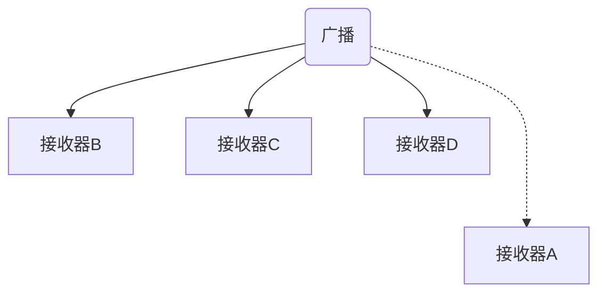

[toc]

### 8.1 BroadcastReceiver

Android 中发送广播事件最常用的方式是通过 Context.sendBroadcast() 方法给 BroadcastReceiver 发送 Intent 对象。许多标准系统事件都被定义成操作字符串，并可以在 Intent 类的 API 文档中查看。

下面的代码显示一个简单的 BroadcastReceiver：

```java
public class ChargerConnectedListener extends BroadcastReceiver {
    
    @Override
    public void onReceive(Context context, Intent intent) {
        String action = intent.getAction();
        
        if (Intent.ACTION_POWER_CONNECTED.equals(action)) {
            context.startService(new Intent(MyService.ACTION_POWER_CONNECTED));
        } else if (Intent.ACTION_POWER_DISCONNECTED.equals(action)) {
            context.startService(new Intent(MyService.ACTION_POWER_DISCONNECTED));
        }
    }
}
```

实现 BroadcastReceiver 的默认方法是在清单文件中声明它。

```xml
<receiver android:name=".ChargerConnectedListener">
	<intent-filter>
    	<action android:name="android.intent.action.ACTION_POWER_CONNECTED" />
        <action android:name="android.intent.action.ACTION_POWER_DISCONNECTED" />
    </intent-filter>
</receiver>
```

也可在 Activity 和 Service 中以编程的方式注册 BroadcastReceiver。有些广播 Intent 只能以编程的方式注册，还有一些只能在清单文件中定义。可在官方 Android API 文档中查看每种广播操作的详细信息。

在代码中注册 BroadcastReceiver 时，开发者必须在相应的回调中移除对该广播的注册，如下所示：

```java
public class MyActivity extends Activity {
    
    private ChargerConnectedListener mPowerConnectionReceiver;
    
    @Override
    protected void onResume() {
        super.onResume();
        IntentFilter intentFilter = new IntentFilter();
        intentFilter.addAction(Intent.ACTION_POWER_CONNECTED);
        intentFilter.addAction(Intent.ACTION_POWER_DISCONNECTED);
        mPowerConnectionReceiver = new ChargerConnectedListener();
        registerReceiver(mPowerConnectionReceiver, intentFilter);
    }
    
    @Override
    protected void onPause() {
        super.onPause();
        unregisterReceiver(mPowerConnectionReceiver);
    }
}
```

#### 8.1.1 本地 BroadcastReceiver

如果只是在应用程序进程内发送和接收广播，可以考虑使用 LocalBroadcastManager 而不是更通用的 Context.sendBroadcast() 方法。下面的代码演示了如何使用 LocalBroadcastManager 来发送本地广播。

```java
public void sendLocalBroadcast(Intent broadcastIntent) {
    LocalBroadcastManager localBroadcastManager = LocalBroadcastManager.getIntance(this);
    localBroadcastManager.sendBroadcast(broadcastIntent);
}
```

要接收本地广播，开发者可以使用上述代码示例中的 LocalBroadcastManager 类。下面的例子显示了在 Activity 中注册并通过 onPause() 方法注销特定操作 的本地广播。

```java
public class LocalBroadcastDemo extends Activity {
    
    public static final String LOCAL_BROADCAST_ACTION = "localBroadcast";
    private BroadcastReceiver mLocalReceiver;
    
    @Override
    protected void onResume() {
        LocalBroadcastManager localBroadcastManager = LocalBroadcastManager.getInstance(this);
        IntentFilter intentFilter = new IntentFilter(LOCAL_BROADCAST_ACTION);
        mLocalReceiver = new BroadcastReceiver() {
            @Override
            public void onReceive(Context context, Intent intent) {
                // TODO: 处理本地广播
            }
        };
       	localBroadcastManager.registerReceiver(mLocalReceiver, intentFilter);
    }
    
    @Override
    protected void onPause() {
        super.onPause();
        LocalBroadcastManager localBroadcastManager = LocalBroadcastManager.getInstance(this);
        localBroadcastManager.unregisterReceiver(mLocalReceiver);
    }
}
```

#### 8.1.2 普通广播和有序广播

广播分为两种类型：普通广播和有序广播。普通广播会以异步方式被发送给所有的接受者，并且没有指定的接收顺序，如下图所示：



<center><b>图8-1 异步方式发送广播</b></center>

有序广播按照特定的顺序分发，每次只发给一个注册的广播接收器（见下图）。开发者可以在清单文件