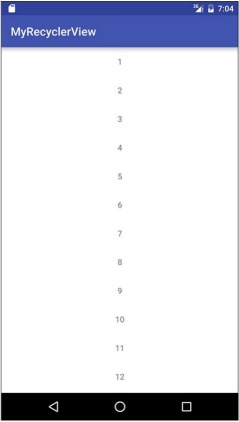
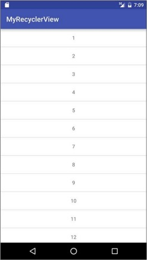
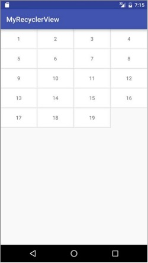
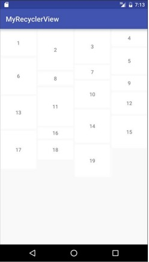

<center><font size="5"><b>替换ListView和GridView的RecyclerView</b></font></center>

[toc]

####1.  配置build.gradle

修改项目根目录下的gradle.properties文件，添加RecyclerView的最新版本号：

```
APPCOMPAT_VERSION = 1.1.0
RECYCLERVIEW_VERSION = 1.0.0
```

在App目录下的build.gradle文件中添加如下依赖：

```
dependencies {
    ...
    implementation 'androidx.appcompat:appcompat:${APPCOMPAT_VERSION}'
    implementation 'androidx.recyclerview:recyclerview:${RECYCLERVIEW_VERSION}'
}
```

####2. 使用RecyclerView

```Java
RecyclerView mRecyclerView = findViewById(R.id.id_recyclerview);
// 设置布局管理器
mRecyclerView.setLayoutManager(new LinearLayoutManager(this));
// 设置item增加和删除时的动画
mRecyclerView.setItemAnimator(new DefaultItemAnimator());
mHomeAdapter = new HomeAdapter(this, mList);
mRecyclerView.setAdapter(mHomeAdapter);
```

与 `ListView` 不同的一点就是，需要设置布局管理器用于设置条目的排列样式，可以是垂直排列或者水平排列。这里我们设置 `setLayoutManager(new LinearLayoutManager(this))` 表示条目是是线性排列的（默认是垂直排列的）。

```Java
static final int DEFAULT_ORIENTATION = VERTICAL;

public LinearLayoutManager(Context context) {
    this(context, RecyclerView.DEFAULT_ORIENTATION, false);
}
```

如果需要设置为水平，可以按如下代码所示编写。

```Java
LinearLayoutManager linearLayoutManager = new LinearLayoutManager(this);
linearLayoutManager.setOrientation(LinearLayoutManager.HORIZONTAL);
mRecyclerView.setLayoutManager(linearLayoutManager);
```

此外， `RecyclerView` 比 `ListView` 的实战要复杂一些，主要是它需要自己去自定义分割线，设置动画和布局管理器，等等。布局文件 `activity_recycler_view.xml` 如下：

```XML
<?xml version="1.0" encoding="utf-8"?>
<RelativeLayout xmlns:android="http://schemas.android.com/apk/res/android"
    android:layout_width="match_parent"
    android:layout_height="match_parent">

    <androidx.recyclerview.widget.RecyclerView
        android:id="@+id/id_recyclerview"
        android:layout_width="match_parent"
        android:layout_height="match_parent"/>

</RelativeLayout>
```

Adapter最大的改进就是对 `ViewHolder` 进行了封装定义，我们只需要自定义一个 `ViewHolder` 继承 `RecyclerView.ViewHolder` 就可以了。另外，`Adapter` 继承了 `RecyclerView.Adapter`，在 `onCreateViewHolder` 中加载条目布局，在 `onBindViewHolder` 中将视图与数据进行绑定。

```Java
import android.content.Context;
import android.view.LayoutInflater;
import android.view.View;
import android.view.ViewGroup;
import android.widget.TextView;

import androidx.annotation.NonNull;
import androidx.recyclerview.widget.RecyclerView;

import java.util.List;

public class HomeAdapter extends RecyclerView.Adapter<HomeAdapter.MyViewHolder> implements View.OnClickListener, View.OnLongClickListener {

    private List<String> mList;
    private Context mContext;
    private OnItemClickListener mOnItemClickListener;

    public HomeAdapter(Context context, List<String> list) {
        mContext = context;
        mList = list;
    }

    public void setOnItemClickListener(OnItemClickListener listener) {
        mOnItemClickListener = listener;
    }

    public void removeData(int position) {
        mList.remove(position);
        notifyDataSetChanged();
    }

    @NonNull
    @Override
    public MyViewHolder onCreateViewHolder(@NonNull ViewGroup parent, int viewType) {
        View view = LayoutInflater.from(mContext).inflate(R.layout.item_recycler, parent, false);
        MyViewHolder holder = new MyViewHolder(view);
        view.setOnClickListener(this);
        view.setOnLongClickListener(this);
        return holder;
    }

    @Override
    public void onBindViewHolder(@NonNull MyViewHolder holder, int position) {
        holder.itemView.setTag(position);
        holder.tv.setText(mList.get(position));
    }

    @Override
    public int getItemCount() {
        return mList.size();
    }

    @Override
    public void onClick(View view) {
        if (mOnItemClickListener != null) {
            mOnItemClickListener.onItemClick(view, (int)view.getTag());
        }
    }

    @Override
    public boolean onLongClick(View view) {
        if (mOnItemClickListener != null) {
            mOnItemClickListener.onItemLongClick(view, (int)view.getTag());
        }
        return true;
    }

    public interface OnItemClickListener {
        void onItemClick(View view, int position);
        void onItemLongClick(View view, int position);
    }

    class MyViewHolder extends RecyclerView.ViewHolder {
        TextView tv;

        public MyViewHolder(View view) {
            super(view);
            tv = (TextView) view.findViewById(R.id.tv_item);
        }
    }
}
```

在 `HomeAdapter` 的 `onCreateViewHolder` 方法中我们加载了条目的样式文件 `item_recycler`。它的布局文件如下：

```XML
<?xml version="1.0" encoding="utf-8"?>
<FrameLayout xmlns:android="http://schemas.android.com/apk/res/android"
    android:layout_width="match_parent"
    android:layout_height="wrap_content"
    android:background="@android:color/white"
    android:layout_margin="2dp">

    <TextView
        android:id="@+id/tv_item"
        android:layout_width="match_parent"
        android:layout_height="50dp"
        android:gravity="center"
        android:text="moon"
        />

</FrameLayout>
```

显示效果如下：



####3. 设置分割线

我们可以使用 `mRecyclerView.addItemDecoration()` 来加入分割线。谷歌目前没有提供默认的分割线，这就需要我们继承 `RecyclerView.ItemDecoration` 来自定义分割线。

```Java
import android.content.Context;
import android.content.res.TypedArray;
import android.graphics.Canvas;
import android.graphics.Rect;
import android.graphics.drawable.Drawable;
import android.view.View;

import androidx.annotation.NonNull;
import androidx.recyclerview.widget.LinearLayoutManager;
import androidx.recyclerview.widget.RecyclerView;

public class DividerItemDecoration extends RecyclerView.ItemDecoration {

    private static final int[] ATTRS = new int[] {
            android.R.attr.listDivider
    };

    public static final int HORIZONTAL_LIST = LinearLayoutManager.HORIZONTAL;

    public static final int VERTICAL_LIST = LinearLayoutManager.VERTICAL;

    private Drawable mDivider;

    private int mOrientation;

    public DividerItemDecoration(Context context, int orientation) {
        final TypedArray a = context.obtainStyledAttributes(ATTRS);
        mDivider = a.getDrawable(0);
        a.recycle();
        setOrientation(orientation);
    }

    public void setOrientation(int orientation) {
        if (orientation != HORIZONTAL_LIST && orientation != VERTICAL_LIST) {
            throw new IllegalArgumentException("Invalid orientation");
        }
        mOrientation = orientation;
    }

    @Override
    public void onDraw(@NonNull Canvas c, @NonNull RecyclerView parent, @NonNull RecyclerView.State state) {
        if (mOrientation == VERTICAL_LIST) {
            drawVertical(c, parent);
        } else {
            drawHorizontal(c, parent);
        }
    }

    public void drawVertical(Canvas c, RecyclerView parent) {
        final int left = parent.getPaddingLeft();
        final int right = parent.getWidth() - parent.getPaddingRight();

        final int childCount = parent.getChildCount();
        for (int i = 0; i < childCount; i++) {
            final View child = parent.getChildAt(i);
            final RecyclerView.LayoutParams params = (RecyclerView.LayoutParams)child.getLayoutParams();
            final int top = child.getBottom() + params.bottomMargin;
            final int bottom = top + mDivider.getIntrinsicHeight();
            mDivider.setBounds(left, top, right, bottom);
            mDivider.draw(c);
        }
    }

    public void drawHorizontal(Canvas c, RecyclerView parent) {
        final int top = parent.getPaddingTop();
        final int bottom = parent.getHeight() - parent.getPaddingBottom();

        final int childCount = parent.getChildCount();
        for (int i = 0; i < childCount; i++) {
            final View child = parent.getChildAt(i);
            final RecyclerView.LayoutParams params = (RecyclerView.LayoutParams) child.getLayoutParams();
            final int left = child.getRight() + params.rightMargin;
            final int right = left + mDivider.getIntrinsicHeight();
            mDivider.setBounds(left, top, right, bottom);
            mDivider.draw(c);
        }
    }

    @Override
    public void getItemOffsets(@NonNull Rect outRect, @NonNull View view, @NonNull RecyclerView parent, @NonNull RecyclerView.State state) {
        if (mOrientation == VERTICAL_LIST) {
            outRect.set(0, 0, 0, mDivider.getIntrinsicHeight());
        } else {
            outRect.set(0, 0, mDivider.getIntrinsicWidth(), 0);
        }
    }
}
```

实现自定义的分割线，我们只要在 `setAdapter` 之前加入如下代码便可加入分割线。代码如下：

```Java
mRecyclerView.addItemDecoration(new DividerItemDecoration(RecyclerViewActivity.this, DividerItemDecoration.VERTICAL_LIST));
```

效果如下：



####4. 自定义点击事件

在 `Adapter` 中定义接口并提供回调，我们在这里定义了条目的点击事件和长按点击事件。

```Java
public interface OnItemClickListener {
    void onItemClick(View view, int position);
    void onItemLongClick(View view, int position);
}

public void setOnItemClickListener(OnItemClickListener listener) {
    this.mOnItemClickListener = listener;
}
```

接下来对 `item` 中的控件进行点击事件监听并回调给我们自定义的监听，如下所示：

```Java
@Override
public void onBindViewHolder(@NonNull final MyViewHolder holder, int position) {
    ViewGroup.LayoutParams lp = holder.tv.getLayoutParams();
    lp.height = mHeights.get(position);

    holder.tv.setLayoutParams(lp);
    holder.tv.setText(mDatas.get(position));

    // 如果设置了回调，则设置点击事件
    if (mOnItemClickListener != null) {
        holder.itemView.setOnClickListener(new View.OnClickListener() {
            @Override
            public void onClick(View view) {
                int pos = holder.getLayoutPosition();
                mOnItemClickListener.onItemClick(holder.itemView, pos);
            }
        });

        holder.itemView.setOnLongClickListener(new View.OnLongClickListener() {
            @Override
            public boolean onLongClick(View view) {
                int pos = holder.getLayoutPosition();
                mOnItemClickListener.onItemLongClick(holder.itemView, pos);
                return false;
            }
        });
    }
}
```

最后在 `Activity` 中进行监听：

```Java
mHomeAdapter.setOnItemClickListener(new HomeAdapter.OnItemClickListener() {
    @Override
    public void onItemClick(View view, int position) {
        Toast.makeText(RecyclerViewActivity.this, "点击第" + (position + 1) + "条", Toast.LENGTH_SHORT).show();
    }

    @Override
    public void onItemLongClick(View view, final int position) {
        new AlertDialog.Builder(RecyclerViewActivity.this)
                .setTitle("确认删除吗？")
                .setNegativeButton("取消", null)
                .setPositiveButton("确定", new DialogInterface.OnClickListener() {
                    @Override
                    public void onClick(DialogInterface dialogInterface, int i) {
                        mHomeAdapter.removeData(position);
                    }
                }).show();
    }
});
```

####5. 实现GridView

只需要自定义横向的分割线，然后在代码中设置：

```Java
mRecyclerView.setLayoutManager(new StaggeredGridLayoutManager(4, StaggeredGridLayoutManager.VERTICAL));
mRecyclerView.addItemDecoration(new DividerGridItemDecoration(this));
```

很明显，这里设置一行显示条目为4个，其实现效果如下所示：



####6. 实现瀑布流

这里为了实现放Ian，我们可以不用写 `mRecyclerView.addItemDecoration(new DividerGridItemDecoration(this))` 来设置分割线，可以在 `item` 布局文件中定义分割线距离 `android:layout_margin="2dp"。

```XML
<?xml version="1.0" encoding="utf-8"?>
<FrameLayout xmlns:android="http://schemas.android.com/apk/res/android"
    android:layout_width="match_parent"
    android:layout_height="wrap_content"
    android:background="@android:color/white"
    android:layout_margin="2dp">
    
    <TextView
        android:id="@+id/tv_item"
        android:layout_width="match_parent"
        android:layout_height="50dp"
        android:gravity="center"
        android:text="moon" />
    
</FrameLayout>
```

实现瀑布流很简单，只要在Adapter写一个随机的高度来控制每个 `item` 的高度就可以了。通常这个高度是有服务端返回的数据高度来控制的，在这里我们写一个随机的高度来控制每个 `item` 的高度：

```Java
mHeights = new ArrayList<Integer>();
for (int i = 0; i < mDatas.size(); i++) {
    mHeights.add((int)(100 + Math.random() * 300));
}
```

接着我们在 `Adapter` 的 `onBindViewHolder` 中设置每个 `item` 的高度，效果如下所示：

```Java
LayoutParams lp = holder.tv.getLayoutParams();
lp.height = mHeights.get(position);
holder.tv.setLayoutParams(lp);
```

最终 `Adapter` 代码如下：

```Java
import android.content.Context;
import android.view.LayoutInflater;
import android.view.View;
import android.view.ViewGroup;
import android.widget.TextView;

import androidx.annotation.NonNull;
import androidx.recyclerview.widget.RecyclerView;

import java.util.ArrayList;
import java.util.List;

public class StaggeredHomeAdapter extends RecyclerView.Adapter<StaggeredHomeAdapter.MyViewHolder> {

    private List<String> mDatas;
    private LayoutInflater mInflater;

    private List<Integer> mHeights;

    private OnItemClickListener mOnItemClickListener;

    public StaggeredHomeAdapter(Context context, List<String> datas) {
        mInflater = LayoutInflater.from(context);
        mDatas = datas;

        mHeights = new ArrayList<>();
        for (int i = 0; i < mDatas.size(); i++) {
            mHeights.add((int)(100 + Math.random() * 300));
        }
    }

    public void setOnItemClickListener(OnItemClickListener listener) {
        mOnItemClickListener = listener;
    }

    @NonNull
    @Override
    public MyViewHolder onCreateViewHolder(@NonNull ViewGroup parent, int viewType) {
        MyViewHolder holder = new MyViewHolder(mInflater.inflate(R.layout.item_recycler, parent, false));
        return holder;
    }

    @Override
    public void onBindViewHolder(@NonNull final MyViewHolder holder, int position) {
        ViewGroup.LayoutParams lp = holder.tv.getLayoutParams();
        lp.height = mHeights.get(position);

        holder.tv.setLayoutParams(lp);
        holder.tv.setText(mDatas.get(position));

        // 如果设置了回调，则设置点击事件
        if (mOnItemClickListener != null) {
            holder.itemView.setOnClickListener(new View.OnClickListener() {
                @Override
                public void onClick(View view) {
                    int pos = holder.getLayoutPosition();
                    mOnItemClickListener.onItemClick(holder.itemView, pos);
                }
            });

            holder.itemView.setOnLongClickListener(new View.OnLongClickListener() {
                @Override
                public boolean onLongClick(View view) {
                    int pos = holder.getLayoutPosition();
                    mOnItemClickListener.onItemLongClick(holder.itemView, pos);
                    return false;
                }
            });
        }
    }

    @Override
    public int getItemCount() {
        return mDatas.size();
    }

    public void addData(int position) {
        mDatas.add(position, "Insert One");
        mHeights.add((int)(100 + Math.random() * 3));
        notifyItemInserted(position);
    }

    public void removeData(int position) {
        mDatas.remove(position);
        notifyItemRemoved(position);
    }

    public interface OnItemClickListener {
        void onItemClick(View view, int position);

        void onItemLongClick(View view, int position);
    }

    class MyViewHolder extends RecyclerView.ViewHolder {
        TextView tv;

        public MyViewHolder(View view) {
            super(view);
            tv = (TextView) view.findViewById(R.id.tv_item);
        }
    }
}
```

效果如下所示：


