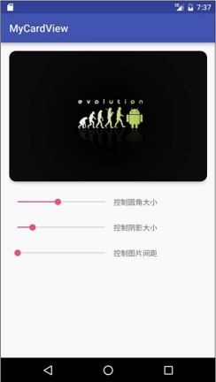

<center><font size="5"><b>卡片CardView</b></font></center>

[toc]

####1. 配置build.gradle

在项目根目录下的 `gradle.properties`文件中添加如下代码：

```
APPCOMPAT_VERSION = 1.1.0
CARDVIEW_VERSION = 1.0.0
```

在 `app` 目录下的 `build.gradle` 文件中添加如下代码：

```
dependencies {
    ......
    implementation 'androidx.appcompat:appcompat:${APPCOMPAT_VERSION}'
    implementation 'androidx.cardview:cardview:${CARDVIEW_VERSION}'
}
```

####2. 使用CardView

先来看布局，代码如下所示：

```XML
<?xml version="1.0" encoding="utf-8"?>
<androidx.appcompat.widget.LinearLayoutCompat xmlns:android="http://schemas.android.com/apk/res/android"
    xmlns:app="http://schemas.android.com/apk/res-auto"
    xmlns:tools="http://schemas.android.com/tools"
    android:layout_width="match_parent"
    android:layout_height="match_parent"
    android:paddingLeft="@dimen/activity_horizontal_margin"
    android:paddingRight="@dimen/activity_horizontal_margin"
    android:paddingTop="@dimen/activity_vertical_margin"
    android:paddingBottom="@dimen/activity_vertical_margin"
    android:orientation="vertical"
    tools:context=".MainActivity">

   <androidx.cardview.widget.CardView
       android:id="@+id/tv_item"
       android:layout_width="match_parent"
       android:layout_height="250dp"
       app:cardBackgroundColor="@android:color/white"
       app:cardCornerRadius="20dp"
       app:cardElevation="20dp">

       <androidx.appcompat.widget.AppCompatImageView
           android:layout_width="match_parent"
           android:layout_height="match_parent"
           android:background="@drawable/cardview"
           android:scaleType="centerInside"/>

   </androidx.cardview.widget.CardView>

    <androidx.appcompat.widget.LinearLayoutCompat
        android:layout_width="match_parent"
        android:layout_height="wrap_content"
        android:layout_marginTop="30dp">

        <androidx.appcompat.widget.AppCompatSeekBar
            android:id="@+id/sb_1"
            android:layout_width="200dp"
            android:layout_height="wrap_content"/>

        <androidx.appcompat.widget.AppCompatTextView
            android:layout_width="wrap_content"
            android:layout_height="wrap_content"
            android:text="控制圆角大小" />

    </androidx.appcompat.widget.LinearLayoutCompat>

    <androidx.appcompat.widget.LinearLayoutCompat
        android:layout_width="match_parent"
        android:layout_height="wrap_content"
        android:layout_marginTop="30dp">

        <androidx.appcompat.widget.AppCompatSeekBar
            android:id="@+id/sb_2"
            android:layout_width="200dp"
            android:layout_height="wrap_content"/>

        <androidx.appcompat.widget.AppCompatTextView
            android:layout_width="wrap_content"
            android:layout_height="wrap_content"
            android:text="控制阴影大小" />

    </androidx.appcompat.widget.LinearLayoutCompat>

    <androidx.appcompat.widget.LinearLayoutCompat
        android:layout_width="match_parent"
        android:layout_height="wrap_content"
        android:layout_marginTop="30dp">

        <androidx.appcompat.widget.AppCompatSeekBar
            android:id="@+id/sb_3"
            android:layout_width="200dp"
            android:layout_height="wrap_content"/>

        <androidx.appcompat.widget.AppCompatTextView
            android:layout_width="wrap_content"
            android:layout_height="wrap_content"
            android:text="控制图片间距" />

    </androidx.appcompat.widget.LinearLayoutCompat>

</androidx.appcompat.widget.LinearLayoutCompat>
```

这里有两个 `CardView` 的重要属性：`app:cardCornerRadius`：设置圆角的半径；`app:cardElevation`：设置阴影的半径。其他属性如下所示：
+ `app:cardBackgroundColor`：设置背景色。
+ `app:cardElevation`：设置Z轴阴影。
+ `app:cardMaxElevation`：设置Z轴最大高度值。
+ `app:cardUseCompatPadding`：是否使用 `CompadPadding`。
+ `app:cardPreventCornerOverlap`：是否使用 `PreventCornerOverlap`。
+ `app:contentPadding`：内容的 `padding`。
+ `app:contentPaddingLeft`：内容的左 `padding`。
+ `app:contentPaddingTop`：内容的上 `padding`。
+ `app:contentPaddingRight`：内容的右 `padding`。
+ `app:contentPaddingBottom`：内容的底 `padding`。

接下来看看Java代码：

```Java
import androidx.appcompat.app.AppCompatActivity;
import androidx.appcompat.widget.AppCompatSeekBar;
import androidx.cardview.widget.CardView;

import android.os.Bundle;
import android.widget.SeekBar;

public class MainActivity extends AppCompatActivity {

    private CardView mCardView;
    private AppCompatSeekBar sb1;
    private AppCompatSeekBar sb2;
    private AppCompatSeekBar sb3;

    @Override
    protected void onCreate(Bundle savedInstanceState) {
        super.onCreate(savedInstanceState);
        setContentView(R.layout.activity_card_view);
        assignViews();
    }

    private void assignViews() {
        mCardView = findViewById(R.id.tv_item);
        sb1 = findViewById(R.id.sb_1);
        sb2 = findViewById(R.id.sb_2);
        sb3 = findViewById(R.id.sb_3);
        sb1.setOnSeekBarChangeListener(new SeekBar.OnSeekBarChangeListener() {
            @Override
            public void onProgressChanged(SeekBar seekBar, int i, boolean b) {
                mCardView.setRadius(i);
            }

            @Override
            public void onStartTrackingTouch(SeekBar seekBar) {

            }

            @Override
            public void onStopTrackingTouch(SeekBar seekBar) {

            }
        });

        sb2.setOnSeekBarChangeListener(new SeekBar.OnSeekBarChangeListener() {
            @Override
            public void onProgressChanged(SeekBar seekBar, int i, boolean b) {
                mCardView.setCardElevation(i);
            }

            @Override
            public void onStartTrackingTouch(SeekBar seekBar) {

            }

            @Override
            public void onStopTrackingTouch(SeekBar seekBar) {

            }
        });

        sb3.setOnSeekBarChangeListener(new SeekBar.OnSeekBarChangeListener() {
            @Override
            public void onProgressChanged(SeekBar seekBar, int i, boolean b) {
                mCardView.setContentPadding(i, i, i, i);
            }

            @Override
            public void onStartTrackingTouch(SeekBar seekBar) {

            }

            @Override
            public void onStopTrackingTouch(SeekBar seekBar) {

            }
        });
    }
}
```

在这里设置了3个 `seekBar` 分别来设置 `CardView`：
+ `mCardView.setRadius()`：设置圆角的半径。
+ `mCardView.setCardElevation()`：设置阴影的半径。
+ `mCardView.setContentPadding()`：设置 `CardView` 中的子控件和父控件的距离。

显示效果如下所示：



