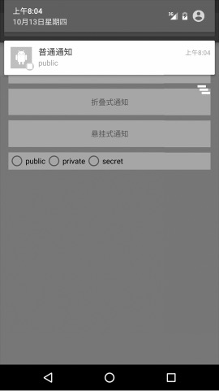
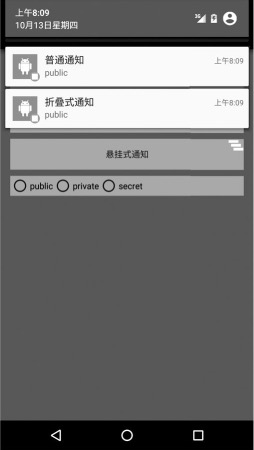
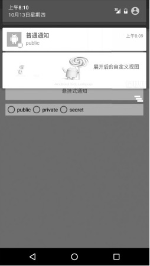
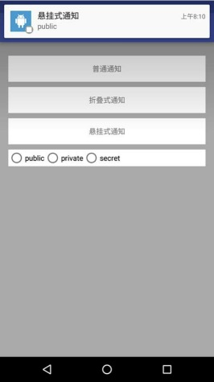
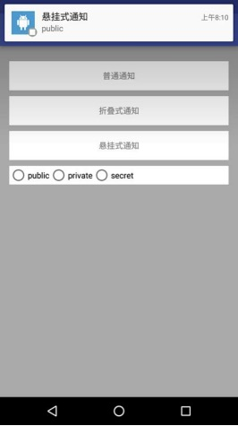

<center><font size="5"><b>3种Notification</b></font></center>

[toc]

####1. 普通Notification

首先创建 `Builder` 对象，用 `PendingIntent` 控制跳转，这里跳转到网页。

```Java
NotificationCompat.Builder builder = null;
if (Build.VERSION.SDK_INT >= Build.VERSION_CODES.O) {
    builder = new NotificationCompat.Builder(this, "110");
} else {
    builder = new NotificationCompat.Builder(this);
}
builder.setPriority(NotificationCompat.PRIORITY_DEFAULT);
Intent mIntent = new Intent(Intent.ACTION_VIEW, Uri.parse("http://blog.csdn.net/itachi85/"));
PendingIntent pendingIntent = PendingIntent.getActivity(this, 100, mIntent, 0);
```

有了 `builder`，我们就可以给 `Notification` 添加各种属性了：

```Java
builder.setContentIntent(pendingIntent);
builder.setSmallIcon(R.mipmap.ic_launcher);
builder.setLargeIcon(BitmapFactory.decodeResource(getResources(), R.mipmap.ic_launcher));
builder.setAutoCancel(true);
builder.setContentTitle("普通通知");
selectNotificationLevel(builder);
notificationManager.notify(new Random().nextInt(), builder.build());
```

显示效果如下：



#### 2. 折叠式Notification

折叠式 `Notification` 是一种自定义视图的 `Notification`，用来显示长文本和一些自定义的布局场景。它有两种状态：一种是普通状态下的视图（如果不是自定义的话，和上面普通 `Notification` 的视图样式一样），另一种是展开状态下的视图。和普通 `Notification` 不同的是，我们需要自定义视图，而这个视图显示的进程和我们创建视图的进程不在一个进程，所以我们需要使用 `RemoteViews`。首先要使用 `RemoteViews` 来创建我们的自定义视图。

```Java
//用RemoteViews来创建自定义Notification视图
RemoteViews remoteViews = new RemoteViews(getPackageName(), R.layout.view_fold);
```

视图的布局文件：

```XML
<?xml version="1.0" encoding="utf-8"?>
<LinearLayout xmlns:android="http://schemas.android.com/apk/res/android"
    android:orientation="horizontal"
    android:layout_width="match_parent"
    android:layout_height="100dp">

    <ImageView
        android:id="@+id/iv_image"
        android:layout_width="100dp"
        android:layout_height="100dp"
        android:src="@drawable/fold"/>

    <TextView
        android:id="@+id/tv_text"
        android:layout_width="wrap_content"
        android:layout_height="wrap_content"
        android:layout_marginTop="30dp"
        android:layout_marginLeft="150dp"
        android:text="展开后的自定义视图"
        android:textColor="@color/colorPrimaryDark" />

</LinearLayout>
```

然后，我们需要把自定义的视图赋值给 `Notification` 的视图，如下代码是把自定义视图复制给 `Notification` 展开时的视图：

```Java
// 指定展开时的视图
notification.bigContentView = remoteViews;
```

当然，我们也可以把自定义视图赋值给 `Notification` 普通状态时的视图，如下所示：

```Java
// 指定普通状态时的视图
notification.contentView = remoteViews;
```

其他的代码和普通 `Notification` 没什么区别，折叠式 `Notification` 的完整代码如下所示：

```Java
NotificationCompat.Builder builder = null;
if (Build.VERSION.SDK_INT >= Build.VERSION_CODES.O) {
    builder = new NotificationCompat.Builder(this, "110");
} else {
    builder = new NotificationCompat.Builder(this);
}
Intent mIntent = new Intent(Intent.ACTION_VIEW, Uri.parse("http://blog.csdn.net/itachi85/"));
PendingIntent pendingIntent = PendingIntent.getActivity(this, 0, mIntent, 0);
builder.setContentIntent(pendingIntent);
builder.setSmallIcon(R.drawable.foldleft);
builder.setLargeIcon(BitmapFactory.decodeResource(getResources(), R.mipmap.ic_launcher));
builder.setAutoCancel(true);
builder.setContentTitle("折叠式通知");
selectNotificationLevel(builder);
//用RemoteViews来创建自定义Notification视图
RemoteViews remoteViews = new RemoteViews(getPackageName(), R.layout.view_fold);
Notification notification = builder.build();
//指定展开时的视图
notification.bigContentView = remoteViews;
notificationManager.notify(new Random().nextInt(), notification);
```

效果显示如下：





####3. 悬挂式Notification

悬挂式 `Notification` 是 `Android 5.0` 新增加的方式。和前两种显示方式不同的是，前两种需要下拉通知栏才能看到通知；而悬挂式 `Notification` 不需要下拉通知栏就直接显示出来悬挂在屏幕上方，并且焦点不变，仍在用户操作的界面，因此不会大段用户的操作。和前两种 `Notification` 不同的是，它需要调用 `setFullScreenIntent` 来将 `Notification` 变为悬挂式 `Notification`。

```Java
NotificationCompat.Builder builder = null;
if (Build.VERSION.SDK_INT >= Build.VERSION_CODES.O) {
    builder = new NotificationCompat.Builder(this, "110");
} else {
    builder = new NotificationCompat.Builder(this);
}
builder.setPriority(NotificationCompat.PRIORITY_HIGH);
Intent mIntent = new Intent(Intent.ACTION_VIEW, Uri.parse("http://blog.csdn.net/itachi85/"));
PendingIntent pendingIntent = PendingIntent.getActivity(this, 102, mIntent, 0);
builder.setContentIntent(pendingIntent);
builder.setSmallIcon(R.mipmap.ic_launcher);
builder.setLargeIcon(BitmapFactory.decodeResource(getResources(), R.mipmap.ic_launcher));
builder.setAutoCancel(true);
builder.setContentTitle("悬挂式通知");
selectNotificationLevel(builder);
// 设置点击跳转
Intent hangIntent = new Intent();
hangIntent.setFlags(Intent.FLAG_ACTIVITY_NEW_TASK);
hangIntent.setClass(this, MyNotificationActivity.class);
// 如果描述的PendingIntent已经存在，则在产生新的Intent之前会先取消掉当前的
PendingIntent handPendingIntent = PendingIntent.getActivity(this, 103, hangIntent, 0);
builder.setFullScreenIntent(handPendingIntent, true);

notificationManager.notify(new Random().nextInt(), builder.build());
```

显示效果如下：



####4. Notification的显示等级

`Android 5.0` 加入了一种新的模式 `Notification` 的显示等级，共有以下3种。
+ **VISIBILITY_PUBLIC：**任何情况都会显示通知。
+ **VISIBILITY_PRIVATE：** 只有在没有锁屏时会显示通知。
+ **VISIBILITY_SECRET：**在 `pin`、`password` 等安全锁和没有锁屏的情况下才能够显示通知。



设置非常简单，只要调用 `setVisibility` 方法就可以了：

```Java
builder.setVisibility(Notification.VISIBILITY_PUBLIC);
```

我在这里写了一个方法来设置 `Notification` 等级，用 `radioGroup` 来演示 `Notification` 的各个显示等级，详情请参照源码。

```Java
private void selectNotificationLevel(NotificationCompat.Builder builder) {
    switch (radioGroup.getCheckedRadioButtonId()) {
        case R.id.rb_private:
            builder.setVisibility(NotificationCompat.VISIBILITY_PRIVATE);
            builder.setContentText("private");
            break;

        case R.id.rb_secret:
            builder.setVisibility(NotificationCompat.VISIBILITY_SECRET);
            builder.setContentText("secret");
            break;

        default:
            builder.setVisibility(NotificationCompat.VISIBILITY_PUBLIC);
            builder.setContentText("public");
            break;
    }
}
```

