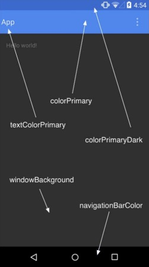
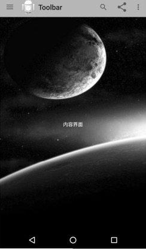
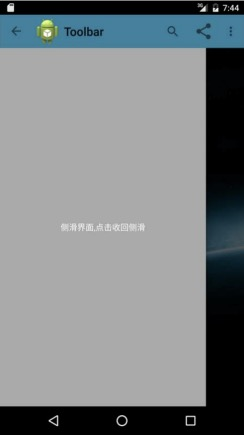

<center><font size="5"><b>Toolbar与Palette</b></font></center>

[toc]

####1. 引入Toolbar

在项目根目录下的 `gradle.properties`文件中添加如下代码：

```
APPCOMPAT_VERSION = 1.1.0
PALETTE_VERSION = 1.0.0
```

在 `app` 目录下的 `build.gradle` 文件中添加如下代码：

```
dependencies {
    ......
    implementation 'androidx.appcompat:appcompat:${APPCOMPAT_VERSION}'
    implementation 'androidx.palette:palette:${PALETTE_VERSION}'
}
```

接下来为了显示 `Toolbar` 控件，先要在 `style` 里把 `Actionbar` 去掉，如下所示：

```XML
<resources>
    <!-- Base application theme. -->
    <style name="AppTheme" parent="Theme.AppCompat.Light.NoActionBar">
        <!-- Customize your theme here. -->
        <item name="colorPrimary">@color/colorPrimary</item>
        <item name="colorPrimaryDark">@color/colorPrimaryDark</item>
        <item name="colorAccent">@color/colorAccent</item>
    </style>
</resources>
```

设置各个部分属性，如下图所示：



接着写一个 `mytoolbar.xml`，引入 `Toolbar` 控件。这么写的目的是方便多次调用，我们可以在其他布局中include引用此布局。

```XML
<?xml version="1.0" encoding="utf-8"?>
<androidx.appcompat.widget.Toolbar xmlns:android="http://schemas.android.com/apk/res/android"
    android:id="@+id/toolbar"
    android:layout_width="match_parent"
    android:layout_height="wrap_content"
    android:background="?attr/colorPrimary"
    android:minHeight="?attr/actionBarSize">

</androidx.appcompat.widget.Toolbar>
```

在主界面布局用include引用 `mytoolbar.xml` 中的 `Toolbar`，在主界面布局中我们用 `DrawerLayout` 来完成侧滑的效果。

```XML
<?xml version="1.0" encoding="utf-8"?>
<LinearLayout xmlns:android="http://schemas.android.com/apk/res/android"
    xmlns:tools="http://schemas.android.com/tools"
    android:orientation="vertical"
    android:layout_width="match_parent"
    android:layout_height="match_parent"
    tools:context=".ToolbarActivity">

    <include layout="@layout/mytoolbar" />

    <androidx.drawerlayout.widget.DrawerLayout
        android:id="@+id/id_drawerlayout"
        android:layout_width="match_parent"
        android:layout_height="match_parent">

        <!-- 内容界面-->
        <LinearLayout
            android:id="@+id/ll_content"
            android:layout_width="match_parent"
            android:layout_height="match_parent"
            android:orientation="vertical"
            android:background="@drawable/bitmap">

            <TextView
                android:layout_width="match_parent"
                android:layout_height="match_parent"
                android:layout_gravity="center"
                android:text="内容界面"
                android:textColor="@android:color/white" />

        </LinearLayout>

        <!-- 侧边菜单界面 -->
        <LinearLayout
            android:id="@+id/ll_tabs"
            android:layout_width="match_parent"
            android:layout_height="match_parent"
            android:background="@android:color/darker_gray"
            android:orientation="vertical"
            android:layout_gravity="start">

            <TextView
                android:id="@+id/tv_close"
                android:layout_width="match_parent"
                android:layout_height="match_parent"
                android:gravity="center"
                android:clickable="true"
                android:text="侧滑界面，点击收回侧滑"
                android:textColor="@android:color/white" />

        </LinearLayout>

    </androidx.drawerlayout.widget.DrawerLayout>
</LinearLayout>
```

接下来在 `Java` 代码找那个设定 `Toolbar`，代码如下所示：

```Java
@Override
protected void onCreate(Bundle savedInstanceState) {
    super.onCreate(savedInstanceState);
    setContentView(R.layout.activity_toolbar);
    initViews();
}

private void initViews() {
    tv_close = findViewById(R.id.tv_close);
    mToolbar = findViewById(R.id.toolbar);
    mToolbar.setTitle("Toolbar");

    setSupportActionBar(mToolbar);
    ......
}       
```

####2. 自定义Toolbar

当然，我们还可以设置 `Toolbar` 的标题和图标以及 `Menu Item` 等属性。`Menu Item` 的设置和 `Actionbar` 类似，我们在 `menu/main.xml` 中去声明，代码如下所示：

```XML
<?xml version="1.0" encoding="utf-8"?>
<menu xmlns:android="http://schemas.android.com/apk/res/android"
    xmlns:app="http://schemas.android.com/apk/res-auto"
    xmlns:tools="http://schemas.android.com/tools"
    tools:context=".ToolbarActivity">

    <item
        android:id="@+id/ab_search"
        android:orderInCategory="80"
        android:title="搜索"
        app:actionViewClass="androidx.appcompat.widget.SearchView"
        app:showAsAction="ifRoom" />

    <item
        android:id="@+id/action_share"
        android:orderInCategory="90"
        android:title="分享"
        app:showAsAction="ifRoom" />

    <item
        android:id="@+id/action_settings"
        android:orderInCategory="100"
        android:title="设置"
        app:showAsAction="never" />

</menu>
```

然后覆写 `onCreateOptionsMenu` 并在 `toolbar.setOnMenuItemClickListener`实现点击 `MenuItem` 的回调，代码如下所示：

```Java
@Override
public boolean onCreateOptionsMenu(Menu menu) {
    // Inflate the menu; this adds items to the action bar if it is present.
    getMenuInflater().inflate(R.menu.main, menu);
    return true;
}

private void initViews() {
    tv_close = findViewById(R.id.tv_close);
    mToolbar = findViewById(R.id.toolbar);
    mToolbar.setTitle("Toolbar");

    setSupportActionBar(mToolbar);
    // 是否给左上角图标的左边加上一个返回的图标
    getSupportActionBar().setDisplayHomeAsUpEnabled(true);
    getSupportActionBar().setLogo(R.drawable.ic_launcher);
    mToolbar.setOnMenuItemClickListener(new Toolbar.OnMenuItemClickListener() {
        @Override
        public boolean onMenuItemClick(MenuItem item) {
            switch (item.getItemId()) {
                case R.id.action_settings:
                    Toast.makeText(ToolbarActivity.this, "action_settings", Toast.LENGTH_LONG).show();
                    break;

                case R.id.action_share:
                    Toast.makeText(ToolbarActivity.this, "action_share", Toast.LENGTH_SHORT).show();
                    break;

                default:
                    break;
            }
            return true;
        }
    });
    ......
}
```

####3. 添加DrawerLayout实现侧滑

`DrawerLayout` 实现侧滑很简单，这里因为是介绍 `Toolbar` 的，所以就不实现稍微复杂的效果了。

```Java
// 设置侧或布局
mDrawerLayout = findViewById(R.id.id_drawerlayout);
mDrawerToggle = new ActionBarDrawerToggle(this, mDrawerLayout, mToolbar, R.string.drawer_open, R.string.drawer_close);
mDrawerToggle.syncState();
mDrawerToggle.setToolbarNavigationClickListener(new View.OnClickListener() {
    @Override
    public void onClick(View view) {
        mDrawerLayout.closeDrawer(Gravity.LEFT);
    }
});
```

显示效果如下：





####4. Palette的应用

这次 `Android 5.x` 用 `Palette` 来提取颜色，从而让主题能够动态适应当前界面的色调，做到整个App颜色的基调和谐统一。`Android`内置了几种提取色调的种类：

+ Vibrant （充满活力的）
+ Vibrant dark （充满活力的黑）
+ Vibrant light （充满活力的亮）
+ Muted （柔和的）
+ Muted （柔和的黑）
+ Muted light （柔和的亮）

实现提取颜色非常容易，只要将 `bitmap` 传递给 `Palette`，调用 `generate` 即可。在 `onGenerated` 回调中得到图片的色调，这里我们获取的是图片充满活力的色调，最后我们把 `Toolbar` 的背景设置为该图片的色调。

```Java
Bitmap bitmap = BitmapFactory.decodeResource(getResources(), R.drawable.bitmap);
Palette.from(bitmap).generate(new Palette.PaletteAsyncListener() {
    @Override
    public void onGenerated(@Nullable Palette palette) {
        Palette.Swatch swatch = palette.getVibrantSwatch();
        getSupportActionBar().setBackgroundDrawable(new ColorDrawable(swatch.getRgb()));
    }
});
```

