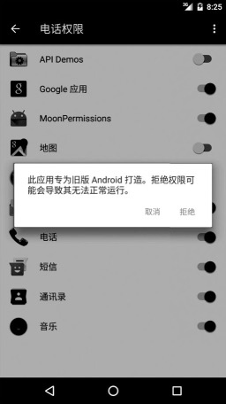
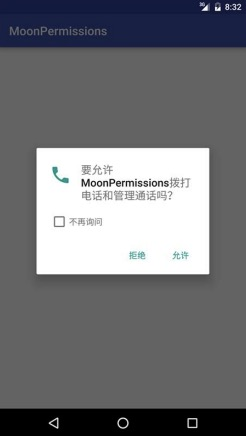
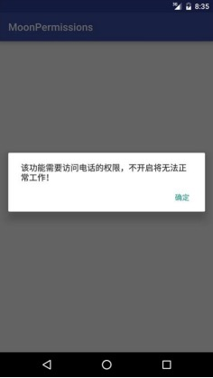

<center><font size="5"><b>Android 6.0 运行时权限机制</b></font></center>

[toc]

####1. Android6.0之前版本的应对之策

`Android 6.0` 系统默认为 `targetSdkVersion` 小于23的应用授予了所申请的所有权限，所以如果你以前的 `App` 设置的 `targetSdkVersion`低于23，在运行时也不会崩溃。为了验证这个问题，首先要在 `build.gradle` 中将 `targetSdkVersion` 设置为23以下。需要注意的是当前 `compileSdkVersion` 为23，也就是SDK版本为23，如下代码所示：

```
android {
    compileSdkVersion 23
    buildToolsVersion "23.0.3"
    
    defaultConfig {
        applicationId "com.example.liuwangshu.moonpermissions"
        minSdkVersion 15
        targetSdkVersion 22
        versionCode 1
        versionName "1.0"
    }
  
    buildTypes {
        release {
            minifyEnabled false
            proguardFiles getDefaultProguardFile('proguard-android.txt'), 'proguard-rules.pro')
        }
    }
}
```

接下来定义一个按钮，点击按钮时拨打电话。

```java
Intent intent = new Intent(Intent.ACTION_CALL);
Uri data = Uri.parse("tel:" + "10086");
intent.setData(data);
startActivity(intent);
```

运行程序会发现仍旧能打电话，这是我们意料之中的。接下来我们取消授予的电话权限，这是系统会弹出提示框，提醒我们拒绝此权限可能会导致其无法正常运行。我们点击 `拒绝`，仍要取消授予的电话权限。如下图所示：



我们接下来再点击按钮拨打电话时，则发现无法拨打该电话。这样用户体验显然不好。

#### 2. Normal Permissions 与 Dangerous Permission

Google将权限分为两类：一类是Normal Permissions，这类权限一般不涉及用户隐私，是无须用户进行授权的，比如手机震动、访问网络等，这些权限只需要在 `AndroidManifest.xml` 中简单声明就好，安装时就授权，无须每次使用时都检查权限，而且用户不能取消以上授权；另一类是Dangerous Permission，一般会涉及用户隐私，需要用户进行授权，比如读取sdcard、访问通信录等。

| 权限 |
| :- |
| android.permission.ACCESS_LOCATION_EXTRA_COMMANDS |
| android.permission.ACCESS_NETWORK_STATE |
| android.permission.ACCESS_NOTIFICATION_POLICY |
| android.permission.ACCESS_WIFI_STATE |
| android.permission.ACCESS_WIMAX_STATE |
| android.permission.BLUETOOTH |
| android.permission.BLUETOOTH_ADMIN |
| android.permission.BROADCAST_STICKY |
| android.permission.CHANGE_NETWORK_STATE |
| android.permission.CHANGE_WIFI_MULTICAST_STATE |
| android.permission.CHANGE_WIFI_STATE |
| android.permission.KILL_BACKGROUND_PROCESSES |
| android.permission.MODIFY_AUDIO_SETTINGS |
| android.permission.NFC |
| android.permission.READ_SYNC_SETTINGS |
| android.permission.READ_SYNC_STATS |
| android.permission.RECEIVE_BOOT_COMPLETED |
| android.permission.REORDER_TASKS |
| android.permission.REQUEST_INSTALL_PACKAGES |
| android.permission.SET_TIME_ZONE |
| android.permission.SET_WALLPAPER |
| android.permission.SET_WALLPAPER_HINTS |
| android.permission.TRANSMIT_IR |
| android.permission.USE_FINGERPRINT |
| android.permission.VIBRATE |
| android.permission.WAKE_LOCK |
| android.permission.WRITE_SYNC_SETTINGS |
| android.permission.SET_ALARM |
| android.permission.INSTALL_SHORTCUT |
| android.permission.UNINSTALL_SHORTCUT |

<center>表1-1 Normal Permissions</center>

Dangerous Permission则是以分组的形式给出的：

| Permission Group | Permissions |
| :-: | :-: |
| android.permission-group.CALENDAR | android.permission.READ_CALENDAR<br/>android.permission.WRITE_CALENDAR |
| android.permission-group.CAMERA | android.permission.CAMERA |
| android.permission-group.CONTACTS | android.permission.READ_CONTACTS<br/>android.permission.WRITE_CONTACTS<br/>android.permission.GET_ACCOUNTS |
| android.permission-group.LOCATION | android.permission.ACCESS_FINE_LOCATION<br/>android.permission.ACCESS_COARSE_LOCATION |
| android.permission-group.MICROPHONE | android.permission.RECORD_AUDIO |
| android.permission-group.PHONE |android.permission.READ_PHONE_STATE<br/>android.permission.CALL_PHONE<br/>android.permission.READ_CALL_LOG<br/>android.permission.WRITE_CALL_LOG<br/>android.android.voicemail.permission.ADD_VOICEMAIL<br/>android.permission.USE_SIP<br/>android.permission.PROCESS_OUTGOING_CALLS |
| android.permission-group.SENSORS | android.permission.body_sensors |
| android.permission-group.SMS | android.permission.SEND_SMS<br/>android.permission.RECEIVE_SMS<br/>android.permission.READ_SMS<br/>android.permission.RECEIVE_WAP_PUSH<br/>android.permission.RECEIVE_MMS<br/>android.permission.READ_CELL_BROADCASTS |
| android.permission-group.STORAGE | android.permission.READ_EXTERNAL_STORAGE<br/>android.permission.WRITE_EXTERNAL_STORAGE |

同一组的任何一个权限被授权了，其他权限也自动被授权。此外，对于申请时弹出的提示框上面的文本说明也是对整个权限组的说明，而不是单个权限的说明。

####3. 实现支持运行时权限

下面仍旧通过一个电话的例子来讲解如何支持运行时权限。首先我们要在 `build.gradle` 中将 `targetSdkVersion` 设置为23.

```
android {
    compileSdkVersion 23
    buildToolsVersion "23.0.3"
    
    defaultConfig {
        applicationId "com.example.liuwangshu.moonpermissions"
        minSdkVersion 15
        targetSdkVersion 23
        versionCode 1
        versionName "1.0"
    }
  
    buildTypes {
        release {
            minifyEnabled false
            proguardFiles getDefaultProguardFile('proguard-android.txt'), 'proguard-rules.pro')
        }
    }
}
```

接下来是Java代码：

```java
public class MainActivity extends AppCompatActivity {
    private Button bt_call;
    private static final int PERMISSIONS_REQUEST_CALL_PHONE = 1;
    
    @Override
    protected void onCreate(Bundle savedInstanceState) {
        super.onCreate(savedInstanceState);
        setContentView(R.layout.activity_main);
        bt_call = findViewById(R.id.bt_call);
        bt_call.setOnCallListener(new View.OnClickListener() {
            @Override
            public void onClick(View v) {
                call();
            }
        });
    }
    
    public void call() {
        // 检查App是否有permission.CALL_PHONE的权限
        if (ActivityCompat.checkSelfPermisson(this, Manifest.permission.CALL_PHONE) != PackageManager.PERMISSION_GRANTED) {
            // 如果没有permission.CALL_PHONE的权限，就申请该权限
            ActivityCompat.requestPermissions(this, new String[] {Manifest.permission.CALL_PHONE }, PERMISSIONS_REQUEST_CALL_PHONE);
        } else {
            callPhone();
        }
    }
    
    public void callPhone() {
        Intent intent = new Intent(Intent.ACTION_CALL);
        Uri data = Uri.parse("tel:" + "10086");
        intent.setData(data);
        try {
            startActivity(intent);
        } catch (SecurityException e) {
            e.printStackTrace();
        }
    }
    
    // 申请权限的回调
    @Override
    public void onRequestPermissionsResult(int requestCode, String[] permissions, int[] grantResults) {
        if (requestCode == PERDMISSIONS_REQUEST_CALL_PHONE) {
            if (grantResults[0] == PackageManager.PERMISSION_GRANTED) {
                callPhone();
            } else {
                Toast.makeText(MainActivity.this, "权限被拒绝", Toast.LENGTH_SHORT).show();
            }
            return;
        }
        super.onRequestPermissionsResult(requestCode, permissions, grantResults);
    }
}
```

需要注意的是在权限申请提示框中，如果我们点击 `拒绝`，则下一次还会弹出权限申请提示框，只不过这一次会多出一个选项，叫作 `不再询问` 。



如果我们勾选了该选项，则下一次就不会弹出权限申请提示框，而直接调用 `onRequestPermissionsResult`，回调结果为最后一次用户的选择，也就会弹出我们定义的Toast：“权限被拒绝”。

####4. 处理“不再询问”选项

这时候需要使用 `shouldShowRequestPermissionRationale` 方法，这个方法用来帮助开发者向用户解释权限的情况。如果用户选择了 `不再询问` 选项，则 `shouldShowRequestPermissionRationale` 方法会返回 `false`，这时候我们可以弹出 `AlertDialog` 来提醒用户允许访问该权限的重要性，代码如下：

```java
@Override
public void onRequestPermissionsResult(int requestCode, @NonNull String[] permissions, @NonNull int[] grantResults) {
    if (requestCode == PERMISSIONS_REQUEST_CALL_PHONE) {
        if (grantResults[0] == PackageManager.PERMISSION_GRANTED) {
            callPhone();
        } else {
            if (!ActivityCompat.shouldShowRequestPermissionRationale(this,
                    Manifest.permission.CALL_PHONE)) {
                AlertDialog dialog = new AlertDialog.Builder(this)
                        .setMessage("该功能需要访问电话权限，不开启将无法正常工作！")
                        .setPositiveButton("确定", new DialogInterface.OnClickListener() {
                            @Override
                            public void onClick(DialogInterface dialogInterface, int i) {
                            }
                        }).create();
                dialog.show();
            }
            return;
        }
        super.onRequestPermissionsResult(requestCode, permissions, grantResults);
    }
}
```

显示效果如下：



####6. PermissionsDipatcher框架的使用

##### 6.1 Github地址

<https://github.com/permissions-dispatcher/PermissionsDispatcher>

#####6.2 注解方法

> 注解方法不能是 `private` 

| Annotation            | Required | Description                                                  |
| --------------------- | -------- | ------------------------------------------------------------ |
| `@RuntimePermissions` | **✓**    | Register an `Activity` or `Fragment` to handle permissions   |
| `@NeedsPermission`    | **✓**    | Annotate a method which performs the action that requires one or more permissions |
| `@OnShowRationale`    |          | Annotate a method which explains why the permissions are needed. It passes in a `PermissionRequest` object which can be used to continue or abort the current permission request upon user input. If you don't specify any argument for the method compiler will generate `process${NeedsPermissionMethodName}ProcessRequest` and `cancel${NeedsPermissionMethodName}ProcessRequest`. You can use those methods in place of `PermissionRequest`(ex: with `DialogFragment`) |
| `@OnPermissionDenied` |          | Annotate a method which is invoked if the user doesn't grant the permissions |
| `@OnNeverAskAgain`    |          | Annotate a method which is invoked if the user chose to have the device "never ask again" about a permission |

#####6.3 配置build.gradle

在项目根目录中的 `gradle.properties` 文件中添加如下代码：

```
PERMISSIONSDISPATCHER_VERSION = 4.6.0
```

在 `app` 目录中的 `build.gradle` 文件中添加如下代码：

Java版本：

```
dependencies {
  implementation "org.permissionsdispatcher:permissionsdispatcher:${latest.version}"
  annotationProcessor "org.permissionsdispatcher:permissionsdispatcher-processor:${latest.version}"
}
```

Kotlin版本：

```
apply plugin: 'kotlin-kapt'

dependencies {
  implementation "org.permissionsdispatcher:permissionsdispatcher:${latest.version}"
  kapt "org.permissionsdispatcher:permissionsdispatcher-processor:${latest.version}"
}
```

可以使用 [JFrog's snapshots repository](https://oss.jfrog.org/oss-snapshot-local/) 替代google maven。具体在项目的 `build.gradle` 文件中添加如下代码：

```
repositories {
  jcenter()
  maven { url 'http://oss.jfrog.org/artifactory/oss-snapshot-local/' }
}
```

##### 6.4 在Activity类上添加@RuntimePermissions注解

```java
@RuntimePermissions
public class ThirdPartyActivity extends AppCompatActivity {
```

#####6.5 在需要权限的方法上添加@NeedsPermission注解

```java
@NeedsPermission(Manifest.permission.CALL_PHONE)
// 在需要获取权限的地方注释
void call() {
    Log.d(ThirdPartyActivity.class.getSimpleName(), "call....");
    Intent intent = new Intent(Intent.ACTION_CALL);
    Uri data = Uri.parse("tel:" + "10010");
    intent.setData(data);
    try {
        startActivity(intent);
    } catch (SecurityException e) {
        Log.e(ThirdPartyActivity.class.getSimpleName(), "call error: " + e);
    }
}
```

##### 6.6 自定义权限申请提示框内容

```java
@OnShowRationale(Manifest.permission.CALL_PHONE)
// 提示用户为何要开启此权限
void showWhy(final PermissionRequest request) {
    Log.d(ThirdPartyActivity.class.getSimpleName(), "showWhy....");
    new AlertDialog.Builder(this)
            .setMessage("提示用户为何要开启此权限")
            .setPositiveButton("知道了", new DialogInterface.OnClickListener() {
                @Override
                public void onClick(DialogInterface dialogInterface, int i) {
                    request.proceed();  // 再次执行权限请求
                }
            }).show();
}
```

##### 6.7 用户拒绝后的回调方法添加@OnPermissionDenied注解

```java
@OnPermissionDenied(Manifest.permission.CALL_PHONE)
// 用户选择拒绝时的提示
void showDenied() {
    Log.d(ThirdPartyActivity.class.getSimpleName(), "showDenied....");
    Toast.makeText(this, "用户选择拒绝时的提示", Toast.LENGTH_SHORT).show();
}
```

##### 6.8 用户选择不再询问后的回调方法添加@OnNeverAskAgain注解

```java
@OnNeverAskAgain(Manifest.permission.CALL_PHONE)
// 用户选择不再询问后的提示
void showNotAsk() {
    Log.d(ThirdPartyActivity.class.getSimpleName(), "showNotAsk....");
    new AlertDialog.Builder(this)
            .setMessage("该功能需要访问电话的权限，不开启将无法正常工作！")
            .setPositiveButton("确定", new DialogInterface.OnClickListener() {
                @Override
                public void onClick(DialogInterface dialogInterface, int i) {

                }
            }).show();
}
```

##### 6.9 在申请权限结果回调方法中添加如下代码

```java
@Override
public void onRequestPermissionsResult(int requestCode, @NonNull String[] permissions, @NonNull int[] grantResults) {
    super.onRequestPermissionsResult(requestCode, permissions, grantResults);
    ThirdPartyActivityPermissionsDispatcher.onRequestPermissionsResult(this, requestCode, grantResults);
}
```

其中 `ThirdPartyActivityPermissionsDispatcher`是在编译时自动生成的。

##### 6.10 调用需要申请权限的方法

```java
bt_call.setOnClickListener(new View.OnClickListener() {
    @Override
    public void onClick(View view) {
        ThirdPartyActivityPermissionsDispatcher.callWithPermissionCheck(ThirdPartyActivity.this);
    }
});
```

其中 `callWithPermissionCheck` 方法也是编译时自动生成的。

#####6.11 完整代码如下：

```java
import androidx.annotation.NonNull;
import androidx.appcompat.app.AlertDialog;
import androidx.appcompat.app.AppCompatActivity;

import android.Manifest;
import android.content.DialogInterface;
import android.content.Intent;
import android.net.Uri;
import android.os.Bundle;
import android.util.Log;
import android.view.View;
import android.widget.Button;
import android.widget.Toast;

import permissions.dispatcher.NeedsPermission;
import permissions.dispatcher.OnNeverAskAgain;
import permissions.dispatcher.OnPermissionDenied;
import permissions.dispatcher.OnShowRationale;
import permissions.dispatcher.PermissionRequest;
import permissions.dispatcher.RuntimePermissions;

@RuntimePermissions
public class ThirdPartyActivity extends AppCompatActivity {

    private Button bt_call;

    @Override
    protected void onCreate(Bundle savedInstanceState) {
        super.onCreate(savedInstanceState);
        setContentView(R.layout.activity_third_party);
        bt_call = (Button) findViewById(R.id.bt_call);
        bt_call.setOnClickListener(new View.OnClickListener() {
            @Override
            public void onClick(View view) {
                ThirdPartyActivityPermissionsDispatcher.callWithPermissionCheck(ThirdPartyActivity.this);
            }
        });
    }

    @NeedsPermission(Manifest.permission.CALL_PHONE)
    // 在需要获取权限的地方注释
    void call() {
        Log.d(ThirdPartyActivity.class.getSimpleName(), "call....");
        Intent intent = new Intent(Intent.ACTION_CALL);
        Uri data = Uri.parse("tel:" + "10010");
        intent.setData(data);
        try {
            startActivity(intent);
        } catch (SecurityException e) {
            Log.e(ThirdPartyActivity.class.getSimpleName(), "call error: " + e);
        }
    }

    @OnShowRationale(Manifest.permission.CALL_PHONE)
    // 提示用户为何要开启此权限
    void showWhy(final PermissionRequest request) {
        Log.d(ThirdPartyActivity.class.getSimpleName(), "showWhy....");
        new AlertDialog.Builder(this)
                .setMessage("提示用户为何要开启此权限")
                .setPositiveButton("知道了", new DialogInterface.OnClickListener() {
                    @Override
                    public void onClick(DialogInterface dialogInterface, int i) {
                        request.proceed();  // 再次执行权限请求
                    }
                }).show();
    }

    @OnPermissionDenied(Manifest.permission.CALL_PHONE)
    // 用户选择拒绝时的提示
    void showDenied() {
        Log.d(ThirdPartyActivity.class.getSimpleName(), "showDenied....");
        Toast.makeText(this, "用户选择拒绝时的提示", Toast.LENGTH_SHORT).show();
    }

    @OnNeverAskAgain(Manifest.permission.CALL_PHONE)
    // 用户选择不再询问后的提示
    void showNotAsk() {
        Log.d(ThirdPartyActivity.class.getSimpleName(), "showNotAsk....");
        new AlertDialog.Builder(this)
                .setMessage("该功能需要访问电话的权限，不开启将无法正常工作！")
                .setPositiveButton("确定", new DialogInterface.OnClickListener() {
                    @Override
                    public void onClick(DialogInterface dialogInterface, int i) {

                    }
                }).show();
    }

    @Override
    public void onRequestPermissionsResult(int requestCode, @NonNull String[] permissions, @NonNull int[] grantResults) {
        super.onRequestPermissionsResult(requestCode, permissions, grantResults);
        ThirdPartyActivityPermissionsDispatcher.onRequestPermissionsResult(this, requestCode, grantResults);
    }
}
```

