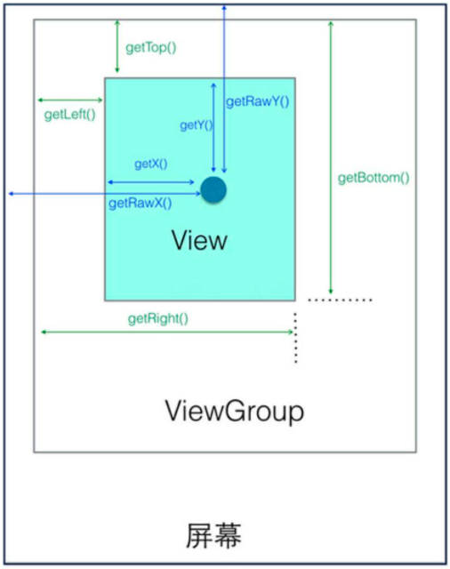

<center><b>View 坐标系</b></center>

### 1. View 获取自身的宽和高

```java
width = getRight() - getLeft();
height = getBottom() - getTop();
```

View 源码中的 getHeight() 方法和 getWidth() 方法如下所示：

```java
public final int getHeight() {
    return mBottom - mTop;
}

public final int getWidth() {
    return mRight - mLeft;
}
```

### 2. View 自身的坐标

+ getTop()：获取 View 自身顶边到其父布局顶边的距离。
+ getLeft()：获取 View 自身左边到其父布局左边的距离。
+ getRight()：获取 view 自身右边到其父布局左边的距离。
+ getBottom()：获取 View 自身底边到其父布局顶边的距离。

### 3. MotionEvent 提供的方法

+ getX()：获取点击事件距离控件左边的距离，即视图坐标。
+ getY()：获取点击事件距离控件顶边的距离，即视图坐标。
+ getRawX()：获取点击事件距离整个屏幕左边的距离，即绝对坐标。
+ getRawY()：获取点击事件距离整个屏幕顶边的距离，即绝对坐标。

