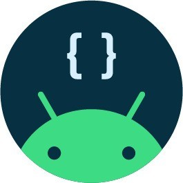
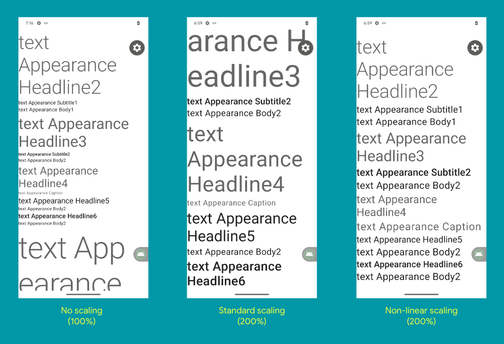
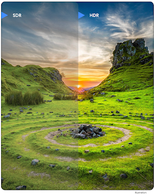
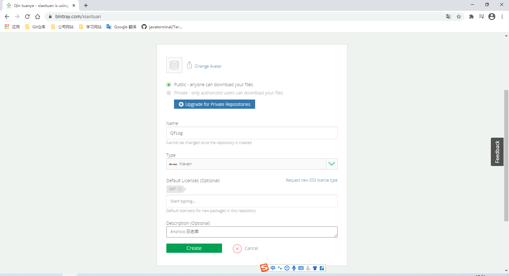
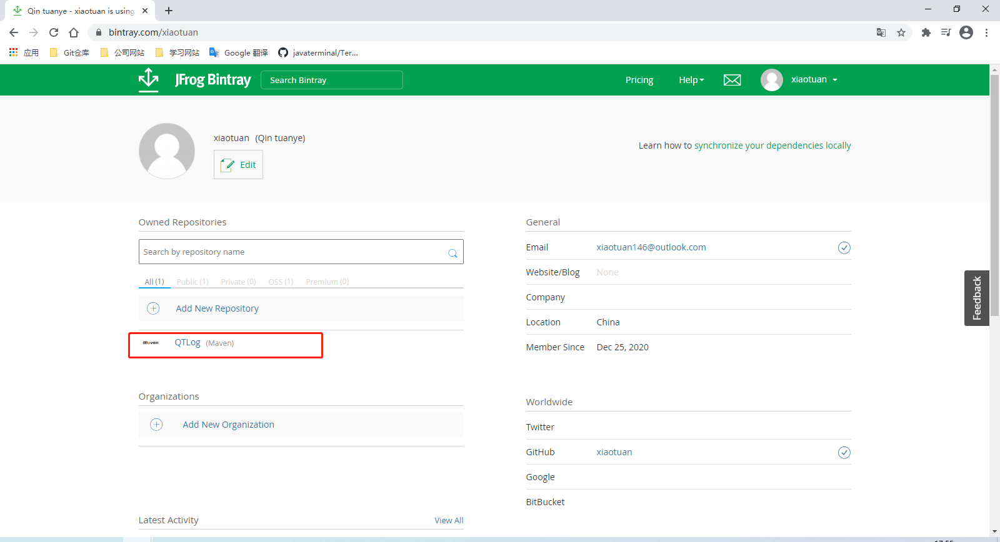
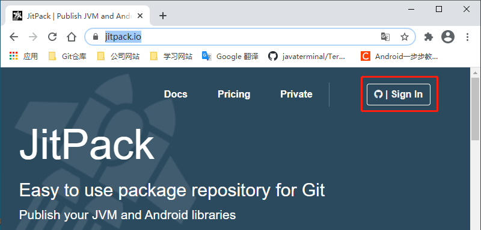
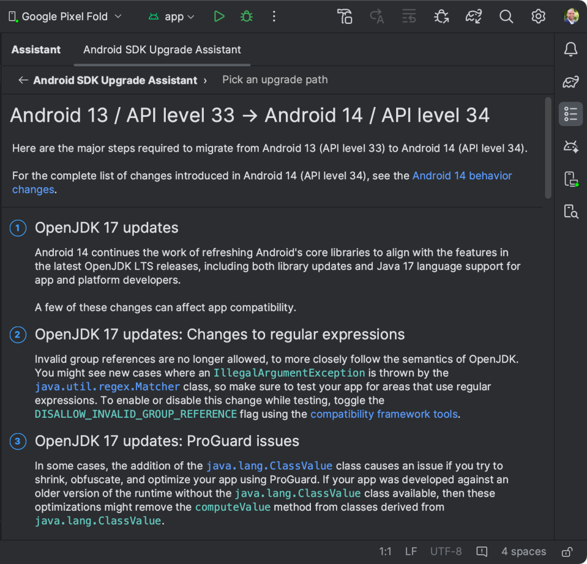

以下文章来源于Android 开发者 ，作者Android

**Android 开发者**.

Android 官方账号。汇集 Android, Kotlin, Jetpack Compose, Jetpack, Android Studio 等开发技术，以及 Google Play 平台出海及政策相关内容。为您带来更及时的资讯动态。

*作者 / Dave Burke, VP of Engineering*

我们正式发布 Android 14，并将其源代码推送至 Android 开源项目 (AOSP)。Android 14 旨在提高开发者的生产力，同时为用户带来更好的性能、隐私、安全和定制功能。

- Android 14

  https://developer.android.google.cn/about/versions/14

- Android 开源项目

  https://source.android.google.cn/

Android 14 自即日起会推送至指定的 Pixel 设备，并将于今年晚些时候出现在更多您喜爱的设备上，包括三星 Galaxy、iQOO、Nothing、一加、OPPO、真我、夏普、索尼、TECNO、vivo、小米等。

大家在 Android 14 开发者预览和 Beta 测试阶段和我们分享了诸多宝贵的反馈和意见，并付诸努力确保您的应用在 Android 14 上提供出色的体验，我们在这里再次向大家表示衷心的感谢。为数十亿 Android 用户打造出优秀的 Android 平台，这包含了我们、Android 硬件制造商以及开发者社区里每一位成员的努力。

Android 14 带来的更新内容众多，本文会着重介绍对开发者影响最大的部分。请您务必前往 Android 14 开发者网站了解所有新功能的详细信息: 

https://developer.android.google.cn/about/versions/14

**性能和效率**

Android 14 聚焦的重点领域之一就是为平台带来更好的性能和效率表现。

**冻结缓存应用**

在 Android 14 之前，缓存的应用可以基本不受限制地运行。在 Android 14 中，我们会在应用进入缓存后很短的时间内将其冻结，其 CPU 时间降为零。在 Android 14 Beta 上，我们发现缓存进程消耗的 CPU 周期要比 Android 13 正式版设备上少 50%。因此，常规的 Android 应用生命周期 API (如前台服务、JobScheduler 或 WorkManager) 之外的后台工作将被禁止。

- 进程和应用生命周期

  https://developer.android.google.cn/guide/components/activities/process-lifecycle

**广播优化**

为了让被冻结的应用更长时间保持冻结状态 (比如不会获得 CPU 时间)，我们调整了应用进入缓存状态后对上下文注册的广播的接收方式: 这些广播也许会被加入队列，一些重复的广播，如 BATTERY_CHANGED，可能会被合并为一个最终广播。

- 进程和应用生命周期

  https://developer.android.google.cn/guide/components/activities/process-lifecycle

- 上下文注册的接收器

  https://developer.android.google.cn/guide/components/broadcasts#context-registered-receivers

- BATTERY_CHANGED

  https://developer.android.google.cn/reference/android/content/Intent#ACTION_BATTERY_CHANGED

**更快的应用启动速度**

随着 Android 14 对缓存应用和广播优化措施一并到来的，是我们得以打破平台缓存应用数量的长期限制，减少了冷启动应用的情况，而且设备 RAM 越大改善就越明显。在 8GB RAM 的设备上，Beta 测试组的冷启动应用减少了 20%，而在 12GB RAM 的设备上则减少了 30%。与热启动相比，冷启动速度较慢，而且耗电量更大。这项工作有效地改善了电量消耗和整体应用启动时间。

**减少内存足迹**

改进 Android 运行时 (Android Runtime, ART) 对 Android 用户体验影响巨大。代码大小是我们关注的关键指标之一: 生成的文件越小，对内存 (包括 RAM 和存储空间) 的占用就越小。在 Android 14 中，ART 可将代码尺寸平均减小 9.3% 且不影响性能。

**定制化**

定制化体验是 Android 的核心基因，我们将继续保障 Android 14 用户围绕其个人需求的定制化体验，为此我们进一步改进了无障碍和国际化功能。

**非线性字体放大** - 从 Android 14 开始，用户可以将字体放大到 200%。此前，Pixel 设备上的字体最多能放大至 130%。系统会采用非线性的放大曲线，让屏幕上大文本元素的放大速度和小文本元素速度不同，从而防止大文本元素被过分放大。请访问官方文档了解详细信息: 

http://developer.android.google.cn/about/versions/14/features#non-linear-font-scaling

△ (左) 100% 字体尺寸 (中) 线性放大至 200% (右) 非线性放大至 200%

**各应用语言偏好设定** - 您可以使用 LocaleManager.setOverrideLocaleConfig 动态更新应用的 localeConfig，以自行定义在 Android 设置页面中各个应用语言列表中的语言清单。IME 现在可以使用 LocaleManager.getApplicationLocales 获取当前应用的界面语言，从而更新键盘语言。从 Android Studio Giraffe 和 AGP 8.1 开始，您可以对应用进行配置，让其自动支持 Android 13 各应用语言偏好设定。

- LocaleManager.setOverrideLocaleConfig

  https://developer.android.google.cn/reference/android/app/LocaleManager?hl=en#setOverrideLocale

- LocaleManager.getApplicationLocales

  https://developer.android.google.cn/reference/android/app/LocaleManager#getApplicationLocales()

- 启用各应用自动设定语言支持

  https://developer.android.google.cn/guide/topics/resources/app-languages#auto-localeconfig

- 各应用语言偏好设定

  https://developer.android.google.cn/guide/topics/resources/app-languages

**地区偏好设置** - 地区偏好设置可让用户定制温度单位、每周的第一天和计数系统:

https://developer.android.google.cn/reference/androidx/core/text/util/LocalePreferences

**语法变化** - 语法变化 (Grammatical Infection) API 可以让开发者更轻松地为需要使用语法性别的用户提供支持。开发者只需为相应的语言添加性别变位译文，并使用这个 API，即可为不同用户展示定制化的译文: 

https://developer.android.google.cn/reference/androidx/core/text/util/LocalePreferences

**新的媒体功能**

**超强 HDR (Ultra HDR) 图片** - Android 14 现在支持 10 位高动态范围 (HDR) 图像以及超强 HDR 图像格式。该格式完全向后兼容 JPEG，应用可以无缝使用 HDR 图像，并根据需要使用标准动态范围来呈现它们。

- 超强 HDR 图像格式

  https://developer.android.google.cn/guide/topics/media/hdr-image-format

**相机扩展中的缩放、对焦、后视等功能** - Android 14 升级和改进了相机扩展功能，让应用支持更长的处理时间，通过计算密集型算法改善成像品质，比如在支持的设备上使用微光拍摄: 

https://developer.android.google.cn/training/camera/camera-extensions

**无损 USB 音频** - Android 14 设备支持无损音频格式，让您可以通过 USB 有线耳机获得发烧级的音频体验:

https://developer.android.google.cn/reference/android/media/AudioMixerAttributes

**新的图形功能**

**带有顶点和片段着色器的自定义网格** - Android 14 新增了对自定义网格的支持，这些网格可以被定义为三角形或三角形带，还能根据需要支持索引。这些网格使用 AGSL 编写，包含自定义属性、顶点跨度、varying 变量和顶点/片段着色器。

- 自定义网格

  https://developer.android.google.cn/reference/kotlin/android/graphics/Mesh

- 三角形

  https://developer.android.google.cn/reference/kotlin/android/graphics/Mesh?#TRIANGLES:kotlin.Int

- 三角形带

  https://developer.android.google.cn/reference/kotlin/android/graphics/Mesh?#triangle_strip

- AGSL

  https://developer.android.google.cn/develop/ui/views/graphics/agsl

- 网格定义

  https://developer.android.google.cn/reference/kotlin/android/graphics/MeshSpecification

- 属性

  https://developer.android.google.cn/reference/kotlin/android/graphics/MeshSpecification.Attribute

- Varying

  https://developer.android.google.cn/reference/kotlin/android/graphics/MeshSpecification.Varying

**Canvas 硬件缓冲渲染器** - Android 14 引入了 HardwareBufferRenderer，让 Android 的 Canvas API 在 HardwareBuffer 中绘制时得以使用硬件加速功能。当您的用例涉及到通过 SurfaceControl 与系统合成器通信以实现低延迟绘制时，此功能会特别有用。

- HardwareBufferRenderer

  https://developer.android.google.cn/reference/android/graphics/HardwareBufferRenderer

- Canvas

  https://developer.android.google.cn/reference/android/graphics/Canvas

- HardwareBuffer

  https://developer.android.google.cn/reference/android/hardware/HardwareBuffer

- SurfaceControl

  https://developer.android.google.cn/reference/android/view/SurfaceControl

**跨设备以及多尺寸屏幕开发**

Android 14 在 Android 12L 和 13 的基础上，继续对平板电脑和可折叠设备带来良好的支持: 比如让任务栏更好地支持多任务、发布针对大屏幕优化的系统应用和通知界面、Activity 嵌入，改进了信箱模式和媒体投屏等。您可以查阅我们的大屏设备应用质量指南，以及有关为大屏和可折叠设备构建应用的其他参考资料，帮助您在所有尺寸的 Android 设备上优化应用。我们还在大屏设计参考图库中为您准备了包括社交和通信、多媒体、生产力、购物和阅读等常见应用的设计参考。

- 大屏设备应用质量

  https://developer.android.google.cn/docs/quality-guidelines/tablet-app-quality

- 大屏幕使用入门

  https://developer.android.google.cn/guide/topics/large-screens/get-started-with-large-screens

- 为可折叠设备构建应用

  https://developer.android.google.cn/guide/topics/ui/foldables

- 大屏设备设计参考图库

  https://developer.android.google.cn/large-screens/gallery

- 设计参考: 社交和通信

  https://developer.android.google.cn/large-screens/gallery/social

- 设计参考: 多媒体

  https://developer.android.google.cn/large-screens/gallery/media

- 设计参考: 生产力

  https://developer.android.google.cn/large-screens/gallery/productivity

- 设计参考: 购物

  https://developer.android.google.cn/large-screens/gallery/shopping

- 设计参考: 阅读

  https://developer.android.google.cn/large-screens/gallery/reading

**提升生产力**

Android 14 中的许多更新会让您的开发体验更一致、更有趣，也更高效。这些更新中的许多内容也会通过 Google Play 系统更新、Jetpack 开发库和 Google Play 服务在之前的平台版本上提供，便于您覆盖更多的用户。

- Google Play 系统更新

  https://support.google.com/product-documentation/answer/11462338

- Jetpack 开发库

  https://developer.android.google.cn/jetpack/androidx/explorer

- Google Play 服务

  https://developer.android.google.cn/google/play-services/index.html

**OpenJDK 17 支持** - 借助 Google Play 系统更新 (Project Mainline)，超过 6 亿台设备得以收到随 Android 14 一同发布的最新 Android Runtime (ART) 更新。请阅读我们的博客文章了解详细信息: 

https://android-developers.googleblog.com/2023/08/latest-artwork-on-hundreds-of-millions-of-devices.html

- Google Play 系统更新

  https://android-developers.googleblog.com/2019/05/fresher-os-with-projects-treble-and-mainline.html

**凭据管理器和通行密钥** - 凭据管理器是新的 Jetpack API，它可通过单一 API 支持多种登录方法，如用户名和密码、通行密钥 (Passkey) 和联合登录解决方案 (如使用 Google 账号登录)，从而帮助开发者简化集成过程。凭据管理器可以通过 Google Play 服务一直向下支持到 Android 4.4 (API 级别 19)。请阅读我们的博客文章了解详细信息: 

https://android-developers.googleblog.com/2023/07/credential-manager-beta-easy-secure-authentication-with-passkeys-on-android.html

- 使用凭据管理器让用户登录

  https://developer.android.google.cn/training/sign-in/passkeys

- 使用通行密钥对用户进行身份验证https://developer.android.google.cn/design/ui/mobile/guides/patterns/passkeys

**Health Connect** - Health Connect 是一个由用户控制的，用于存放用户健康和健身数据的设备端内容库，它让实现跨应用和跨设备的集成健康和健身体验变得前所未有的简单。Health Connect 是 Android 平台的一部分，通过 Google Play 系统更新进行升级，无需单独下载。在更早的设备上则以应用的形式提供，可通过 Google Play 商店下载。请参阅《[Android Health 最新动态](https://mp.weixin.qq.com/s?__biz=Mzk0NDIwMTExNw==&mid=2247549735&idx=1&sn=0d091284293bc315e7147a5101bfc01e&scene=21#wechat_redirect)》了解 Health Connect 的更多信息。

- Health Connect

  https://developer.android.google.cn/health-connect

**更强大的系统 Sharesheet** - Android 14 的系统 Sharesheet 可添加自定义动作，并改进了共享目标的排名机制，让您的应用可以轻松为用户提供丰富、一致的共享体验。

- 提高直接共享目标的排名

  https://developer.android.google.cn/about/versions/14/features#publish-dynamic-shortcuts

**更一致、更可靠的前台服务** - 我们与三星等硬件制造商合作，打造更一致的开发者体验和更可靠的用户体验。为此，Android 14 更新了声明前台服务类型和请求特定类型权限的要求。Google Play 也推出了新政策，以确保开发者合理使用这些 API。我们还新增了用户发起的数据传输作业类型，可以为 JobScheduler 设置约束条件，从而简化用户发起的大型上传和下载的管理 (如设置网络约束条件，仅允许通过未计量的 Wi-Fi 进行下载)。

- 提升 Android 后台工作稳定性

  https://android-developers.googleblog.com/2023/05/improving-consistency-of-background-work-on-android.html

- 前台服务类型是必填项

  https://developer.android.google.cn/about/versions/14/changes/fgs-types-required

- 设备和网络滥用

  https://support.google.com/googleplay/android-developer/answer/13315670

- 将前台服务迁移到用户发起的数据传输作业

  https://developer.android.google.cn/about/versions/14/changes/user-initiated-data-transfers

- setRequiredNetworkType

  https://developer.android.google.cn/reference/android/app/job/JobInfo.Builder#setRequiredNetworkType%28int%29

**用户体验**

**预测性返回** - 继 Android 13 引入 "返回主屏幕" 动画后，Android 14 引入了新的跨 Activity 和跨任务的预测性返回 (Predictive Back) 系统动画。该系统动画目前仍可在开发者选项中手动启用，以便留出时间进行更多打磨，并让更多应用选择对预测性返回进行适配。Material 和 Jetpack 库目前已提供预测性返回动画供大家使用。

- 测试预测性返回手势动画

  https://developer.android.google.cn/guide/navigation/custom-back/predictive-back-gesture#dev-option

- 添加对内置和自定义预测性返回动画的支持

  https://developer.android.google.cn/about/versions/14/features/predictive-back

**隐私和安全**

**数据分享更新** - 用户将在位置信息的运行时授权对话框中看到一块新的描述，用于突出显示应用与第三方共享位置数据的情况，用户可以了解更多信息并控制应用对数据的访问。

**对照片和视频授予部分访问权限** - 在 Android 14 (API 级别 34) 中，当应用请求 Android 13 (API 级别 33) 中引入的任何视觉媒体权限 (READ_MEDIA_IMAGES 或 READ_MEDIA_VIDEO) 时，用户可以授予对其照片和视频的部分访问权限。我们建议您在应用中采用最新的最佳实践方案来适配此项变更。

- READ_MEDIA_IMAGES

  https://developer.android.google.cn/reference/android/Manifest.permission#READ_MEDIA_IMAGES

- READ_MEDIA_VIDEO

  https://developer.android.google.cn/reference/android/Manifest.permission#READ_MEDIA_VIDEO

- 选择合适的存储体验

  https://android-developers.googleblog.com/2023/08/choosing-right-storage-experience.html

**后台启动 Activity** - Android 10 (API 级别 29) 及以上版本对在后台运行的应用启动 Activity 的时机施加了限制。为进一步减少中断用户体验的情况，以 Android 14 为目标平台的应用在发送 PendingIntent 或绑定服务时，需要授予启动特权才能在后台启动 Activity。

- Android 10

  https://developer.android.google.cn/about/versions/10

- Activity

  https://developer.android.google.cn/guide/components/activities/intro-activities

- 从后台启动 Activity 的限制

  https://developer.android.google.cn/guide/components/activities/background-starts

- 针对从后台启动 Activity 的其他限制

  https://developer.android.google.cn/about/versions/14/behavior-changes-14#background-activity-restrictions

**阻止安装使用旧版 SDK 的应用** - 为防止恶意软件利用旧版 API 绕过最新的安全和隐私保护措施，从 Android 14 开始，targetSdkVersion 低于 23 的应用将无法安装。

- targetSdkVersion

  https://developer.android.google.cn/guide/topics/manifest/uses-sdk-element

**运行时接收器** - 以 Android 14 为目标平台的应用必须说明动态 Context.registerReceiver() 的使用是否应被视为 "导出" 或 "未导出"。这是以前版本中清单级工作的延续，请访问官方文档了解详细信息: 

https://developer.android.google.cn/about/versions/14/behavior-changes-14#runtime-receivers-exported

- Context.registerReceiver()

  https://developer.android.google.cn/reference/android/content/Context#registerReceiver(android.content.BroadcastReceiver,%20android.content.IntentFilter,%20int)

**安全的全屏 Intent 通知** - 由于全屏 Intent 通知是专为需要用户立即关注的极高优先级通知而设计的，因此 Android 14 将只允许提供通话和闹钟功能的应用在安装时获取该权限。您的应用可以启动设置页面让用户完成授权。

**更安全的动态代码加载** - 以 Android 14 为目标平台的应用动态加载的文件需要标记为只读。请访问官方文档了解详细信息: 

https://developer.android.google.cn/about/versions/14/behavior-changes-14#safer-dynamic-code-loading

**更安全的隐式 Intent** - 以 Android 14 为目标平台的应用在使用隐式 Intent 创建可变的 PendingIntent 时将抛出一个异常，以防它们被用来触发意外的代码路径。应用在使用 PendingIntent 时需要确保其不可变，或使用显式 Intent。请访问官方文档了解详细信息: 

https://developer.android.google.cn/about/versions/14/behavior-changes-14#safer-intents

- PendingIntent

  https://developer.android.google.cn/reference/android/app/PendingIntent

**应用兼容性**

在发布新的平台版本时，我们会优先考虑应用的兼容性，以让更新过程更快、更顺畅。在 Android 14 中，大多数面向应用的变更依然是可选的，这样能为大家提供更多的时间进行调整和适配，直到您将应用的 targetSdkVersion 升级为 34。我们还更新了工具和流程，帮助大家更快地做好准备。

**更轻松地针对变更进行测试和调试** - 为了让您更轻松地测试可能会影响应用的可选变更，我们今年依然为许多变更提供了开关选项。您可以在开发者选项或 adb 中单独强制启用或停用这些变更。请访问官方文档了解详细信息: 

https://developer.android.google.cn/about/versions/14/reference/compat-framework-changes

△ 开发者选项中的应用兼容性开关

**应用、开发库、工具**

**和游戏引擎:** **请就绪！**

为确保您的用户们获得流畅的使用体验，请尽快完成**最终兼容性测试**并**发布必要的更新**，现在是时候了！

如果您是 **SDK、开发库、工具和游戏引擎**的开发者，现在发布必要的更新则尤为重要: 您的更新能让下游的应用和游戏开发者免遭兼容性问题困扰，并能及时引入最新的 SDK 功能特性。因此，请务必在发布了 Android 14 所必需的兼容性更新后，及时告知您的下游开发者们。

只需在运行 Android 14 的设备上，通过 Google Play 或其他来源安装您的正式版应用即可开始测试。请测试应用的所有流程，找出功能或用户界面中暴露的问题。请通过行为变更清单 (针对所有应用) 来确定测试重点:

https://developer.android.google.cn/about/versions/14/behavior-changes-all

随着 Android 每个版本的发布，我们都会对平台进行整体的改进，以强化隐私和安全，并优化整个操作系统的用户体验，这些都可能会影响到您的应用。以下是一些需要重点测试的变更: 

- **授予对照片和视频的部分访问权限** - 在 Android 14 中，当应用请求 Android 13 (API 级别 33) 中引入的任何视觉媒体权限 (READ_MEDIA_IMAGES 或 READ_MEDIA_VIDEO) 时，用户可以授予对其照片和视频的部分访问权限。如果您的应用已经在使用照片选择器，则无需额外操作即可适配此项变更，否则请使用新的 READ_MEDIA_VISUAL_USER_SELECTED 权限来优化这部分的用户体验。请访问官方文档了解详细信息: 

  https://developer.android.google.cn/about/versions/14/behavior-changes-all#partial-photo-video-access

- READ_MEDIA_IMAGES

  https://developer.android.google.cn/reference/android/Manifest.permission#READ_MEDIA_IMAGES

- READ_MEDIA_VIDEO

  https://developer.android.google.cn/reference/android/Manifest.permission#READ_MEDIA_VIDEO

- 照片选择器

  https://developer.android.google.cn/training/data-storage/shared/photopicker

- READ_MEDIA_VISUAL_USER_SELECTED

  https://developer.android.google.cn/reference/android/Manifest.permission#READ_MEDIA_VISUAL_USER_SELECTED

- 选择合适的存储体验

  https://android-developers.googleblog.com/2023/08/choosing-right-storage-experience.html

- **安全的全屏 Intent 通知** - 从 Android 14 开始，能使用全屏 Intent 通知的应用将仅限于提供通话和闹钟的应用。对于不适合此情况的任何应用，Google Play 商店会撤消其默认的 USE_FULL_SCREEN_INTENT 权限。访问官方文档了解详细信息: 

  https://developer.android.google.cn/about/versions/14/behavior-changes-all#secure-fsi

- USE_FULL_SCREEN_INTENT

  https://developer.android.google.cn/reference/android/Manifest.permission#USE_FULL_SCREEN_INTENT

- **默认拒绝设定精确的闹钟** - 从 Android 14 开始，系统**不再向以 Android 13 及更高版本为目标平台的大多数新安装应用预先授予** SCHEDULE_EXACT_ALARM 权限，该权限默认处于拒绝状态。请在安排精确闹钟前检查权限，并考虑采用无需该权限的精确闹钟替代方案。请访问官方文档了解详细信息: 

  https://developer.android.google.cn/about/versions/14/behavior-changes-all#schedule-exact-alarms

- SCHEDULE_EXACT_ALARM

  https://developer.android.google.cn/reference/android/Manifest.permission#SCHEDULE_EXACT_ALARM

- 精确闹钟替代方案

  https://developer.android.google.cn/about/versions/14/changes/schedule-exact-alarms?hl=zh-cn#use-cases

- **非线性字体放大至 200%** - 从 Android 14 开始，系统支持字体放大至 200%，为弱视用户进一步提供符合网络内容无障碍指南 (WCAG) 的无障碍功能选项。请访问官方文档了解详细信息: 

  https://developer.android.google.cn/about/versions/14/behavior-changes-all#non-linear-font-scaling

- 网络内容无障碍指南

  https://www.w3.org/TR/UNDERSTANDING-WCAG20/visual-audio-contrast-scale.html

请在兼容性测试中对应用里使用到的开发库和 SDK 一并进行测试。您可能会需要更新 SDK 到最新版本，或寻求其开发者的帮助。

一旦您发布了当前应用的兼容版本，就可以开始更新应用的 targetSdkVersion。请查阅行为变更清单 (针对以 Android 14 为目标平台的应用) 并使用兼容性框架工具来快速检测问题。

- 设置 SDK

  https://developer.android.google.cn/preview/migration#setup_sdk

- 符合 Google Play 的目标 API 级别要求

  https://developer.android.google.cn/distribute/best-practices/develop/target-sdk

- 行为变更: 以 Android 14 或更高版本为目标平台的应用

  https://developer.android.google.cn/about/versions/14/behavior-changes-14

- 兼容性框架工具

  https://developer.android.google.cn/preview/test-changes

**即刻体验 Android 14**

如果您的 Pixel 设备没有参加 Android Beta 版测试计划，则会通过 OTA 方式获得正式版本的 Android 更新 (可能需要等待一周或更长的时间，因为这是一个分阶段发布的过程，具体取决于设备类型和运营商)。如果您已经参加了 Android 14 Beta 测试计划，则可能已经获得了 Android 14 的下一个 Beta 版本 (Android 14 QPR1 Beta)。

适用于 Pixel 设备的系统映像已经发布，您可以下载并刷入设备。您也可以通过 Android Studio 的 SDK 管理器获得最新的 64 位 Android 模拟器系统映像。如果您需要 Android 14 的源代码，可以在 Android 开源项目 (AOSP) repo 里的 Android 14 分支里获取。

- 系统映像

  https://developers.google.cn/android/images

- 安装 SDK

  https://developer.android.google.cn/about/versions/14/setup-sdk#install-sdk

- Android 开源项目

  https://source.android.google.cn/

- Android 源代码

  https://android.googlesource.com/?format=HTML

为了获得最佳的 Android 14 开发体验，我们建议您使用 Android Studio Hedgehog 的最新版本:

https://developer.android.google.cn/studio/preview

设置好 SDK 后，您可以:

- **体验新功能和 API** - 欢迎大家继续在我们的跟踪页报告问题。

- **测试应用的兼容性** - 测试您的应用是否受到 Android 14 默认行为变更的影响。请将应用安装到运行 Android 14 的设备或模拟器上进行彻底的测试。

- **使用可选变更项测试应用** - Android 14 提供了可选的行为变更，这些变更仅在您的应用以新平台为目标时才会造成影响。尽早了解和评估这些变更十分重要。为了便于测试，您可以单独启用或者禁用这些变更: 

  https://developer.android.google.cn/about/versions/14/reference/compat-framework-changes

- **使用 Android SDK 升级助理更新应用** - Android Studio Hedgehog 现在可以筛选和识别与您的应用有关的特定 Android 14 API 变更，并通过 Android SDK 升级助理逐步引导您升级 targetSdkVersion: 

  https://developer.android.google.cn/build/sdk-upgrade-assistant

- 设置 Android 14 SDK

  https://developer.android.google.cn/about/versions/14/setup-sdk

再次感谢您参与我们的开发者预览和 Beta 版测试！我们已经迫不及待想看到您的应用在 Android 14 新功能的加持下有怎样的精彩表现了！

https://developer.android.google.cn/about/versions/14

** Java 和 OpenJDK 是 Oracle 和/或其附属公司的商标或注册商标。*