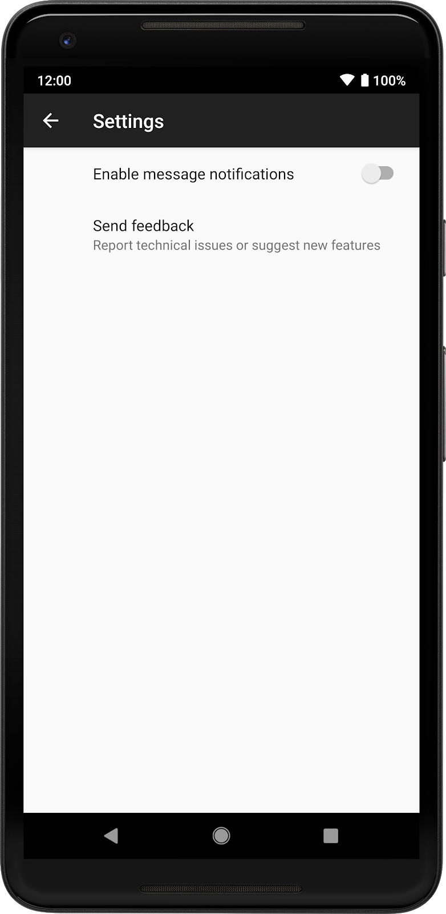

[toc]

### 设置  **Part of [Android Jetpack](https://developer.android.com/jetpack).**

> **注意：**本指南介绍如何使用 [AndroidX Preference Library](https://developer.android.com/reference/androidx/preference/package-summary)。自 Android 10 开始，系统已弃用 `android.preference` 库平台。

设置使用户能够改变应用的功能和行为。设置可以影响后台行为，例如应用与云同步数据的频率；设置的影响还可能更为深远，例如改变用户界面的内容和呈现方式。

建议使用 AndroidX Preference Library 将用户可配置设置集成至您的应用中。此库管理界面，并与存储空间交互，因此您只需定义用户可以配置的单独设置。此库自带 Material 主题，可在不同的设备和操作系统版本之间提供一致的用户体验。

### 使用入门

`Preference` 是 Preference Library 的基础构建基块。设置屏幕包含 `Preference` *层次结构*。您可将此层次结构定义为 XML 资源，或[通过代码构建层次结构](https://developer.android.com/guide/topics/ui/settings/programmatic-hierarchy)。

以下部分将介绍如何使用 AndroidX Preference Library 构建简单的设置屏幕。

>  **注意：**本指南假定您使用 `androidx.preference:preference:1.1.0-alpha04` 或更高版本。该库的旧版本可能不支持某些功能。

### 创建层次结构



以下示例展示通过 XML 定义的简单层次结构：

```xml
<PreferenceScreen
    xmlns:app="http://schemas.android.com/apk/res-auto">

    <SwitchPreferenceCompat
        app:key="notifications"
        app:title="Enable message notifications"/>

    <Preference
        app:key="feedback"
        app:title="Send feedback"
        app:summary="Report technical issues or suggest new features"/>

</PreferenceScreen>
```

>  **注意：**根标签必须为 `<PreferenceScreen>`，XML 资源必须放置于 **res/xml/** 目录。

该层级结构包含两个单独的 `Preferences`：一个支持用户切换设置的 [`SwitchPreferenceCompat`](https://developer.android.com/reference/androidx/preference/SwitchPreferenceCompat)，还有一个没有微件的基础 `Preference`。

构建层次结构时，每个 `Preference` 都应配有唯一的密钥。

> **注意：**请参阅 [Android 设置设计指南](https://source.android.com/devices/tech/settings/settings-guidelines)，获取关于如何整理设置屏幕的建议。

### 扩充层次结构

若要从 XML 属性中扩充层次结构，则需要先创建一个 [`PreferenceFragmentCompat`](https://developer.android.com/reference/androidx/preference/PreferenceFragmentCompat)，替换 [`onCreatePreferences()`](https://developer.android.com/reference/androidx/preference/PreferenceFragmentCompat#oncreatepreferences)，然后提供 XML 资源进行扩充，如以下示例所示：

**Kotlin**

```kotlin
class MySettingsFragment : PreferenceFragmentCompat() {
    override fun onCreatePreferences(savedInstanceState: Bundle?, rootKey: String?) {
        setPreferencesFromResource(R.xml.preferences, rootKey)
    }
}
```

**Java**

```java
public class MySettingsFragment extends PreferenceFragmentCompat {
    @Override
    public void onCreatePreferences(Bundle savedInstanceState, String rootKey) {
        setPreferencesFromResource(R.xml.preferences, rootKey);
    }
}
```


然后，与您对其他 `Fragment` 进行的操作一样，您可以将此 `Fragment` 添加到您的 `Activity`：

**Kotlin**

```kotlin
class MySettingsActivity : AppCompatActivity() {
    override fun onCreate(savedInstanceState: Bundle?) {
        super.onCreate(savedInstanceState)
        supportFragmentManager
                .beginTransaction()
                .replace(R.id.settings_container, MySettingsFragment())
                .commit()
    }
}
```

**Java**

```java
public class MySettingsActivity extends AppCompatActivity {
    @Override
    protected void onCreate(Bundle savedInstanceState) {
        super.onCreate(savedInstanceState);
        getSupportFragmentManager()
                .beginTransaction()
                .replace(R.id.settings_container, new MySettingsFragment())
                .commit();
    }
}
```

