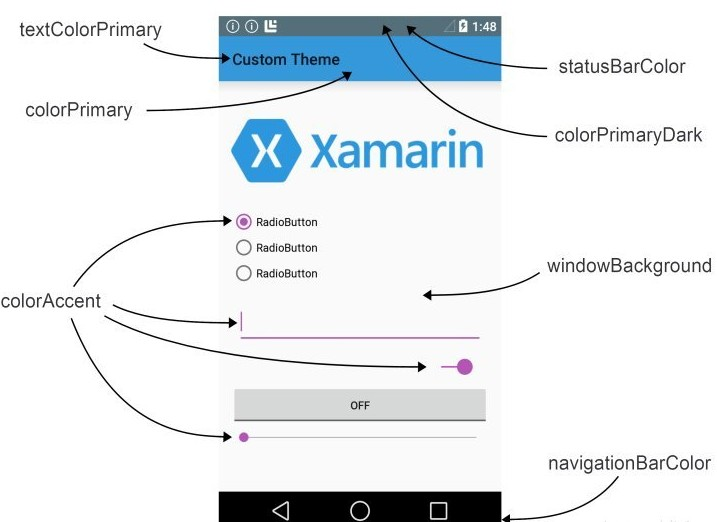

<center><font size="5"><b>Theme 中各个颜色的含义</b></font></center>

```xml
<!-- 状态栏的颜色 -->
<item name="colorPrimaryDark">@color/colorPrimaryDark</item>
<!-- AppBar背景色 -->
<item name="colorPrimary">@color/colorPrimary</item>
<!-- 控制各个控件被选中时的颜色 -->
<item name="colorAccent">@color/colorAccent</item>
<!-- ToolBar上的title颜色 -->
<item name="android:textColorPrimary">@color/textColorPrimary</item>
<!-- 页面背景色 -->
<item name="android:windowBackground">@color/windowBg</item>
<!-- 底部导航栏颜色 -->
<item name="android:navigationBarColor">@color/navigationColor</item>
<!-- 各个控制控件的默认颜色 -->
<item name="android:colorControlNormal">@color/colorControlNormal</item>
```

