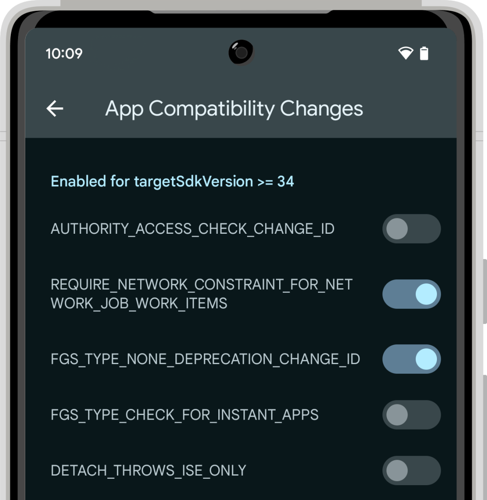
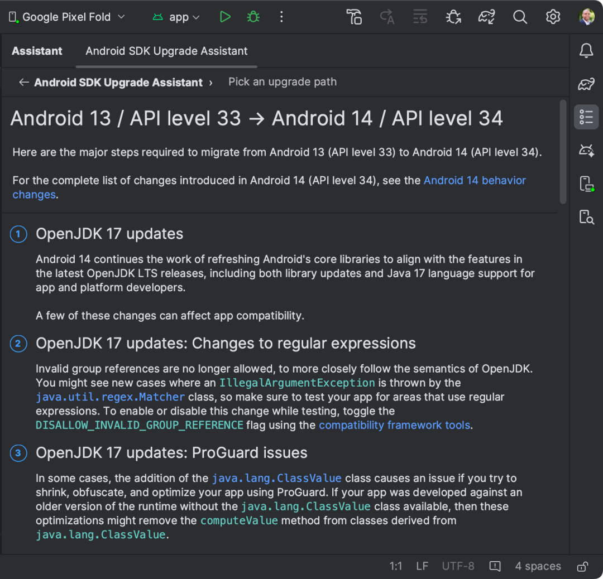
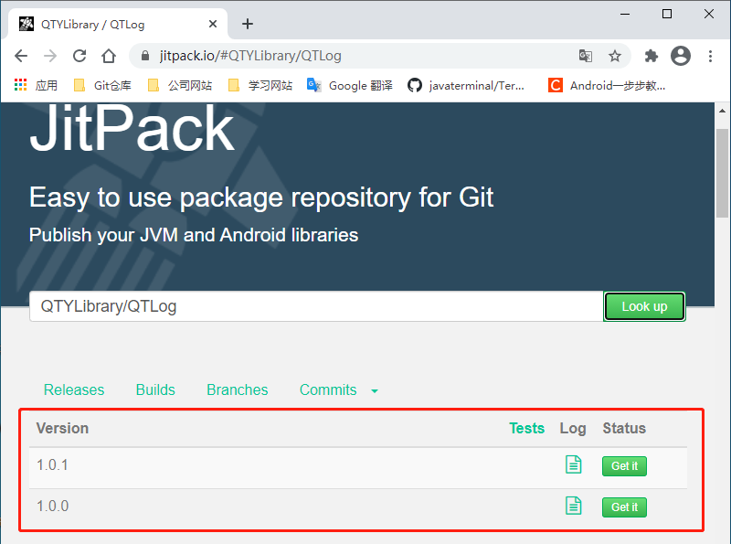

[toc]

### 1. 打开 JitPack 网站

JitPack 网站网址：<https://jitpack.io/>

### 2. 登录账号



> 注意：使用 Github账号登录即可。

### 3. 在查找框中输入库仓库地址



点击查找按钮后可以看到该仓库中已经发布的版本。



> 注意：在操作这一步骤时需要先在仓库中创建发布版本。

在版本号后，点击 `Get it` 按钮即可完成发布库，这个过程需要一点时间。

发布成功后，可以在下面看到使用该库的方法。

+ gradle 的使用方法

  1. 将下面的代码添加到你根目录下的 build.gradle 文件中。

  ```json
  allprojects {
      repositories {
          ...
          maven { url 'https://jitpack.io' }
  	}
  }
  ```

  2. 然后添加如下依赖。

  ```json
  dependencies {
      implementation 'com.github.QTYLibrary:QTLog:Tag'
  }
  ```

  在下面还可以获取该版本库的标志图标的连接。

