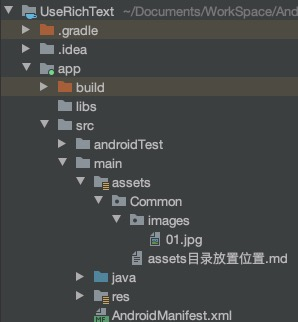

<center><font size="5"><b>读取assets目录中的文件</b></font></center>

1. assets目录结构如下：



2. 获取 `Common` 目录下的文件列表

```java
try {
    String[] paths = getAssets().list("Common");
    for (int i = 0; i < paths.length; i++) {
        Log.d("MainActivity", "path: " + paths[i]);
    }
} catch (IOException e) {
    Log.e("MainActivity", "onCreate=>error: " + e);
}
```

1. 读取 `assets目录放置位置.md` 文件

```java
try {
    InputStream in = getAssets().open("Common/assets目录放置位置.md");
    BufferedReader br = new BufferedReader(new InputStreamReader(in));
    StringBuilder sb = new StringBuilder();
    String line = "";
    while ((line = br.readLine()) != null) {
        sb.append(line).append("\n");
    }
    Log.d("MainActivity", "content: " + sb.toString());
} catch (IOException e) {
    Log.e("MainActivity", "onCreate=>error: " + e);
}
```

