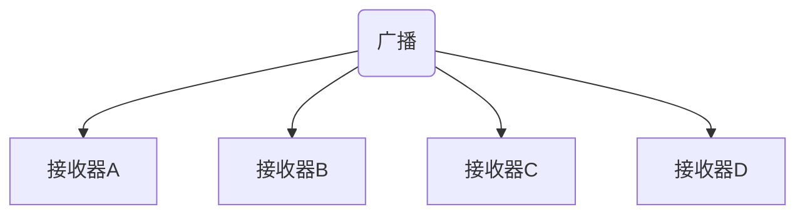
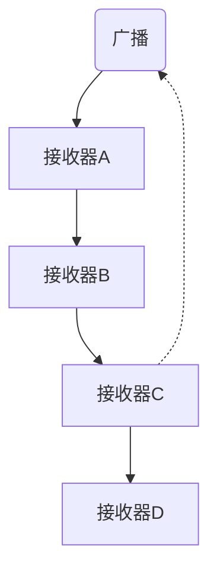

[toc]

### 8.1 BroadcastReceiver

Android 中发送广播事件最常用的方式是通过 Context.sendBroadcast() 方法给 BroadcastReceiver 发送 Intent 对象。许多标准系统事件都被定义成操作字符串，并可以在 Intent 类的 API 文档中查看。

下面的代码显示一个简单的 BroadcastReceiver：

```java
public class ChargerConnectedListener extends BroadcastReceiver {
    
    @Override
    public void onReceive(Context context, Intent intent) {
        String action = intent.getAction();
        
        if (Intent.ACTION_POWER_CONNECTED.equals(action)) {
            context.startService(new Intent(MyService.ACTION_POWER_CONNECTED));
        } else if (Intent.ACTION_POWER_DISCONNECTED.equals(action)) {
            context.startService(new Intent(MyService.ACTION_POWER_DISCONNECTED));
        }
    }
}
```

实现 BroadcastReceiver 的默认方法是在清单文件中声明它。

```xml
<receiver android:name=".ChargerConnectedListener">
	<intent-filter>
    	<action android:name="android.intent.action.ACTION_POWER_CONNECTED" />
        <action android:name="android.intent.action.ACTION_POWER_DISCONNECTED" />
    </intent-filter>
</receiver>
```

也可在 Activity 和 Service 中以编程的方式注册 BroadcastReceiver。有些广播 Intent 只能以编程的方式注册，还有一些只能在清单文件中定义。可在官方 Android API 文档中查看每种广播操作的详细信息。

在代码中注册 BroadcastReceiver 时，开发者必须在相应的回调中移除对该广播的注册，如下所示：

```java
public class MyActivity extends Activity {
    
    private ChargerConnectedListener mPowerConnectionReceiver;
    
    @Override
    protected void onResume() {
        super.onResume();
        IntentFilter intentFilter = new IntentFilter();
        intentFilter.addAction(Intent.ACTION_POWER_CONNECTED);
        intentFilter.addAction(Intent.ACTION_POWER_DISCONNECTED);
        mPowerConnectionReceiver = new ChargerConnectedListener();
        registerReceiver(mPowerConnectionReceiver, intentFilter);
    }
    
    @Override
    protected void onPause() {
        super.onPause();
        unregisterReceiver(mPowerConnectionReceiver);
    }
}
```

#### 8.1.1 本地 BroadcastReceiver(已经不可用)

如果只是在应用程序进程内发送和接收广播，可以考虑使用 LocalBroadcastManager 而不是更通用的 Context.sendBroadcast() 方法。下面的代码演示了如何使用 LocalBroadcastManager 来发送本地广播。

```java
public void sendLocalBroadcast(Intent broadcastIntent) {
    LocalBroadcastManager localBroadcastManager = LocalBroadcastManager.getIntance(this);
    localBroadcastManager.sendBroadcast(broadcastIntent);
}
```

要接收本地广播，开发者可以使用上述代码示例中的 LocalBroadcastManager 类。下面的例子显示了在 Activity 中注册并通过 onPause() 方法注销特定操作 的本地广播。

```java
public class LocalBroadcastDemo extends Activity {
    
    public static final String LOCAL_BROADCAST_ACTION = "localBroadcast";
    private BroadcastReceiver mLocalReceiver;
    
    @Override
    protected void onResume() {
        LocalBroadcastManager localBroadcastManager = LocalBroadcastManager.getInstance(this);
        IntentFilter intentFilter = new IntentFilter(LOCAL_BROADCAST_ACTION);
        mLocalReceiver = new BroadcastReceiver() {
            @Override
            public void onReceive(Context context, Intent intent) {
                // TODO: 处理本地广播
            }
        };
       	localBroadcastManager.registerReceiver(mLocalReceiver, intentFilter);
    }
    
    @Override
    protected void onPause() {
        super.onPause();
        LocalBroadcastManager localBroadcastManager = LocalBroadcastManager.getInstance(this);
        localBroadcastManager.unregisterReceiver(mLocalReceiver);
    }
}
```

#### 8.1.2 普通广播和有序广播

广播分为两种类型：普通广播和有序广播。普通广播会以异步方式被发送给所有的接受者，并且没有指定的接收顺序，如下图所示：



<center><b>图8-1 异步方式发送广播</b></center>

有序广播按照特定的顺序分发，每次只发给一个注册的广播接收器（见下图）。开发者可以在清单文件中设置相关 intent-filter 标签的 android:priority 属性来控制广播的接收顺序。有序广播还有另外一个特性：通过使用 abortBroadcast()、setResultCode() 和 setResultData() 方法，接收器可以把结果回传给广播，或者终止广播的分发，这样 Intent 就不会传递给下一个广播接收器了。



<center><b>图8-2 按顺序发送广播</b></center>

下面的代码实现了一个有序广播接收器。首先检查该广播是否是顺序的，如果是的话，接下来分配结果代码、结果数据，以及任何想要传递的额外信息。一旦 onReceive() 执行完毕返回，响应会自动被传给下一个广播。

```java
public class OrderedReceiver extends BroadcastReceiver {
    
    @Override
    public void onReceive(Context context, Intent intent) {
        if (isOrderedBroadcast()) {
            setResultCode(Activity.RESULT_OK);
            setResultData("simple response string");
            // 获取当前响应的 extras, 如果为 null 则新建一个
            Bundle resultExtras = getResultExtras(true);
            // 设置组件的名称
            resultExtras.putParcelable("componentName", 
                                      new ComponentName(context, getClass()));
        }
    }
}
```

下面的代码演示了如何发送有序广播以及如何处理响应。可以通过 Context.sendBroadcast() 方法发送 BroadcastReceiver 对象来注册响应。对原有序广播的每一个接收器，该接收器都会收到 onReceive() 回调。

```java
public void sendOrderedBroadcastAndGetResponse() {
    Intent intent = new Intent(ACTION_ORDERED_MESSAGE);
    // 处理响应的广播接收器
    BroadcastReceiver responseReceiver = new BroadcastReceiver() {
        
        @Override
        public void onReceive(Context context, Intent intent) {
            String resultData = getResultData();
            Bundle resultExtras = getResultExtras(false);
            if (resultExtras != null) {
                ComponentName registeredComponent = resultExtras.getParcelable("componentName");
            }
            // TODO: 处理响应
        }
    };
    
    sendOrderedBroadcast(intent, responseReceiver, null,
                        RESULT_OK, null, null);
}
```

#### 8.1.4 粘性广播

粘性广播在使用 Context.sendStickyBroadcast() 发送 Intent 后，该 Intent 还会 "继续保留"，允许之后匹配该 Intent 的注册收到相同的广播。

粘性广播的一个例子是 Intent.ACTION_BATTERY_CHANGED，它用来指示设备中电池电量的变化。下面的代码展示了如何监听电池的变化，该例还会检查粘性广播是否是新发出来的。

```java
public class BatteryChangeListener extends BroadcastReceiver {
    
    @Override
    public void onReceive(Context context, Intent intent) {
        String action = intent.getAction();
        if (Intent.ACTION_BATTERY_CHANGED.equals(action)) {
            if (isInitialStickyBroadcast()) {
                // 这是从粘性广播缓存发出的老事件
            } else {
                // 这是刚发生的新事件
            }
        }
    }
}
```

为了发送该类型的广播，应用程序必须在清单文件中定义 `android.permission.BROADCAST_STICKY` 权限，并使用 `Context.sendStickyBroadcast()` 发生粘性广播。

#### 8.1.4 定向广播

定向广播使用了 intent-filter 的一个特性，通过在 Intent 中设置 ComponentName 来显示指定接收器。它把注册 BroadcastReceiver 的类名和包名结合在了一起，如下面的代码所示：

```java
public void sendDirectedBroadcast(String pakcageName, String className,
                                  String action) {
    Intent intent = new Intent(action);
    intent.setCompontent(new ComponentName(packageName, className));
    sendBroadcast(intent);
}
```

> 注意：使用定向广播必须要同时知道接收器的包名和类名。

#### 8.1.5 启用和禁用广播接收器

下面的两个方法说明了如何在代码中基于 ComponentName 来启用和禁用特定组件。开发者只需在清单文件中把组件的 android:enabled 属性默认设为 false，并稍后用下面的代码把它们修改成 true。

```java
public void enabledBroadcastReceiver() {
    PackageManager packageManager = getPackageManager();
    packageManager.setComponentEnabledSetting(
    	new ComponentName(this, ChargerConnectedListener.class),
    	PackageManager.COMPONENT_ENABLED_STATE_ENABLED,
    	PackageManager.DONT_KILL_APP);
}

public void disabledBroadcastReceiver() {
    PackageManager packageManager = getPackageManager();
    packageManager.setComponentEnabledSetting(
    	new ComponentName(this, ChargerConnectedListener.class),
    	PackageManager.COMPONENT_ENABLED_STATE_DISABLED,
    	PackageManager.DONT_KILL_APP);
}
```

注意 setComponentEnabledSetting() 方法最后一个参数值 PackageManager.DONT_KILL_APP 的使用。这会防止平台杀死应用，如果不设置该值平台默认会杀死应用。

> 开发者也可以使用此方法启用和禁用 Activity （同样也使用与 Service 和 ContentProvider）。这是切换应用程序启动图标（也叫做 **主屏幕应用程序托盘** ）可见性的一个有效途径。

#### 8.1.6 系统广播 Intent

##### 1. 自动启动应用程序

下面的代码在清单文件中声明了一个广播接收器，用来监听 Intent.ACTION_BOOT_COMPLETED  和 Intent.ACTION_MY_PACKAGE_REPLACED  广播。注意：该接收器默认是禁止的。这是一个很好的做法，尤其是监听 Intent.ACTION_BOOT_COMPLETED 事件时，否则每次设备开机都会启动应用程序，可能会浪费系统资源。

```xml
<receiver android:name=".StartupListener"
          android:enabled="false">
	<intent-filter>
    	<action android:name="android.intent.action.BOOT_COMPLETED" />
        <action android:name="android.intent.action.MY_PACKAGE_REPLACED" />
    </intent-filter>
</receiver>
```

##### 2. 用户状态和屏幕状态

```xml
<receiver android:name=".UserPresentListener">
	<intent-filter>
    	<action android:name="android.intent.action.SCREEN_OFF" />
        <action android:name="android.intent.action.SCREEN_ON" />
        <action android:name="android.intent.action.USER_PRESENT" />
    </intent-filter>
</receiver>
```

开启和关闭设备屏幕时，系统会分别发送 Intent.ACTION_SCREEN_ON 和 Intent.ACTION_SCREEN_OFF 广播事件。当用户解锁屏幕时系统会发送 Intent.ACTION_USER_PRESENT 广播事件。

##### 3. 网络和连接变化

连接相关的广播和网络相关的广播分别是有不同的 API 负责的。每当有通用的网络连接变化发生时，比如从 Wi-Fi 切换到移动数据，系统就会发送 ConnectivityManager.CONNECTIVITY_ACTION 广播。接下来可以使用 Context.getService() 方法来检索 ConnectivityManager 服务，它允许开发者获取当前网络的更多详细信息。

然而，要获取关于当前网络更细粒的信息，开发者还需要监听来自 TelephonyManager（蜂窝移动数据网络事件）和 WifiManager（Wi-Fi 相关事件）的广播事件。TelephonyManager 允许查询移动数据连接的类型，WifiManager 允许检索 Wi-Fi 连接状态并访问和 Wi-Fi 相关的不同 ID（SSID 和 BSSID）。

下面的代码简单演示了如何检测设备是否连接到了预先配置的 "home" Wi-Fi。该方法可以有效地和服务器或者只支持特定 Wi-Fi 的媒体中心进行通信。

```java
public class CheckForHomeWifi extends BroadcastReceiver {
    
    public static final String PREFS_HOME_WIFI_SSID = "homeSSID";
    
    @Override
    public void onReceive(Context context, Intent intent) {
        SharedPreference preferences = PreferenceManager.getDefaultSharedPreferences(context);
        String homeWifi = preferences.getString(PREFS_HOME_WIFI_SSID, null);
        if (homeWifi != null) {	// 只有在设置了 "home" Wi-Fi 的情况下才进行检查
        	NetworkInfo networkInfo = intent.getParcelableExtra(WifiManager.EXTRA_NETWORK_INFO);
            if (networkInfo != null && networkInfo.getState().equals(NetWorkInfo.State.CONNECTED)) {
                WifiInfo wifiInfo = intent.getParcelableExtra(WifiManager.EXTRA_WIFI_INFO);
                
                if (wifiInfo != null
                   && homeWifi.equals(wifiInfo.getSSID())) {
                    // 成功，连接到了 "home" Wi-Fi
                } else {
                    // 失败，连接到了其他 Wi-Fi
                }
            }
        }
    }
}
```

下面的例子监听来自 ConnectivityManager 的变化，并确定当前连接的是否为移动数据网络。如果收到了移动数据，接下来在使用 TelephonyManager 检查是否在使用 3G 或者 LTE 网络。

```java
public class WhenOn3GorLTE extends BroadcastReceiver {
    
    @Override
    public void onReceive(Context context, Intent intent) {
        String action = intent.getAction();
        
        if (ConnectivityManager.CONNECTIVITY_ACTION.equals(action)) {
            boolean noConnectivity = intent.getBooleanExtra(ConnectivityManager.EXTRA_NO_CONNECTIVITY, false);
            if (noConnectivity) {
                // 没有网络连接
            } else {
                int networkType = intent.getIntExtra(ConnectivityManager.EXTRA_NETWORK_TYPE, ConnectivityManager.TYPE_DUMMY);
                if (networkType == ConnectivityManager.TYPE_MOBILE) {
                    checkFor3GorLte(context);
                }
            }
        }
    }
    
    private void checkFor3GorLte(Context context) {
        TelephonyManager telephonyManager = (TelephonyManager) context.getSystemService(Context.TELEPHONY_SERVICE);
        
        switch (telephonyManager.getNetworkType()) {
            case TelephonyManager.NETWORK_TYPE_HSDPA:
            case TelephonyManager.NETWORK_TYPE_HSPA:
            case TelephonyManager.NETWORK_TYPE_HSPAP:
            case TelephonyManager.NETWORK_TYPE_HSUPA:
            case TelephonyManager.NETWORK_TYPE_LTE:
                // 哇， 网络数据足够快
                break;
                
            default:
                // 速度很慢的移动网络，通知用户
                break;
        }
    }
}
```

