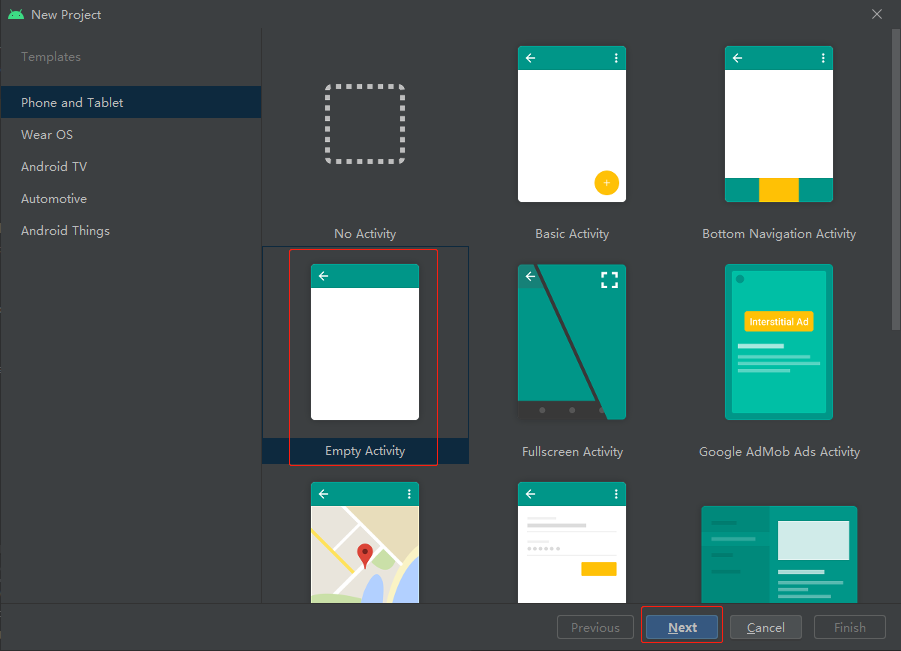
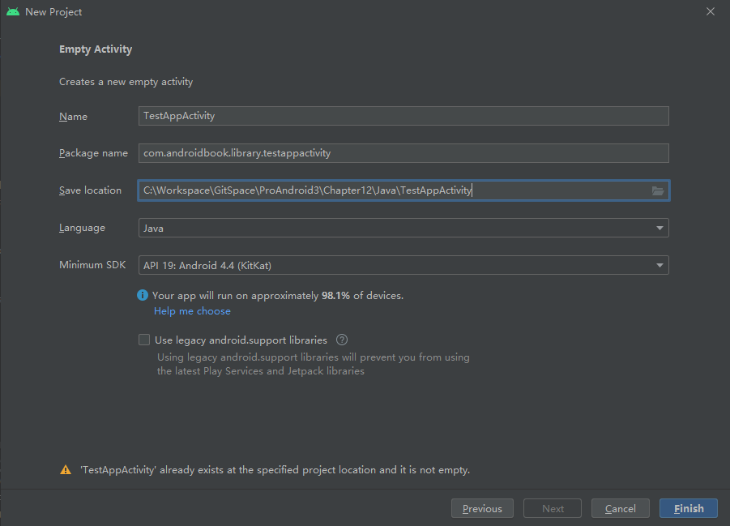
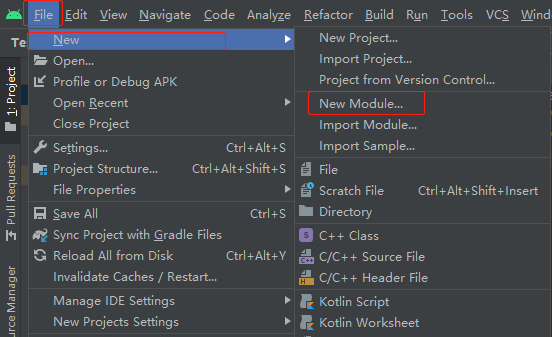
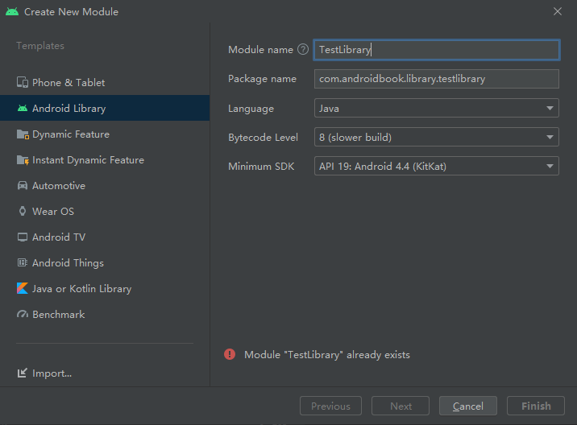
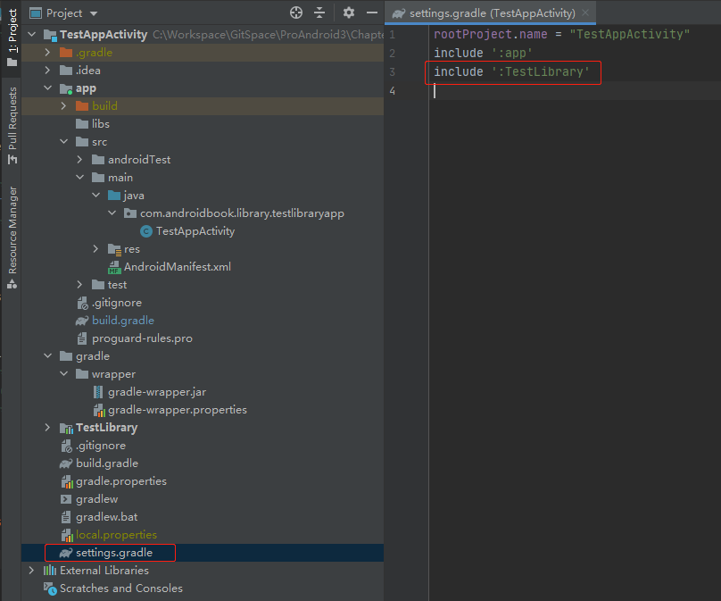
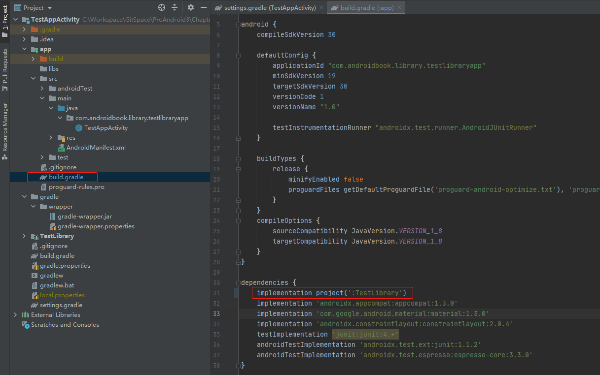

[toc]

### 1. 创建工程

这创建一个名为 `TestLibraryApp` 的 Android 工程。





### 2. 创建库项目

在 `TestLibraryApp` 工程界面，创建一个库项目。这里创建一个名为 `TestLibrary` 的库项目。





### 3. 将库项目添加到依赖中

可以在工程根目录下的 `settings.gradle` 查看当前的添加的库项目的名称。



在 `TestLibraryApp ` 工程的 `app` 目录下的 `build.gradle` 文件中添加对库项目的依赖。



### 4. 下面是这个工程的实现代码

#### 4.1 Java 版本的实现

##### 4.1.1 TestLibraryApp工程

###### TestAppActivity.java

```java
package com.androidbook.library.testlibraryapp;

import androidx.annotation.NonNull;
import androidx.appcompat.app.AppCompatActivity;

import android.content.Intent;
import android.os.Bundle;
import android.view.Menu;
import android.view.MenuInflater;
import android.view.MenuItem;
import android.widget.TextView;

import com.androidbook.library.testlibrary.TestLibActivity;

public class TestAppActivity extends AppCompatActivity {

    @Override
    protected void onCreate(Bundle savedInstanceState) {
        super.onCreate(savedInstanceState);
        setContentView(R.layout.main);
    }

    @Override
    public boolean onCreateOptionsMenu(Menu menu) {
        super.onCreateOptionsMenu(menu);
        MenuInflater inflater = getMenuInflater();
        inflater.inflate(R.menu.main_menu, menu);
        return true;
    }

    @Override
    public boolean onOptionsItemSelected(@NonNull MenuItem item) {
        appendMenuItemText(item);
        switch (item.getItemId()) {
            case R.id.menu_clear:
                emptyText();
                break;

            case R.id.menu_library_activity:
                invokeLibActivity(item.getItemId());
                break;
        }
        return true;
    }

    private void invokeLibActivity(int mid) {
        Intent intent = new Intent(this, TestLibActivity.class);
        intent.putExtra("com.ai.menuid", mid);
        startActivity(intent);
    }

    private TextView getTextView() {
        return findViewById(R.id.text1);
    }

    private void appendText(String abc) {
        TextView tv = getTextView();
        tv.setText(tv.getText() + "\n" + abc);
    }

    private void appendMenuItemText(MenuItem menuItem) {
        String title = menuItem.getTitle().toString();
        TextView tv = getTextView();
        tv.setText(tv.getText() + "\n" + title);
    }

    private void emptyText() {
        TextView tv = getTextView();
        tv.setText("");
    }
}
```

###### main.xml

```xml
<?xml version="1.0" encoding="utf-8"?>
<LinearLayout xmlns:android="http://schemas.android.com/apk/res/android"
    android:layout_width="match_parent"
    android:layout_height="match_parent"
    android:orientation="vertical">

    <TextView
        android:id="@+id/text1"
        android:layout_width="wrap_content"
        android:layout_height="wrap_content"
        android:text="@string/hello"/>

</LinearLayout>
```

###### main_menu.xml

```xml
<?xml version="1.0" encoding="utf-8"?>
<menu xmlns:android="http://schemas.android.com/apk/res/android">

    <!--    This group uses the default category.   -->
    <group android:id="@+id/menuGroup_Main">

        <item
            android:id="@+id/menu_clear"
            android:title="clear" />

        <item
            android:id="@+id/menu_library_activity"
            android:title="invoke lib" />

    </group>

</menu>
```

###### strings.xml

```xml
<resources>
    <string name="app_name">TestAppActivity</string>
    <string name="hello">Your debug will appear here</string>
</resources>
```

###### AndroidManifest.xml

```xml
<?xml version="1.0" encoding="utf-8"?>
<manifest xmlns:android="http://schemas.android.com/apk/res/android"
    package="com.androidbook.library.testlibraryapp">

    <application
        android:allowBackup="true"
        android:icon="@mipmap/ic_launcher"
        android:label="@string/app_name"
        android:roundIcon="@mipmap/ic_launcher_round"
        android:supportsRtl="true"
        android:theme="@style/Theme.TestAppActivity">
        <activity android:name=".TestAppActivity"
            android:label="Test Library App">
            <intent-filter>
                <action android:name="android.intent.action.MAIN" />

                <category android:name="android.intent.category.LAUNCHER" />
            </intent-filter>
        </activity>
    </application>

</manifest>
```

###### build.gradle

```properties
plugins {
    id 'com.android.application'
}

android {
    compileSdkVersion 30

    defaultConfig {
        applicationId "com.androidbook.library.testlibraryapp"
        minSdkVersion 19
        targetSdkVersion 30
        versionCode 1
        versionName "1.0"

        testInstrumentationRunner "androidx.test.runner.AndroidJUnitRunner"
    }

    buildTypes {
        release {
            minifyEnabled false
            proguardFiles getDefaultProguardFile('proguard-android-optimize.txt'), 'proguard-rules.pro'
        }
    }
    compileOptions {
        sourceCompatibility JavaVersion.VERSION_1_8
        targetCompatibility JavaVersion.VERSION_1_8
    }
}

dependencies {
    implementation project(':TestLibrary')
    implementation 'androidx.appcompat:appcompat:1.3.0'
    implementation 'com.google.android.material:material:1.3.0'
    implementation 'androidx.constraintlayout:constraintlayout:2.0.4'
    testImplementation 'junit:junit:4.+'
    androidTestImplementation 'androidx.test.ext:junit:1.1.2'
    androidTestImplementation 'androidx.test.espresso:espresso-core:3.3.0'
}
```

##### 4.1.2 TestLibrary 库工程

###### TestLibActivity.java

```java
package com.androidbook.library.testlibrary;

import androidx.annotation.NonNull;
import androidx.appcompat.app.AppCompatActivity;

import android.os.Bundle;
import android.view.Menu;
import android.view.MenuInflater;
import android.view.MenuItem;
import android.widget.TextView;

public class TestLibActivity extends AppCompatActivity {

    private static final String TAG = "TestLibActivity";

    @Override
    protected void onCreate(Bundle savedInstanceState) {
        super.onCreate(savedInstanceState);
        setContentView(R.layout.lib_main);
    }

    @Override
    public boolean onCreateOptionsMenu(Menu menu) {
        super.onCreateOptionsMenu(menu);
        MenuInflater inflater = getMenuInflater();
        inflater.inflate(R.menu.lib_main_menu, menu);
        return true;
    }

    @Override
    public boolean onOptionsItemSelected(@NonNull MenuItem item) {
        appendMenuItemText(item);
        if (item.getItemId() == R.id.menu_clear) {
            emptyText();
        }
        return true;
    }

    private TextView getTextView() {
        return findViewById(R.id.text1);
    }

    private void appendText(String abc) {
        TextView tv = getTextView();
        tv.setText(tv.getText() + "\n" + abc);
    }

    private void appendMenuItemText(MenuItem menuItem) {
        String title = menuItem.getTitle().toString();
        TextView tv = getTextView();
        tv.setText(tv.getText() + "\n" + title);
    }

    private void emptyText() {
        TextView tv = getTextView();
        tv.setText("");
    }
}
```

###### lib_main.xml

```xml
<?xml version="1.0" encoding="utf-8"?>
<LinearLayout xmlns:android="http://schemas.android.com/apk/res/android"
    android:layout_width="match_parent"
    android:layout_height="match_parent"
    android:orientation="vertical">

    <TextView
        android:id="@+id/text1"
        android:layout_width="match_parent"
        android:layout_height="wrap_content"
        android:text="Your debug will appear here" />

</LinearLayout>
```

###### lib_main_menu.xml

```xml
<?xml version="1.0" encoding="utf-8"?>
<menu xmlns:android="http://schemas.android.com/apk/res/android">

    <!--    This group uses the default category.   -->
    <group android:id="@+id/menuGroup_Main">

        <item
            android:id="@+id/menu_clear"
            android:title="clear" />

        <item
            android:id="@+id/menu_testlib1"
            android:title="Lib Test Menu1" />

        <item
            android:id="@+id/menu_textlib_2"
            android:title="Lib Test Menu2" />

    </group>
</menu>
```

###### AndroidManifest.xml

```xml
<?xml version="1.0" encoding="utf-8"?>
<manifest xmlns:android="http://schemas.android.com/apk/res/android"
    package="com.androidbook.library.testlibrary">

    <application>
        <activity android:name=".TestLibActivity"
            android:label="Test Library Helloworld Activity"></activity>
    </application>

</manifest>
```

#### 4.2 Kotlin 版本

##### 4.2.1 TestLibraryApp 工程

###### TestAppActivity.kt

```kotlin
package com.androidbook.library.testlibraryapp

import android.annotation.SuppressLint
import android.content.Intent
import androidx.appcompat.app.AppCompatActivity
import android.os.Bundle
import android.view.Menu
import android.view.MenuItem
import android.widget.TextView
import com.androidbook.library.testlibrary.TestLibActivity

class TestAppActivity : AppCompatActivity() {

    override fun onCreate(savedInstanceState: Bundle?) {
        super.onCreate(savedInstanceState)
        setContentView(R.layout.main)
    }

    override fun onCreateOptionsMenu(menu: Menu?): Boolean {
        super.onCreateOptionsMenu(menu)
        menuInflater.inflate(R.menu.main_menu, menu)
        return true
    }

    override fun onOptionsItemSelected(item: MenuItem): Boolean {
        appendMenuItemText(item)
        when (item.itemId) {
            R.id.menu_clear -> emptyText()
            R.id.menu_library_activity -> invokeLibActivity(item.itemId)
        }
        return true
    }

    private fun invokeLibActivity(mid: Int) {
        val intent = Intent(this, TestLibActivity::class.java)
        intent.putExtra("com.ai.menuid", mid)
        startActivity(intent)
    }

    @SuppressLint("WrongViewCast")
    private fun getTextView(): TextView {
        return findViewById(R.id.text1)
    }

    @SuppressLint("SetTextI18n")
    private fun appendText(abc: String) {
        val tv = getTextView()
        tv.text = "${tv.text}\n$abc"
    }

    @SuppressLint("SetTextI18n")
    private fun appendMenuItemText(menuItem: MenuItem) {
        val title = menuItem.title.toString()
        val tv = getTextView()
        tv.text = "${tv.text}\n$title"
    }

    private fun emptyText() {
        val tv = getTextView()
        tv.text = ""
    }

    companion object {
        const val TAG = "TestAppActivity"
    }
}
```

###### main.xml

```xml
<?xml version="1.0" encoding="utf-8"?>
<LinearLayout xmlns:android="http://schemas.android.com/apk/res/android"
    android:layout_width="fill_parent"
    android:layout_height="fill_parent"
    android:orientation="vertical">

    <TextView
        android:id="@+id/text1"
        android:layout_width="fill_parent"
        android:layout_height="wrap_content"
        android:text="@string/hello" />

</LinearLayout>

```

###### main_menu.xml

```xml
<?xml version="1.0" encoding="utf-8"?>
<menu xmlns:android="http://schemas.android.com/apk/res/android">

    <!-- This group uses the default category. -->
    <group android:id="@+id/menuGroup_Main">
        <item
            android:id="@+id/menu_clear"
            android:title="clear" />

        <item
            android:id="@+id/menu_library_activity"
            android:title="invoke lib" />
    </group>

</menu>
```

###### strings.xml

```xml
<resources>
    <string name="app_name">TestLibraryApp</string>
    <string name="hello">Your debug will appear here</string>
</resources>
```

###### AndroidManifest.xml

```xml
<?xml version="1.0" encoding="utf-8"?>
<manifest xmlns:android="http://schemas.android.com/apk/res/android"
    package="com.androidbook.library.testlibraryapp">

    <application
        android:allowBackup="true"
        android:icon="@mipmap/ic_launcher"
        android:label="@string/app_name"
        android:roundIcon="@mipmap/ic_launcher_round"
        android:supportsRtl="true"
        android:theme="@style/Theme.TestLibraryApp">
        <activity
            android:name=".TestAppActivity"
            android:label="Test Library App">
            <intent-filter>
                <action android:name="android.intent.action.MAIN" />

                <category android:name="android.intent.category.LAUNCHER" />
            </intent-filter>
        </activity>
    </application>

</manifest>
```

###### build.gradle

```properties
plugins {
    id 'com.android.application'
    id 'kotlin-android'
}

android {
    compileSdkVersion 30

    defaultConfig {
        applicationId "com.androidbook.library.testlibraryapp"
        minSdkVersion 19
        targetSdkVersion 30
        versionCode 1
        versionName "1.0"

        testInstrumentationRunner "androidx.test.runner.AndroidJUnitRunner"
    }

    buildTypes {
        release {
            minifyEnabled false
            proguardFiles getDefaultProguardFile('proguard-android-optimize.txt'), 'proguard-rules.pro'
        }
    }
    compileOptions {
        sourceCompatibility JavaVersion.VERSION_1_8
        targetCompatibility JavaVersion.VERSION_1_8
    }
    kotlinOptions {
        jvmTarget = '1.8'
    }
}

dependencies {
    implementation project(':TestLibrary')
    implementation "org.jetbrains.kotlin:kotlin-stdlib:$kotlin_version"
    implementation 'androidx.core:core-ktx:1.5.0'
    implementation 'androidx.appcompat:appcompat:1.3.0'
    implementation 'com.google.android.material:material:1.3.0'
    implementation 'androidx.constraintlayout:constraintlayout:2.0.4'
    testImplementation 'junit:junit:4.+'
    androidTestImplementation 'androidx.test.ext:junit:1.1.2'
    androidTestImplementation 'androidx.test.espresso:espresso-core:3.3.0'
}
```

##### 4.2.2 TestLibrary 库工程

###### TestLibActivity.kt

```kotlin
package com.androidbook.library.testlibrary

import android.annotation.SuppressLint
import androidx.appcompat.app.AppCompatActivity
import android.os.Bundle
import android.view.Menu
import android.view.MenuItem
import android.widget.TextView

class TestLibActivity : AppCompatActivity() {

    override fun onCreate(savedInstanceState: Bundle?) {
        super.onCreate(savedInstanceState)
        setContentView(R.layout.lib_main)
    }

    override fun onCreateOptionsMenu(menu: Menu?): Boolean {
        super.onCreateOptionsMenu(menu)
        menuInflater.inflate(R.menu.lib_main_menu, menu)
        return true
    }

    override fun onOptionsItemSelected(item: MenuItem): Boolean {
        appendMenuItemText(item)
        if (item.itemId == R.id.menu_clear) {
            emptyText()
        }
        return true
    }

    @SuppressLint("WrongViewCast")
    private fun getTextView(): TextView {
        return findViewById(R.id.text1)
    }

    @SuppressLint("SetTextI18n")
    private fun appendText(abc: String) {
        val tv = getTextView()
        tv.text = "${tv.text}\n$abc"
    }

    @SuppressLint("SetTextI18n")
    private fun appendMenuItemText(menuItem: MenuItem) {
        val title = menuItem.title.toString()
        val tv = getTextView()
        tv.text = "${tv.text}\n$title"
    }

    private fun emptyText() {
        val tv = getTextView()
        tv.text = ""
    }

    companion object {
        const val TAG = "TestLibActivity"
    }
}
```

###### lib_main.xml

```xml
<?xml version="1.0" encoding="utf-8"?>
<LinearLayout xmlns:android="http://schemas.android.com/apk/res/android"
    android:layout_width="fill_parent"
    android:layout_height="fill_parent"
    android:orientation="vertical">

    <TextView
        android:id="@+id/text1"
        android:layout_width="fill_parent"
        android:layout_height="wrap_content"
        android:text="Your debug will appear here" />

</LinearLayout>

```

###### lib_main_menu.xml

```xml
<?xml version="1.0" encoding="utf-8"?>
<menu xmlns:android="http://schemas.android.com/apk/res/android">

    <!-- This group uses the default category. -->
    <group android:id="@+id/menuGroup_Main">
        <item
            android:id="@+id/menu_clear"
            android:title="clear" />

        <item
            android:id="@+id/menu_testlib_1"
            android:title="Lib Test Menu1" />

        <item
            android:id="@+id/menu_testlib_2"
            android:title="Lib Test Menu2" />
    </group>


</menu>
```

###### AndroidManifest.xml

```xml
<?xml version="1.0" encoding="utf-8"?>
<manifest xmlns:android="http://schemas.android.com/apk/res/android"
    package="com.androidbook.library.testlibrary">

    <application>
        <activity
            android:name=".TestLibActivity"
            android:label="Test Library Helloworld Activity"></activity>
    </application>

</manifest>
```

