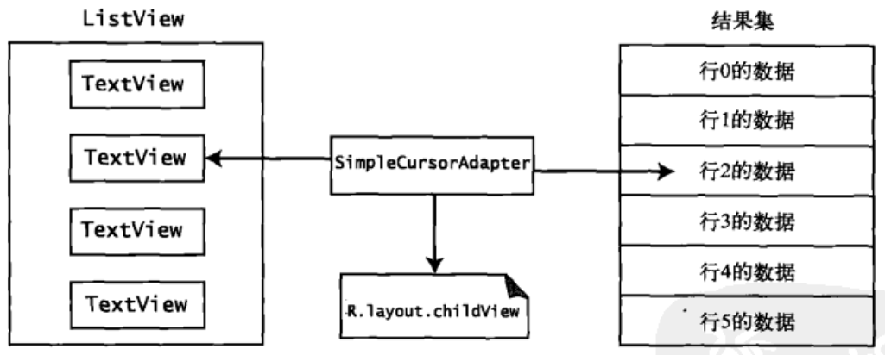

[toc]

### 1. SimpleCursorAdapter



<center>SimpleCursorAdapter</center>

SimpleCursorAdapter 的构造函数类似于：

```java
SimpleCursorAdapter(Context context, int layout, Cursor c, String[] from, int[] to)
```

请注意，由于游标中的行可以有多列，所以需要通过指定一个列名称数组（使用 from 参数），告诉 SimpleCursorAdapter 希望从行中选择那些列。

类似地，由于所选的每列会映射到一个布局的的一个 View，所以必须在 to 参数中指定 ID。所选的列与显示该列中数据的 View 之间存在一对一关系，所以 from 和 to  参数必须具有相同的大小。

### 2. 了解 ArrayAdapter

一般可以通过如下代码创建新的 ArrayAdapter：

```java
ArrayAdapter<String> aa = new ArrayAdapter<>(this, android.R.layout.simple_dropdown_item_1line,
                new String[] {"English", "Hebrew", "Hindi", "Spanish", "German", "Greek"});
```

**代码清单6-26** 从字符串资源文件创建 ArrayAdapter

```xml
<Spinner
	android:id="@+id/spinner"
    android:layout_width="wrap_content"
    android:layout_height="wrap_content" />
```

```java
Spinner spinner = findViewById(R.id.spinner);

ArrayAdapter<CharSequence> adapter = ArrayAdapter.createFromResource(this, 	
                	R.array.planets, android.R.layout.simple_spinner_item);

adapter.setDropDownViewResource(android.R.layout.simple_spinner_dropdown_item);

spinner.setAdapter(adapter);
```

```xml
<?xml version="1.0" encoding="utf-8"?>
<resources>
    <string-array name="planets">
        <item>Mercury</item>
        <item>Venus</item>
        <item>Earth</item>
        <item>Mars</item>
        <item>Jupiter</item>
        <item>Saturn</item>
        <item>Uranus</item>
        <item>Neptune</item>
    </string-array>
</resources>
```

ArrayAdapter 支持动态修改底层数据。例如，add() 方法将新值附加到数组末尾。insert() 方法将新值添加到数组中指定的位置。remove() 从数组获取对象。也可以调用 sort() 来重新排序数组。当然，完成此操作后，数据数组将与 ListView 不同步，这时就需要调用适配器的 notifyDataSetChanged() 方法。

以下列表汇总了 Android 提供的适配器：

+ ArrayAdapter\<T\>：这个适配器位于一般的任意对象数组的顶部，需要在 ListView 中使用。
+ CursorAdapter：这个适配器也需要在 ListView 中使用，通过游标项列表提供数据。
+ SimpleAdapter: 从名称可以看出，这个适配器是一个简单适配器，它通常用于使用静态数据（可能来自资源）填充列表。
+ ResourceCursorAdapter：这个适配器扩展了 CursorAdapter，知道如何从资源创建视图。
+ SimpleCursorAdapter：这个适配器扩展了 ResourceCursorAdapter，从游标中的列创建 TextView / ImageView 视图。这些视图在资源中定义。