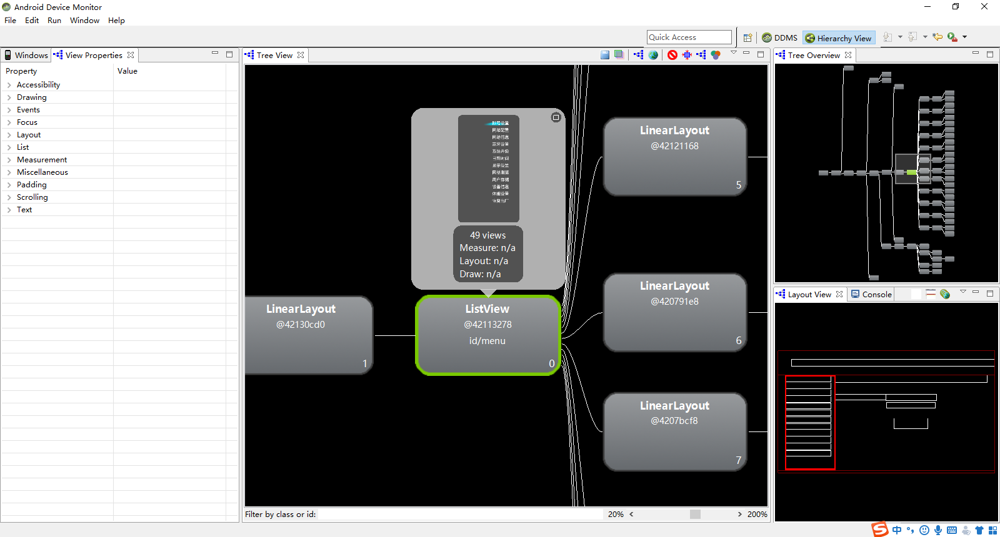
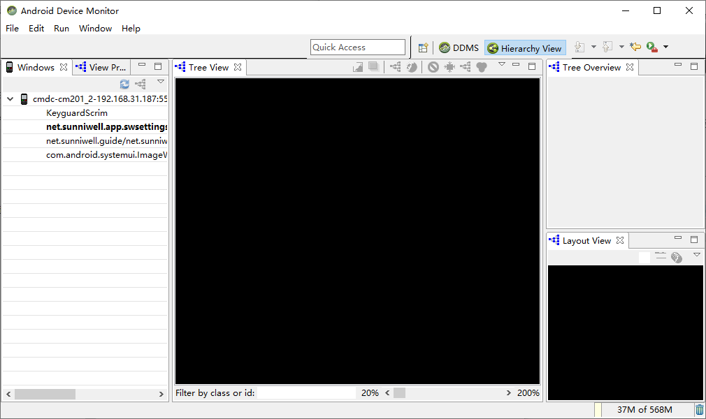

Hierarchy Viewer 以树的形式显示视图层次结构。它的思路是：将布局加载到工具中，然后检查布局来（1）确定可能的布局问题或（2）尝试优化布局，从而最小化视图数量（提供性能）。

要调试 UI，在模拟器中运行应用程序并找到希望调试的 UI。然后转到 Android SDK/tools 目录，启动 Hierarchy Viewer 工具。在 Windows 上，将会在 /tools 目录下看的一个名为 monitor.bat 的批处理文件。运行该批处理文件是，将会看的如下界面：

