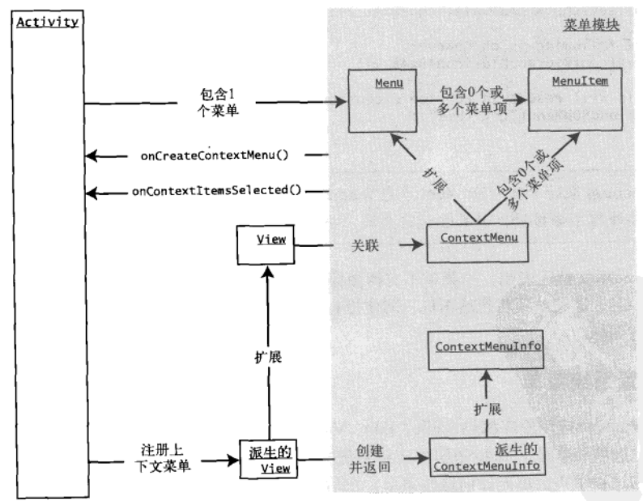

[toc]

### 1. 展开的菜单

如果应用程序拥有的菜单项比主屏幕能够显示的菜单项多，Android 将会显示 More 菜单项来支持用户查看剩余菜单。此菜单称为 **展开菜单**，当菜单项太多而无法在有限的控件内全部显示时，就会自动显示该菜单项。当是展开菜单具有一个缺陷：它不能容纳图标。

### 2. 使用图标菜单

请注意，在使用图标菜单时有一些限制。第一，无法将图标用于展开菜单。第二，图标菜单项不支持菜单项勾选标记。第三，如果图标菜单项中的文本太长，它将从一定数量的字符之后截断，具体取决于显示区域的大小。

下面这些示例代码演示了创建图标菜单项这一过程：

```java
// add a menu item and remember it so that you can use it
// subsequently to set the icon on it.
MenuItem item8 = menu.add(base, base + 8, base + 8, "uncheck secondary");
item8.setIcon(R.drawable.balloons);
```

### 3. 使用子菜单

Menu 对象可以有多个 SubMenu 对象。每个 SubMenu 对象通过调用 Menu.addSubMenu 方法被添加到 Menu 对象中。

> 注意，无法向子菜单添加更多子菜单。

**代码清单7-14** 添加子菜单

```java
private void addSubMenu(Menu menu) {
    // Secondary items are shown just like everything else
    int base = Menu.FIRST + 100;
    SubMenu sm = menu.addSubMenu(base, base + 1, Menu.NONE, "submenu");
    sm.add(base, base + 2, base + 2, "sub item1");
    sm.add(base, base + 3, base + 3, "sub item2");
    sm.add(base, base + 4, base + 4, "sub item3");
    
    // submenu item icons are not supported
    item1.setIcon(R.drawable.icon48x48_2);
    
    // the following is ok however
    sm.setIcon(R.drawable.icon48x48_1);
    
    // This will result in runtime exception
    // sm.addSubMenu("try this");
}
```

> 作为 Menu 对象的子类，SubMenu 也包含 addSubMenu 方法，但如果向子菜单中添加另一个子菜单，编译器不会报错，如果尝试这么做，将会抛出运行时异常。

### 4. 配置系统菜单

最新的 Android SDK 版本再创建菜单的过程中不会填充任何系统菜单。在后续版本中可能会实现这些系统菜单。Android SDK 文档建议，开发人员可以在它们的代码中进行配置，这样，在系统菜单可用时就可以添加它们。可以调用父类的 onCreateOptionsMenu 方法来实现此目标，该方法允许系统向常量 CATEGORY_SYSTEM 所标识的组中添加系统菜单。

### 5. 使用上下文菜单

Android 通过名为 **长单击** 的操作来支持相同的上下文菜单理念。

在 Android 菜单架构中，上下文菜单被表示为 ContextMenu 类。就像 Menu 一样，ContextMenu 可以包含许多菜单项。可以使用相同的 Menu 方法来向上下文菜单添加菜单项。Menu 与 ContextMenu 之间最大的不同在于菜单的所有关系。活动拥有常规的选项菜单，而视图拥有上下文菜单。



<center>图7-3 活动、视图和上下文菜单</center>

尽管上下文菜单归视图所有，但填充上下文菜单的方法包含在 Activity 类中。这个方法是 activity.onCreateContextMenu()，它的作用类似于 activity.onCreateOptionsMenu() 方法，此回调方法还包含要为其填充上下文菜单的视图。

如果希望特定视图拥有上下文菜单，必须针对拥有上下文菜单这一目的，专门向活动注册视图。可以通过 activity.registerForContextMenu(view) 方法来实现此任务。

现在请注意图7-3 中所示的 ContextMenuInfo 类，可以向 onCreateContextMenu 方法传递此中类型的对象。这是视图向此方法传递附加信息的一种方式。视图要完成此操作，它需要重写 getContextViewInfo() 方法，并返回 ContextMenuInfo 的派生类，使用附加方法来表示附加信息。

#### 5.1 为上下文菜单注册视图

**代码清单7-15** 为上下文菜单注册 TextView

```java
@Override
public void onCreate(Bundle savedInstanceState) {
    super.onCreate(savedInstanceState);
    setContentView(R.layout.main);
    
    TextView tv = (TextView) findViewById(R.id.textViewId);
    registerForContextMenu(tv);
}
```

#### 5.2 填充上下文菜单

对于许多简单情形，可以忽略 ContextMenuInfo 对象。但是，一些视图可以通过此对象传递额外的信息。在这些情形下，需要将 ContextMenuInfo 类转换为子类，然后使用附加的方法来检索附加信息。

派生自 ContextMenuInfo 的类包括 AdapterContextMenuInfo 和 ExpandableContextMenuInfo 等。在 Android 中，绑定到数据库游标的视图使用 AdapterContextMenuInfo 类，将行 ID 传入将显示上下文菜单的视图中。

**代码清单7-16** onCreateContextMenu() 方法

```java
@Override
public void onCreateContextMenu(ContextMenu menu, View v, ContextMenuInfo menuInfo) {
    menu.setHeaderTitle("Sample Context Menu");
    menu.add(200, 200, 200, "item1");
}
```

> 实验：测试多视图上下文菜单的使用。

#### 5.3 响应上下文菜单项

**代码清单7-17** 响应上下文菜单

```java
@Override
public boolean onContextItemSelected(MenuItem item) {
    if (item.getItemId()= some-menu-item-id) {
        // handle this menu item
        return true;
    }
    other exception processing
}
```

### 6 使用交替菜单

交替菜单允许一个应用程序包含另一个应用程序的菜单。当选择交替菜单时，将使用该活动所需的数据 URL 启动目标应用程序或活动。调用的活动然后将使用传入的 Intent 中的数据 URL。

要将交替菜单项附加到菜单上，执行以下步骤，同时在 onCreateOptionsMenu 方法中设置该菜单。

（1）创建一个 Intent，将它的数据 URI 设置为当前显示的数据 URI。

（2）将 Intent 的类别设置为 CATEGORY_ALTERNATIVE。

（3）搜索允许对此 URI 类型支持的数据进行操作的活动。

（4）将可以调用这些活动的 Intent 以菜单项的形式添加到菜单。

**代码清单7-18** 使用交替菜单项填充菜单

```java
Intent criteriaIntent = new Intent(null, getIntent().getData());
intent.addCategory(Intent.CATEGORY_ALTERNATIVE);

// Search for, and populate the menu with matching Activities.
menu.addIntentOptions(
	Menu.CATEGORY_ALTERNATIVE,	// Group
	Menu.CATEGORY_ALTERNATIVE,	// Any unique IDs we might care to add.
	Menu.CATEGORY_ALTERNATIVE,	// order
	this.getComponentName(),	// Name of the activity class displaying
								// the menu--here, it's this class.
    							// variable "this" points to activity
	null,						// No specifiecs.
	criteriaIntent,				// Previously created intent that
								// describes our requirements.
	0,							// No flags.
	null);						// returned menu items
```

所添加的菜单项的名称是什么？Android 文档对此未作说明。那么我们检查一下源代码，看看此函数在幕后实际做了些什么。

事实证明，Menu 类只是一个接口，所以我们无法看到它的任何实现源代码。实现 Menu 接口的类是 MenuBuilder.

**代码清单7-19** MenuBuilder.addIntentOptions 方法

```java
public int addIntentOptions(int group, int id, int categoryOrder,
                           ComponentName caller,
                           Intent[] specifics,
                           Intent intent, int flags,
                           MenuItem[] outSpecificItems) {
    PackageManager pm = mContext.getPackageManager();
    final List<ResolveInfo> lri = pm.queryIntentActivityOptions(caller, specifics, intent, 0);
    final int N = lri != null ? lri.size() : 0;
    if ((flags & FLAG_APPEND_TO_GROUP) == 0) {
        removeGroup(group);
    }
    for (int i = 0; i < N; i++) {
        final ResolveInfo ri = lri.get(i);
        Intent rintent = new Intent(ri.specificIndex < 0 ? intent : specifics[ri.specificIndex]);
        rintent.setComponent(new ComponentName(ri.activityInfo.applicationInfo.packageName, ri.activityInfo.name));
        final MenuItem item = add(group, id, categoryOrder, ri.loadLabel(pm));
        item.setIntent(rintent);
        if (outSpecificItems != null) && ri.specificIndex >= 0) {
            outSpecificItems[ri.specificIndex] = item;
        }
    }
    return N;
}
```

代码将找出菜单标题的工作委托给 ResolveInfo 类。ResolveInfo 类的源代码表明，声明此 Intent 的 Intent 过滤器拥有一个与之关联的标题。下面给出了一个示例：

```xml
<intent-filter android:label="Menu Title">
    ......
	<category android:name="android.intent.category.ALTERNATE" />
    <data android:mimeType="some type data" />
</intent-filter>
```

Intent 过滤器的 label 值就是菜单的名称。

### 7. 使用菜单响应数据变化

如果希望创建动态菜单，可以使用 Android 所提供的 onPrepareOptionsMenu 方法。此方法类似于 onCreateOptionsMenu，但每次调用菜单时都会调用它。