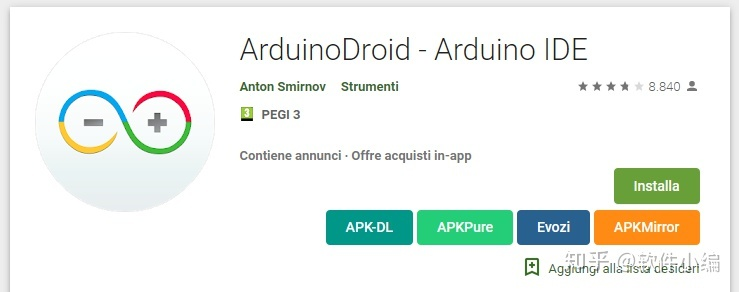
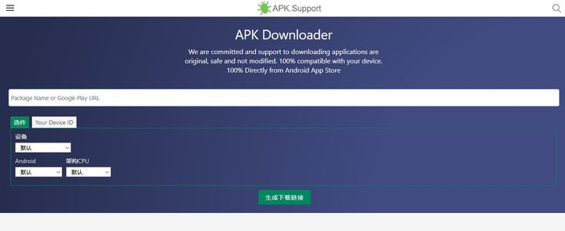
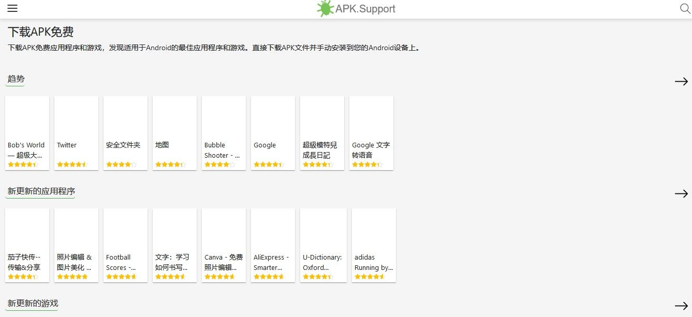
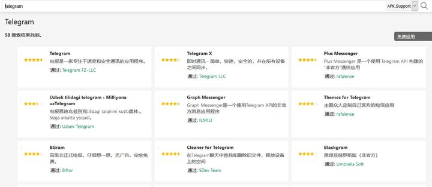

## 类似 Google Play 的应用市场

- [#APK Download #APK Mod #Paid Android Apps](https://link.zhihu.com/?target=https%3A//apkdownload.cc/)
- [APKTurbo](https://link.zhihu.com/?target=https%3A//www.apkturbo.com/)
- [观道_国外App下载_App下载界的一股清流](https://link.zhihu.com/?target=http%3A//www.guandao.cc/)

## 利用脚本下载

一个油猴脚本：[Direct download from Google Play](https://link.zhihu.com/?target=https%3A//greasyfork.org/zh-CN/scripts/33005-direct-download-from-google-play)

它会直接帮你显示几个下载源，点击就可以直接从第三方下载了，非常方便

## 利用第三方下载 Google Play 原版应用

官网：[https://apk.support/zh_cn/apk-downloader](https://link.zhihu.com/?target=https%3A//apk.support/zh_cn/apk-downloader)

输入Google Play地址或者应用包名即可下载

这个网站也是一个的应用市场，你可以按照分类查找应用

地址：[https://apk.support/zh_cn](https://link.zhihu.com/?target=https%3A//apk.support/zh_cn)

点击网页右上角的放大镜，你可以搜索自己想要的软件，甚至可以切换搜索源

当然，如果网络条件可以，你还可以用下面的工具从 Google Play 在线下载apk