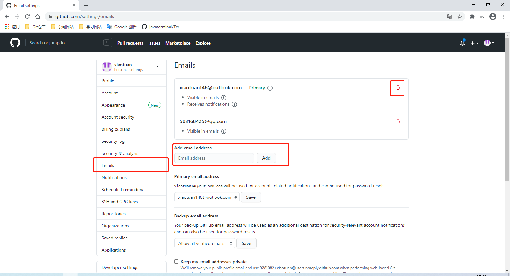
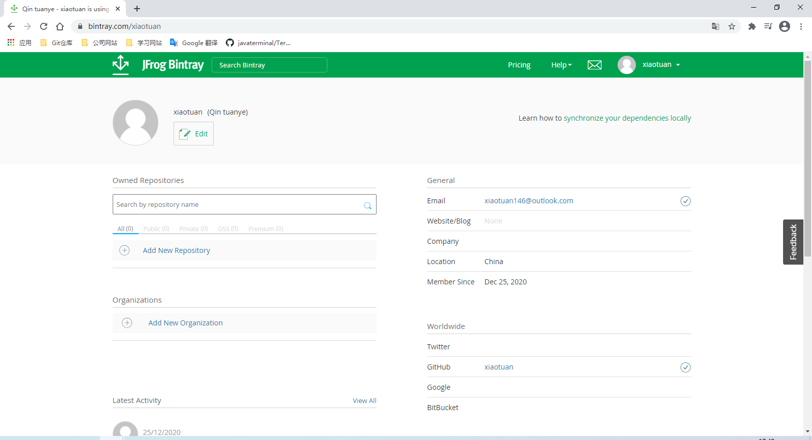
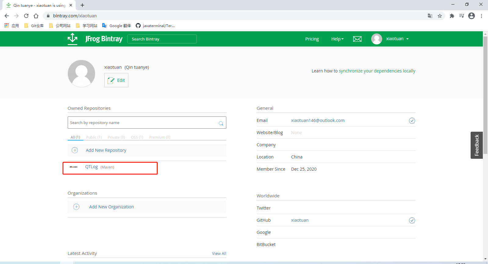

[toc]

### 1. 注册 bintray

bintray 官网：<https://bintray.com>

注册网址：<https://bintray.com/login?forwardedFrom=%2F>

点击 `Sign in with Github` 按钮，使用 Github 账号进行注册。

> 注意：如果 Github 账号的 Email 是 QQ邮箱或网易邮箱是不能注册的。可以参照下面修改 Github 账号的 Email。
>
> 进入 Github 的设置页面，在左边列表中选择 Emails 项，将右边 Emails 列表中的邮箱账号，直到非 QQ 邮箱和网易邮箱不是 Primary 邮箱时即可。如果删除完后还没有一个可用的邮箱，可通过下方的添加邮箱输入框添加合适的邮箱。
>
> 

注册完成后，将显示如下页面。

### 2. 创建库

点击上图中的 `Add New Repostory` 按钮，进入创建库界面。

在 Name 输入框中输入你要创建的库，在 Type 输入框中选择库的类型，在 Default Licenses(Optional) 输入框中选择库的许可证，在 Description(Optional) 输入框中输入库的描述字符串。然后点击 `Create` 按钮即创建成功。

创建好后，点击 QTLog 项进入库的设置界面。

