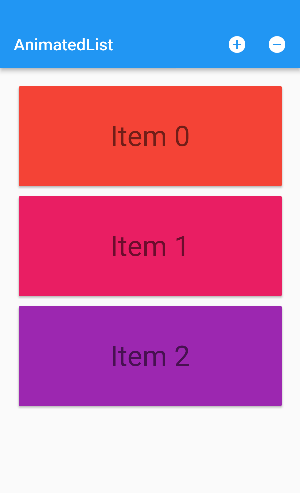
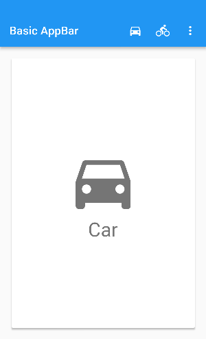
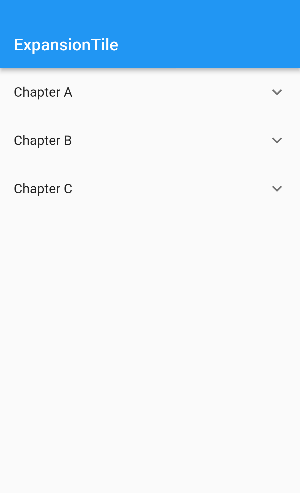

[toc]

# Flutter示例目录

此目录列出了演示如何使用Flutter实现常见移动设计模式的应用程序。 每个示例演示了如何将几个Flutter widget聚合在一起来实现有意义的用户界面。示例很短，只有一个Dart文件，但它们是完整的应用程序，您可以自由的修改。

如果您还想查看其它的示例，我们将非常欢迎在我们的[Gitter channel](https://gitter.im/flutter/flutter)或[邮件列表中](https://groups.google.com/d/forum/flutter-dev)中收到您的来信。

AnimatedList显示了一个卡片列表。当有条目被添加删除时，相应的卡片会以动画的方式在UI中插入或移除。

这个应用程序展示了以下类的特性：AnimatedList、AnimatedListState。

[了解更多](https://flutterchina.club/catalog/samples/animated-list/).

任何具有PreferredSize的widget都可以出现在AppBar的底部

这个应用程序展示了以下类的特性：AppBar、PreferredSize、TabBarView、TabController。

[了解更多](https://flutterchina.club/catalog/samples/app-bar-bottom/).

带标题、操作和下拉菜单的典型AppBar。

这个应用程序展示了以下类的特性：AppBar、IconButton、PopupMenuButton、Scaffold.

[了解更多](https://flutterchina.club/catalog/samples/basic-app-bar/).

ExpansionTiles可用于生成二级或多级列表。

这个应用程序展示了以下类的特性： ExpansionTile、ListView.

[了解更多](https://flutterchina.club/catalog/samples/expansion-tile-sample/).

