# Flutter for React Native 开发者

本文档适用于React Native (RN) 开发人员，可以将您现有的RN知识应用于使用Flutter构建移动应用程序。 如果您了解RN框架的基础知识，那么您可以将此文档用作Flutter开发的一个开端

可以将此文档作为cookbook, 通过跳转并查找与您的需求最相关的问题

------

- 介绍Dart for JavaScript 开发者
  - [入口点](https://flutterchina.club/flutter-for-react-native/#入口点)
  - [打印到控制台](https://flutterchina.club/flutter-for-react-native/#打印到控制台)
  - 变量
    - [创建和分配变量](https://flutterchina.club/flutter-for-react-native/#创建和分配变量)
    - [默认值](https://flutterchina.club/flutter-for-react-native/#默认值)
  - [检查null或零](https://flutterchina.club/flutter-for-react-native/#检查null或零)
  - [Functions](https://flutterchina.club/flutter-for-react-native/#functions)
  - 异步编程
    - [Futures](https://flutterchina.club/flutter-for-react-native/#futures)
    - [`async` 和 `await`](https://flutterchina.club/flutter-for-react-native/#async-和-await)
- 基础
  - [如何创建Flutter应用程序?](https://flutterchina.club/flutter-for-react-native/#如何创建flutter应用程序)
  - [我如何运行我的应用程序?](https://flutterchina.club/flutter-for-react-native/#我如何运行我的应用程序)
  - [如何导入?](https://flutterchina.club/flutter-for-react-native/#如何导入)
  - [Flutter中的应用程序中，什么是React Native“Hello world！”的等价物?](https://flutterchina.club/flutter-for-react-native/#flutter中的应用程序中什么是react-nativehello-world的等价物)
  - [如何使用组件并将其嵌套以形成组件树?](https://flutterchina.club/flutter-for-react-native/#如何使用组件并将其嵌套以形成组件树)
  - [如何创建可重用组件?](https://flutterchina.club/flutter-for-react-native/#如何创建可重用组件)
- 项目结构和资源
  - [我从哪里开始编写代码?](https://flutterchina.club/flutter-for-react-native/#我从哪里开始编写代码)
  - [在Flutter项目的目录结构是怎样的?](https://flutterchina.club/flutter-for-react-native/#在flutter项目的目录结构是怎样的)
  - [我在哪里放置我的代码和资源文件以及如何使用它们?](https://flutterchina.club/flutter-for-react-native/#我在哪里放置我的代码和资源文件以及如何使用它们)
  - [如何通过网络加载图像?](https://flutterchina.club/flutter-for-react-native/#如何通过网络加载图像)
  - [如何安装第三方包和第三方包插件?](https://flutterchina.club/flutter-for-react-native/#如何安装第三方包和第三方包插件)
- [Flutter widgets](https://flutterchina.club/flutter-for-react-native/#flutter-widgets)
- Views
  - [什么是等效的“视图”容器?](https://flutterchina.club/flutter-for-react-native/#什么是等效的视图容器)
  - [什么是`FlatList`或`SectionList`的等价物?](https://flutterchina.club/flutter-for-react-native/#什么是flatlist或sectionlist的等价物)
  - [如何使用Canvas绘制或渲染?](https://flutterchina.club/flutter-for-react-native/#如何使用canvas绘制或渲染)
- 布局
  - [如何使用小部件定义布局属性?](https://flutterchina.club/flutter-for-react-native/#如何使用小部件定义布局属性)
  - [如何分层widgets?](https://flutterchina.club/flutter-for-react-native/#如何分层widgets)
- 样式
  - [如何设置组件的样式?](https://flutterchina.club/flutter-for-react-native/#如何设置组件的样式)
  - [我如何使用`Icons`和`Colors`?](https://flutterchina.club/flutter-for-react-native/#我如何使用icons和colors)
  - [如何添加样式主题?](https://flutterchina.club/flutter-for-react-native/#如何添加样式主题)
- 状态管理
  - [StatelessWidget](https://flutterchina.club/flutter-for-react-native/#statelesswidget)
  - [StatefulWidget](https://flutterchina.club/flutter-for-react-native/#statefulwidget)
  - 什么是StatefulWidget和StatelessWidget最佳实践?
    - [1. 确定窗口小部件应该是StatefulWidget还是StatelessWidget](https://flutterchina.club/flutter-for-react-native/#1-确定窗口小部件应该是statefulwidget还是statelesswidget)
    - [2. 确定哪个对象管理窗口小部件的状态（对于StatefulWidget）](https://flutterchina.club/flutter-for-react-native/#2-确定哪个对象管理窗口小部件的状态对于statefulwidget)
    - [3. StatefulWidget 和 Stated的子类](https://flutterchina.club/flutter-for-react-native/#3-statefulwidget-和-stated的子类)
    - [4. 将StatefulWidget添加到窗口小部件树中](https://flutterchina.club/flutter-for-react-native/#4-将statefulwidget添加到窗口小部件树中)
- [Props](https://flutterchina.club/flutter-for-react-native/#props)
- 本地存储
  - [如何存储应用程序全局的持久键值对?](https://flutterchina.club/flutter-for-react-native/#如何存储应用程序全局的持久键值对)
- 路由
  - [如何在页面之间导航?](https://flutterchina.club/flutter-for-react-native/#如何在页面之间导航)
  - 如何使用选项卡导航和抽屉导航?
    - [标签导航](https://flutterchina.club/flutter-for-react-native/#标签导航)
    - [抽屉导航](https://flutterchina.club/flutter-for-react-native/#抽屉导航)
- 手势检测和触摸事件处理
  - [如何监听窗口小部件单击或按压事件?](https://flutterchina.club/flutter-for-react-native/#如何监听窗口小部件单击或按压事件)
- 发出HTTP网络请求
  - [如何从API调用中获取数据?](https://flutterchina.club/flutter-for-react-native/#如何从api调用中获取数据)
- 表单输入
  - [如何使用文本字段小部件?](https://flutterchina.club/flutter-for-react-native/#如何使用文本字段小部件)
  - [我如何使用表单小部件?](https://flutterchina.club/flutter-for-react-native/#我如何使用表单小部件)
- [特定于平台的代码](https://flutterchina.club/flutter-for-react-native/#特定于平台的代码)
- 调试
  - [如何访问应用内开发人员菜单?](https://flutterchina.club/flutter-for-react-native/#如何访问应用内开发人员菜单)
  - [如何执行热重新加载?](https://flutterchina.club/flutter-for-react-native/#如何执行热重新加载)
  - [我可以使用哪些工具在Flutter中调试我的应用程序?](https://flutterchina.club/flutter-for-react-native/#我可以使用哪些工具在flutter中调试我的应用程序)
- 动画
  - [如何添加简单的淡入动画?](https://flutterchina.club/flutter-for-react-native/#如何添加简单的淡入动画)
  - [如何向卡添加滑动动画?](https://flutterchina.club/flutter-for-react-native/#如何向卡添加滑动动画)
- [React Native和Flutter Widget等效组件](https://flutterchina.club/flutter-for-react-native/#react-native和flutter-widget等效组件)

------

## 介绍Dart for JavaScript 开发者

像React Native一样, Flutter使用反应式视图.然而,相比于RN转换原生控件,Flutter则编译为原生代码. Flutter控制屏幕上的每个像素,这避免了由于需要JavaScript桥接而导致的性能问题

Dart是一种易于学习的语言，并提供以下功能:

- 提供用于构建Web的开源，可伸缩编程语言， 服务器和移动应用程序。
- 提供使用C风格的面向对象的单继承语言AOT编译成本机的语法。
- 可选地转换为JavaScript。
- 支持接口和抽象类。

下面描述了JavaScript和Dart之间差异的一些示例。

### 入口点

JavaScript没有预定义的入口函数 - 您可以定义入口点.

```javascript
// JavaScript
function startHere() {
  // Can be used as entry point
}
```

在Dart中，每个app都必须有一个顶级的`main（）`函数作为应用程序的入口点。

```dart
// Dart
main() {
}
```

尝试一下 [DartPad](https://dartpad.dartlang.org/0df636e00f348bdec2bc1c8ebc7daeb1).

### 打印到控制台

要在Dart中打印到控制台，请使用`print`。

```javascript
// JavaScript
console.log("Hello world!");
// Dart
print('Hello world!');
```

尝试一下 [DartPad](https://dartpad.dartlang.org/cf9e652f77636224d3e37d96dcf238e5).

### 变量

Dart是类型安全的 - 它使用静态类型检查和运行时的组合,检查以确保变量的值始终与变量的静态值匹配 类型。尽管类型是必需的，但某些类型注释是可选的，因为 Dart执行类型推断。

#### 创建和分配变量

在JavaScript中，无法定义变量类型。

在 [Dart](https://www.dartlang.org/dart-2)中, 变量必须是明确的 类型或系统能够解析的类型。

```javascript
// JavaScript
var name = "JavaScript";
// Dart
String name = 'dart'; // Explicitly typed as a string.
var otherName = 'Dart'; // Inferred string.
// Both are acceptable in Dart.
```

尝试一下 [DartPad](https://dartpad.dartlang.org/3f4625c16e05eec396d6046883739612)。

有关更多信息, 请参阅 [Dart的类型系统](https://www.dartlang.org/guides/language/sound-dart)。

#### 默认值

在JavaScript中，未初始化的变量是 `undefined`。

在Dart中，未初始化的变量的初始值为“null”。因为数字是Dart中的对象，所以只要是带有数字类型的未初始化变量 的值都是“null”。

```javascript
// JavaScript
var name; // == undefined
// Dart
var name; // == null
int x; // == null
```

尝试一下 [DartPad](https://dartpad.dartlang.org/57ec21faa8b6fe2326ffd74e9781a2c7)。

有关更多信息，请参阅文档 [变量](https://www.dartlang.org/guides/language/language-tour#variables)。

### 检查null或零

在JavaScript中，1或任何非null对象的值被视为true。

```javascript
// JavaScript
var myNull = null;
if (!myNull) {
  console.log("null is treated as false");
}
var zero = 0;
if (!zero) {
  console.log("0 is treated as false");
}
```

在Dart中，只有布尔值“true”被视为true。

```dart
// Dart
var myNull = null;
if (myNull == null) {
  print('use "== null" to check null');
}
var zero = 0;
if (zero == 0) {
  print('use "== 0" to check zero');
}
```

尝试一下 [DartPad](https://dartpad.dartlang.org/c85038ad677963cb6dc943eb1a0b72e6).

### Functions

Dart和JavaScript函数通常类似。主要区别是声明。

```javascript
// JavaScript
function fn() {
  return true;
}
// Dart
fn() {
  return true;
}
// can also be written as
bool fn() {
  return true;
}
```

尝试一下 [DartPad](https://dartpad.dartlang.org/5454e8bfadf3000179d19b9bc6be9918)。

有关更多信息，请参阅文档 [functions](https://www.dartlang.org/guides/language/language-tour#functions)。

### 异步编程

#### Futures

与JavaScript一样，Dart支持单线程执行。在JavaScript中，Promise对象表示异步操作的最终完成（或失败）及其结果值

Dart使用 [`Future`](https://www.dartlang.org/tutorials/language/futures) 对象提交到这里.

```javascript
// JavaScript
_getIPAddress = () => {
  const url="https://httpbin.org/ip";
  return fetch(url)
    .then(response => response.json())
    .then(responseJson => {
      console.log(responseJson.origin);
    })
    .catch(error => {
      console.error(error);
    });
};
// Dart
_getIPAddress() {
  final url = 'https://httpbin.org/ip';
  HttpRequest.request(url).then((value) {
      print(json.decode(value.responseText)['origin']);
  }).catchError((error) => print(error));
}
```

尝试一下 [DartPad](https://dartpad.dartlang.org/b68eb981456c5eec03daa3c05ee59486)。

有关更多信息，请参阅文档 [Futures](https://www.dartlang.org/tutorials/language/futures)。

#### `async` 和 `await`

`async`函数声明定义了一个异步函数。

在JavaScript中，`async`函数返回一个`Promise`。 `await`运算符是用来等待’Promise’。

```javascript
// JavaScript
async _getIPAddress() {
  const url="https://httpbin.org/ip";
  const response = await fetch(url);
  const json = await response.json();
  const data = await json.origin;
  console.log(data);
}
```

在Dart中，`async`函数返回一个`Future`，函数的主体是稍后执行。 `await`运算符用于等待`Future`。

```dart
// Dart
_getIPAddress() async {
  final url = 'https://httpbin.org/ip';
  var request = await HttpRequest.request(url);
  String ip = json.decode(request.responseText)['origin'];
  print(ip);
}
```

尝试一下 [DartPad](https://dartpad.dartlang.org/96e845a844d8f8d91c6f5b826ef38951)。

有关更多信息，请参阅 [`async` and `await`](https://www.dartlang.org/guides/language/language-tour#asynchrony-support) 文档。

## 基础

### 如何创建Flutter应用程序?

要使用React Native创建应用程序，您将运行`create-react-native-app`从命令行。

```
$ create-react-native-app <projectname>
```

要在Flutter中创建应用程序，请执行以下操作之一:

- 从命令行使用`flutter create`命令。确保Flutter SDK配置了环境变量。
- 使用安装了Flutter和Dart插件的IDE。

```
$ flutter create <projectname>
```

有关更多信息，请参阅 [入门: 概述](https://flutterchina.club/get-started/) 教程 引导您创建一个按钮单击计数器应用程序。创造一个Flutter 项目构建在Android上运行示例应用程序所需的所有文件 和iOS设备。

### 我如何运行我的应用程序?

在React Native中，您将在项目目录中运行`npm run`或`yarn run`。

您可以通过几种方式运行Flutter应用程序:

- 从项目的根目录使用`flutter run`。
- 在带有Flutter和Dart插件的IDE中使用“run”选项。

您的应用在连接的设备，iOS模拟器或Android模拟器上运行。

有关更多信息，请参阅Flutter [入门: 概述](https://flutterchina.club/get-started/) 文档。

### 如何导入?

在React Native中，您需要导入每个必需的组件。

```javascript
//React Native
import React from "react";
import { StyleSheet, Text, View } from "react-native";
```

在Flutter中，要使用Material Design库中的小部件，请导入`material.dart`包。要使用iOS样式小部件，请导入Cupertino库。要使用更基本的窗口小部件集，请导入窗口小部件库。或者，您可以编写自己的小部件库并导入它.

```dart
import 'package:flutter/material.dart';
import 'package:flutter/cupertino.dart';
import 'package:flutter/widgets.dart';
import 'package:flutter/my_widgets.dart';
```

无论您导入哪个小部件包，Dart都只会导入在您的应用中使用的小部件。

有关更多信息，请参阅 [Flutter Widgets 目录](https://flutterchina.club/widgets/)。

### Flutter中的应用程序中，什么是React Native“Hello world！”的等价物?

在React Native中，`HelloWorldApp`类扩展了`React.Component`和 通过返回视图组件来实现render方法。

```javascript
// React Native
import React from "react";
import { StyleSheet, Text, View } from "react-native";

export default class App extends React.Component {
  render() {
    return (
      <View style={styles.container}>
        <Text>Hello world!</Text>
      </View>
    );
  }
}

const styles = StyleSheet.create({
  container: {
    flex: 1,
    backgroundColor: "#fff",
    alignItems: "center",
    justifyContent: "center"
  }
});
```

在Flutter中，您可以创建一个完全相同的“Hello world！”应用程序使用核心窗口小部件库中的Center和Text窗口小部件。Center窗口小部件成为窗口小部件树的根，并且有一个子窗口，即“Text”窗口小部件。

```dart
// Flutter
import 'package:flutter/material.dart';

void main() {
  runApp(
    Center(
      child: Text(
        'Hello, world!',
        textDirection: TextDirection.ltr,
      ),
    ),
  );
}
```

以下图片显示了基本Flutter“Hello world！”的Android和iOS UI中的应用。

|                      Android                       |                      iOS                       |
| :------------------------------------------------: | :--------------------------------------------: |
| 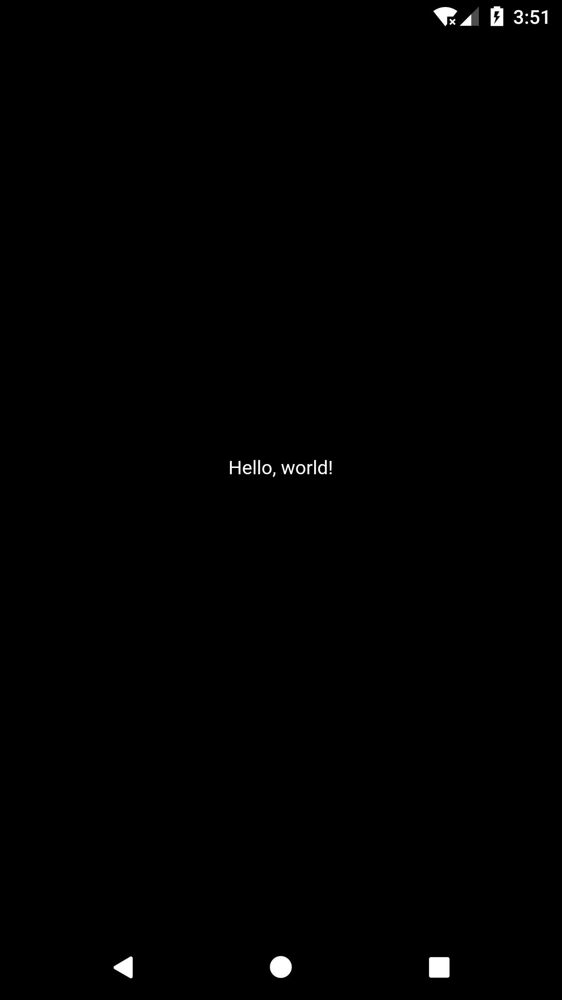 | 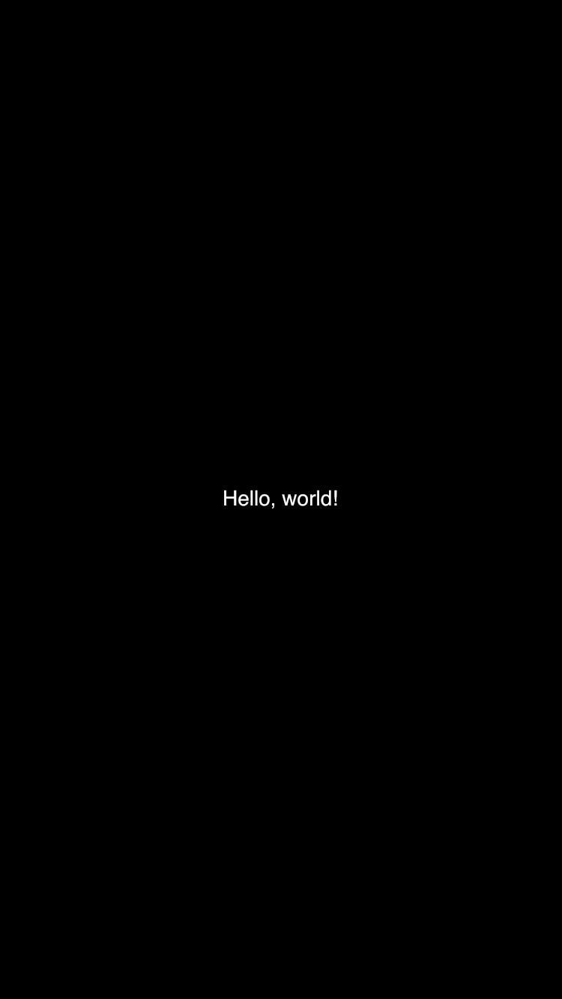 |


现在您已经看到了最基本的Flutter应用程序，下一节将展示 如何利用Flutter丰富的小部件库创建一个现代的， 优雅的应用程序。

### 如何使用组件并将其嵌套以形成组件树?

在Flutter中，几乎所有东西都是widget。

widget是应用程序用户界面的基本构建块，您将组件组成一个层次结构，调用组件树。每个窗口widget都嵌套在父窗口widget中，并从其父窗口继承属性。甚至应用程序对象本身也是一个组件，没有单独的“应用程序”对象。相反，根组件担任此角色。

Widget可以定义:

- 结构元素 - 如按钮或菜单
- 风格元素 - 像字体或颜色主题
- 类似布局的填充或对齐的一个方向

以下示例使用Material库中的Widget显示“Hello world！”应用程序。在此示例中，窗口组件树嵌套在MaterialApp根窗口组件中。

```dart
// Flutter
import 'package:flutter/material.dart';

void main() => runApp(MyApp());

class MyApp extends StatelessWidget {
  @override
  Widget build(BuildContext context) {
    return MaterialApp(
      title: 'Welcome to Flutter',
      home: Scaffold(
        appBar: AppBar(
          title: Text('Welcome to Flutter'),
        ),
        body: Center(
          child: Text('Hello world'),
        ),
      ),
    );
  }
}
```

以下图片显示了使用Material Design小部件构建的“Hello world！”。您可以免费获得比基本的“Hello world！”应用程序更多的功能。

|                  Android                  |                    iOS                    |
| :---------------------------------------: | :---------------------------------------: |
| 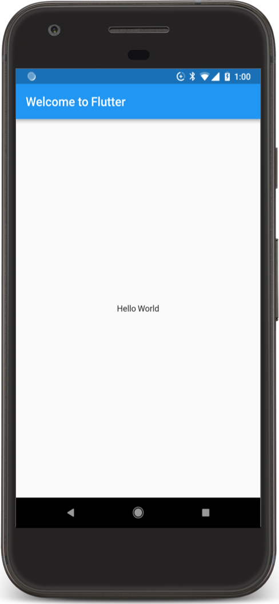 | 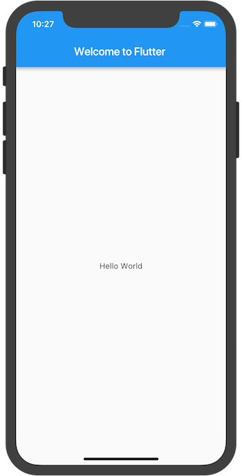 |


编写应用程序时，您将使用两种类型的widgets: [StatelessWidget](https://docs.flutter.io/flutter/widgets/StatelessWidget-class.html) 和 [StatefulWidget](https://docs.flutter.io/flutter/widgets/StatefulWidget-class.html)。StatelessWidget听起来就像是一个没有状态的组件，StatelessWidget创建一次，永远不会改变其外观。 StatefulWidget根据收到的数据或用户输入动态更改状态

无状态小部件和有状态小部件之间的重要区别在于StatefulWidgets具有一个State对象，该对象存储状态数据并在树重建中进行传递，因此它不会丢失。

在简单或基本的应用程序中，嵌套widgets很容易，但随着代码库变大，应用程序变得复杂，您应该将深层嵌套的小部件分解为返回小部件或更小类的函数。创建单独的函数和小部件允许您重用应用程序中的组件。

### 如何创建可重用组件?

在React Native中，您将定义一个类来创建可重用的组件，然后使用props方法来设置或返回所选元素的属性和值，在下面的示例中，定义了CustomCard类，然后在父类中使用。

```javascript
// React Native
class CustomCard extends React.Component {
  render() {
    return (
      <View>
        <Text > Card {this.props.index} </Text>
        <Button
          title="Press"
          onPress={() => this.props.onPress(this.props.index)}
        />
      </View>
    );
  }
}

// Usage
<CustomCard onPress={this.onPress} index={item.key} />
```

在Flutter中，定义一个类来创建自定义widget，然后重用widget。您还可以定义和调用返回可重用小部件的函数，如以下示例中的构建函数所示。

```dart
// Flutter
class CustomCard extends StatelessWidget {
  CustomCard({@required this.index, @required 
     this.onPress});

  final index;
  final Function onPress;

  @override
  Widget build(BuildContext context) {
    return Card(
      child: Column(
        children: <Widget>[
          Text('Card $index'),
          FlatButton(
            child: const Text('Press'),
            onPressed: this.onPress,
          ),
        ],
      )
    );
  }
}
    ...
// Usage
CustomCard(
  index: index,
  onPress: () { 
    print('Card $index');
  },
)
    ...
```

在前面的例子中, `CustomCard`类的构造函数使用Dart的大括号语法`{}`来配置 [Optional parameters](https://www.dartlang.org/guides/language/language-tour#optional-parameters)。

要使用这些字段，请从构造函数中删除花括号，或者 将`@ required`添加到构造函数中。

以下屏幕截图显示了可重用的CustomCard类的示例。

|             Android              |             iOS              |
| :------------------------------: | :--------------------------: |
| 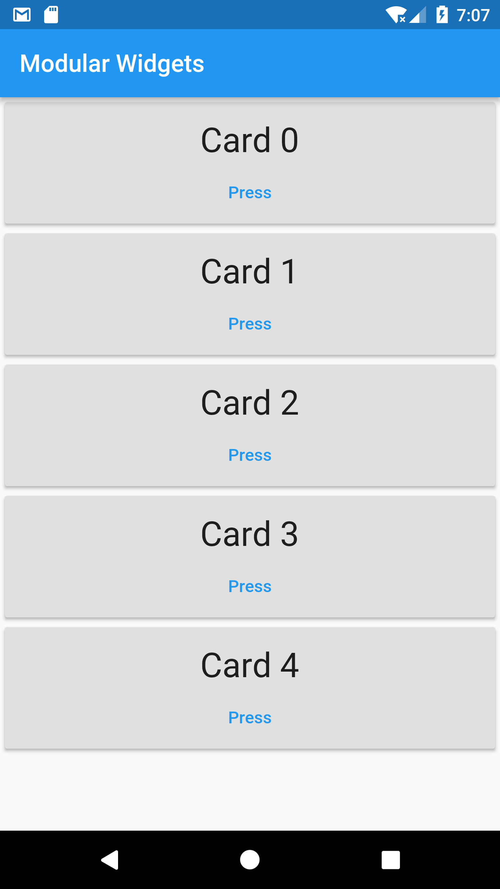 | 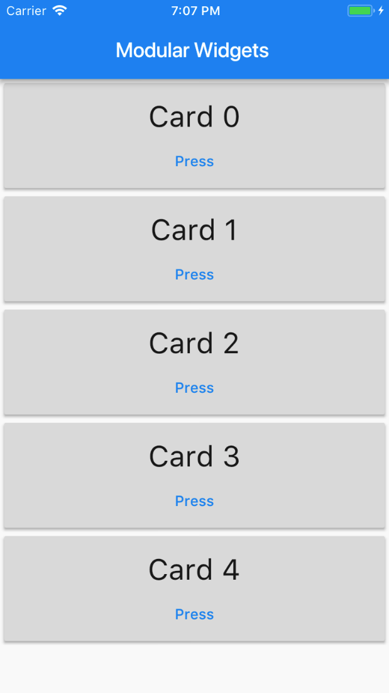 |


## 项目结构和资源

### 我从哪里开始编写代码?

从`main.dart`文件开始。它是在您创建时自动生成的Flutter应用程序。

```dart
// Dart
void main(){
 print("Hello, this is the main function.");
}
```

在Flutter中，入口点文件是`'项目名称'/ lib / main.dart`并执行从`main`函数开始。

### 在Flutter项目的目录结构是怎样的?

创建新的Flutter项目时，它会构建以下目录结构。您可以稍后自定义它，但这是您开始的地方

```
┬
└ projectname
  ┬
  ├ android      - Contains Android-specific files.
  ├ build        - Stores iOS and Android build files.
  ├ ios          - Contains iOS-specific files.
  ├ lib          - Contains externally accessible Dart source files.
    ┬
    └ src        - Contains additional source files.
    └ main.dart  - The Flutter entry point and the start of a new app.
                   This is generated automatically when you create a Flutter
                    project.
                   It's where you start writing your Dart code.
  ├ test         - Contains automated test files.
  └ pubspec.yaml - Contains the metadata for the Flutter app.
                   This is equivalent to the package.json file in React Native.
```

### 我在哪里放置我的代码和资源文件以及如何使用它们?

Flutter源码或资源文件是与您的应用捆绑在一起并部署的文件 并且可以在运行时访问。 Flutter应用程序可以包含以下文件类型:

- 静态数据，例如JSON文件
- 配置文件
- 图标和图片 (JPEG, PNG, GIF, Animated GIF, WebP, Animated WebP, BMP, and WBMP)

Flutter使用位于项目根目录的`pubspec.yaml`文件识别应用程序所需的资源文件。

```yaml
flutter:
  assets:
    - assets/my_icon.png
    - assets/background.png
```

`assets`指定的部分应包含在应用程序中的文件。 每个assets文件都由相对于`pubspec.yaml`的显式路径标识, assets文件所在的位置. assets的顺序和 命名以及 使用的实际目录（在这种情况下为`assets`） 都没影响。但是，虽然assets可以放在任何应用程序目录中，但它是一个 将它们放在`assets`目录中的最佳实践。

在构建期间, Flutter将资源文件放入名为* asset的特殊存档中, 当应用程序从内存中读取时。当资源的路径在 `pubspec.yaml`中声明时, 构建过程查找任何文件 相邻子目录中的相同名称. 这些文件也包含在 assets包以及指定的assets。 Flutter使用assets变量时将 为您的应用选择适合分辨率的图像。

在React Native中，您可以通过将图像文件放在源代码目录中并引用它来添加静态图像。

```javascript
<Image source={require("./my-icon.png")} />
```

在Flutter中，使用`AssetImage`类将静态图像添加到应用程序 widget的构建方法。

```dart
image: AssetImage('assets/background.png'),
```

有关更多信息，请参阅 [在Flutter中添加资源和图片](https://flutterchina.club/assets-and-images/)。

### 如何通过网络加载图像?

在React Native中，你可以在`Image`组件的`source` prop中指定`uri` ，如果需要也提供大小。

In Flutter, use the `Image.network` constructor to include an image from a URL。

```dart
// Flutter
body: Image.network(
          'https://flutter.io/images/owl.jpg',
```

### 如何安装第三方包和第三方包插件?

Flutter支持使用第三方包 由其他开发者贡献给 Flutter和Dart生态系统。 这使您可以快速构建应用程序而没必要 必须从头开发一切。包含的包 特定于平台的代码称为包插件。

在React Native中，你可以使用`yarn add {package-name}`或`npm install --save {package-name}`从命令行安装软件包。

在Flutter中，使用以下说明安装包:

1. 将包名称和版本添加到

   ```
   pubspec.yaml
   ```

    

   dependencies部分。 下面的示例显示了如何将

   ```
   google_sign_in
   ```

    

   Dart包添加到

    

   ```
   pubspec.yaml
   ```

   文件。在YAML文件中工作时会检查空格，因为

   空格很重要

   !

   ```yaml
   dependencies:
     flutter:
    sdk: flutter
     google_sign_in: ^3.0.3
   ```

2. 使用`flutter packages get`从命令行安装软件包。 如果使用IDE，它通常会为您运行`flutter packages get`，或者它可能 提示你这样做。

3. 将包导入您的应用代码，如下所示：

   ```dart
   import 'package:flutter/cupertino.dart';
   ```

有关更多信息，请参阅 [使用packages](https://flutterchina.club/using-packages/) and [开发Packages和插件](https://flutterchina.club/developing-packages/)。

您可以在中找到Flutter开发人员共享的许多软件包 [Flutter Packages](https://pub.dartlang.org/flutter/) 部分 [pub.dartlang.org](https://pub.dartlang.org/)。

## Flutter widgets

在Flutter中，您可以使用描述其视图内容的widgets来构建UI 应该看起来像他们当前的配置和状态。

Widgets通常由许多小部件组成, 嵌套的单一功能的widget产生强大的效果。例如，Container Widget包含 几个widget负责布局, 绘制, 排版, 和 测量。 具体来说，`Container`小部件包括`LimitedBox`, `ConstrainedBox`, `Align`, `Padding`, `DecoratedBox`, 和 `Transform` widgets。 您可以使用而不是继承“Container”来生成自定义效果 以新颖独特的方式构建这些和其他简单的小部件。

“Center”widget是另一种控制布局的方式， 要使窗口小部件居中，请将其包装在“Center”窗口小部件中，然后使用布局窗口小部件进行对齐，行，列和网格。 这些布局widget没有自己的视觉表现 。相反，他们唯一的目的是控制。其他widget的布局方向。检查相邻的widget对于理解widget是如何呈现另一个widget是很有帮助的。

有关更多信息，请参见 [Flutter框架概览](https://flutterchina.club/technical-overview/)。

有关小部件包中的核心部件的更多信息，请参见 [基础 Widgets](https://flutterchina.club/widgets/basics/), [Widgets 目录](https://flutterchina.club/widgets/)，或者 [Flutter Widget 索引](https://flutterchina.club/widgets/widgetindex/)。

## Views

### 什么是等效的“视图”容器?

在React Native中，`View`是一个支持`Flexbox`布局的容器， 风格，触摸处理和辅助功能控件。

在Flutter中，您可以使用Widgets库中的核心布局小部件 如 [Container](https://docs.flutter.io/flutter/widgets/Container-class.html), [Column](https://docs.flutter.io/flutter/widgets/Column-class.html), [Row](https://docs.flutter.io/flutter/widgets/Row-class.html), 和 [Center](https://docs.flutter.io/flutter/widgets/Center-class.html).

有关更多信息，请参阅 [布局 Widget](https://flutterchina.club/widgets/layout/) 目录。

### 什么是`FlatList`或`SectionList`的等价物?

“List”是垂直排列的可滚动组件列表。

在React Native中，`FlatList`或`SectionList`用于渲染简单或 分段列表。

```javascript
// React Native
<FlatList
  data={[ ... ]}
  renderItem={({ item }) => <Text>{item.key}</Text>}
/>
```

[`ListView`](https://docs.flutter.io/flutter/widgets/ListView-class.html) 是Flutter最常用的滚动小部件。 默认构造函数构造每一个子条目。 [`ListView`](https://docs.flutter.io/flutter/widgets/ListView-class.html) 最适合少量数据小部件。对于大型或无限列表, 使用 `ListView.builder`, 它根据需要构建其子条目且仅构建 那些可见的条目。

```dart
// Flutter
var data = [ ... ];
ListView.builder(
  itemCount: data.length,
  itemBuilder: (context, int index) {
    return Text(
      data[index],
    );
  },
)
```

|                  Android                  |                  iOS                  |
| :---------------------------------------: | :-----------------------------------: |
|  |  |


要了解如何实现无限滚动列表，请参阅 [编写第一个Flutter应用, Part 1](https://codelabs.developers.google.com/codelabs/first-flutter-app-pt1/#0) 。

### 如何使用Canvas绘制或渲染?

在React Native中，不存在canvas组件，因此使用了诸如`react-native-canvas`之类的第三方库

```javascript
// React Native
handleCanvas = canvas => {
  const ctx = canvas.getContext("2d");
  ctx.fillStyle = "skyblue";
  ctx.beginPath();
  ctx.arc(75, 75, 50, 0, 2 * Math.PI);
  ctx.fillRect(150, 100, 300, 300);
  ctx.stroke();
};

render() {
  return (
    <View>
      <Canvas ref={this.handleCanvas} />
    </View>
  );
}
```

在Flutter中，你可以使用 [`CustomPaint`](https://docs.flutter.io/flutter/widgets/CustomPaint-class.html) 和 [`CustomPainter`](https://docs.flutter.io/flutter/rendering/CustomPainter-class.html) 类去绘制到画布。

以下示例显示如何使用`CustomPaint`小部件在绘制阶段绘制。 它实现了抽象类CustomPainter，并将其传递给CustomPaint的painter属性。 CustomPaint子类必须实现`paint`和`shouldRepaint`方法。

```dart
// Flutter
class MyCanvasPainter extends CustomPainter {

  @override
  void paint(Canvas canvas, Size size) {
    Paint paint = Paint();
    paint.color = Colors.amber;
    canvas.drawCircle(Offset(100.0, 200.0), 40.0, paint);
    Paint paintRect = Paint();
    paintRect.color = Colors.lightBlue;
    Rect rect = Rect.fromPoints(Offset(150.0, 300.0), Offset(300.0, 400.0));
    canvas.drawRect(rect, paintRect);
  }

  bool shouldRepaint(MyCanvasPainter oldDelegate) => false;
  bool shouldRebuildSemantics(MyCanvasPainter oldDelegate) => false;
}
class _MyCanvasState extends State<MyCanvas> {

  @override
  Widget build(BuildContext context) {
    return Scaffold(
      body: CustomPaint(
        painter: MyCanvasPainter(),
      ),
    );
  }
}
```

|                 Android                 |                 iOS                 |
| :-------------------------------------: | :---------------------------------: |
| 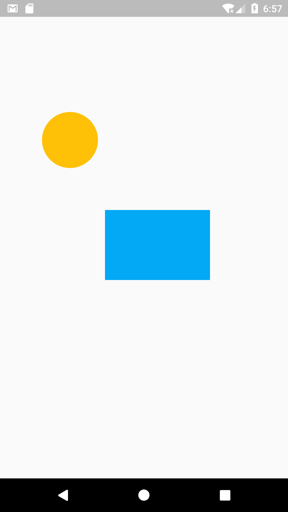 | 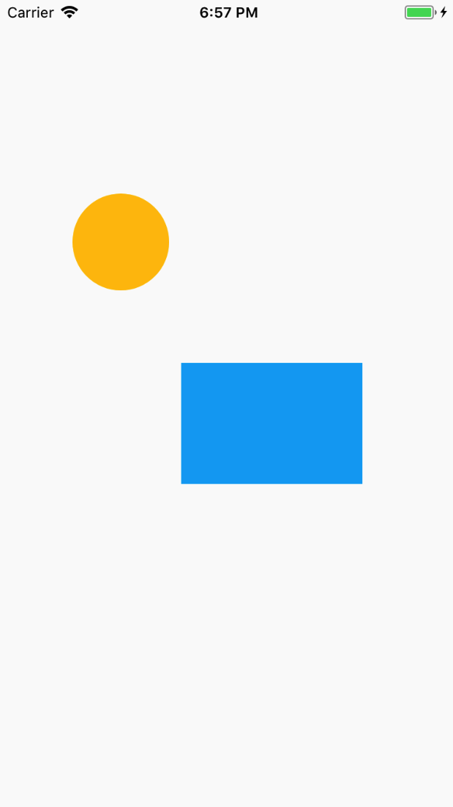 |


## 布局

### 如何使用小部件定义布局属性?

在React Native中，大多数布局都可以使用传递的道具来完成 到特定的组件。例如，你可以使用`style` 道具在 `View`组件上以指定flexbox属性。 排版你的 在列中的组件，您将指定一个支柱，如: `flexDirection: “column”`。

```javascript
// React Native
<View
  style={{
    flex: 1,
    flexDirection: "column",
    justifyContent: "space-between",
    alignItems: "center"
  }}
>
```

在Flutter中，布局主要由专门设计的小部件定义 并提供布局，结合控件小部件及其样式属性。

例如, [列](https://docs.flutter.io/flutter/widgets/Column-class.html) 和 [行](https://docs.flutter.io/flutter/widgets/Row-class.html) widgets 控制一个数组中的条目 并且 分别垂直和水平对齐它们。 [Container](https://docs.flutter.io/flutter/widgets/Container-class.html) widget 控制一个布局的样式和属性, 并且 [`Center`](https://docs.flutter.io/flutter/widgets/Center-class.html) widget 负责居中 它的子widget。

```dart
// Flutter
Center(
  child: Column(
    children: <Widget>[
      Container(
        color: Colors.red,
        width: 100.0,
        height: 100.0,
      ),
      Container(
        color: Colors.blue,
        width: 100.0,
        height: 100.0,
      ),
      Container(
        color: Colors.green,
        width: 100.0,
        height: 100.0,
      ),
    ],
  ),
)
```

Flutter在其核心小部件库中提供了各种布局小部件。 例如, [`Padding`](https://docs.flutter.io/flutter/widgets/Padding-class.html), [`Align`](https://docs.flutter.io/flutter/widgets/Align-class.html), 和 [`Stack`](https://docs.flutter.io/flutter/widgets/Stack-class.html).

有关完整列表，请参阅 [布局 Widget](https://flutterchina.club/widgets/layout/)。

|                    Android                    |                    iOS                    |
| :-------------------------------------------: | :---------------------------------------: |
| 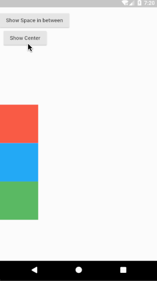 | 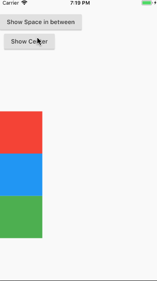 |


### 如何分层widgets?

在React Native中，组件可以使用`absolute`定位进行分层。

Flutter 使用[`Stack`](https://docs.flutter.io/flutter/widgets/Stack-class.html) widget 控制子widget在一层。 子widgets可以完全或者部分覆盖基础widgets。

`Stack`控件将其子项相对于其框的边缘定位。如果您只想重叠多个子窗口小部件，这个类很有用。

```dart
// Flutter
Stack(
  alignment: const Alignment(0.6, 0.6),
  children: <Widget>[
    CircleAvatar(
      backgroundImage: NetworkImage(
        "https://avatars3.githubusercontent.com/u/14101776?v=4"),
    ),
    Container(
      decoration: BoxDecoration(
          color: Colors.black45,
      ),
      child: Text('Flutter'),
    ),
  ],
)
```

上一个示例使用 `Stack` 覆盖容器 (显示其“Text”在半透明的黑色背景上) 在’CircleAvatar`之上. Stack偏移文本 使用alignment属性和Alignment定位。

|                Android                 |                iOS                 |
| :------------------------------------: | :--------------------------------: |
|  |  |


有关更多信息，请参阅 [Stack class](https://docs.flutter.io/flutter/widgets/Stack-class.html) 文档。

## 样式

### 如何设置组件的样式?

在React Native中，内联样式和`stylesheets.create`用于样式 组件

```javascript
// React Native
<View style={styles.container}>
  <Text style={{ fontSize: 32, color: "cyan", fontWeight: "600" }}>
    This is a sample text
  </Text>
</View>

const styles = StyleSheet.create({
  container: {
    flex: 1,
    backgroundColor: "#fff",
    alignItems: "center",
    justifyContent: "center"
  }
});
```

在Flutter中，`Text`小部件可以使用`TextStyle`类的风格属性。如果要在多个位置使用相同的文本样式， 你可以创建一个 [`TextStyle`](https://docs.flutter.io/flutter/dart-ui/TextStyle-class.html) 类并将其应用于各个 `Text` widgets。

```dart
// Flutter
var textStyle = TextStyle(fontSize: 32.0, color: Colors.cyan, fontWeight:
   FontWeight.w600);
	...
Center(
  child: Column(
    children: <Widget>[
      Text(
        'Sample text',
        style: textStyle,
      ),
      Padding(
        padding: EdgeInsets.all(20.0),
        child: Icon(Icons.lightbulb_outline,
          size: 48.0, color: Colors.redAccent)
      ),
    ],
  ),
)
```

|                     Android                     |                     iOS                     |
| :---------------------------------------------: | :-----------------------------------------: |
|  |  |


### 我如何使用`Icons`和`Colors`?

React Native不包含对图标的支持，因此使用第三方库。

在Flutter中，导入Material库也会引入  丰富的Material [icons](https://docs.flutter.io/flutter/material/Icons-class.html) 和 [colors](https://docs.flutter.io/flutter/material/Colors-class.html)。

```dart
Icon(Icons.lightbulb_outline, color: Colors.redAccent)
```

使用`Icons`类时，请务必在该项目的`pubspec.yaml`文件中设置`uses-material-design：true`。这确保显示包含在您的应用程序中图标的`MaterialIcons`字体。

```dart
name: my_awesome_application
flutter: uses-material-design: true
```

Flutter的 [Cupertino (iOS风格)](https://flutterchina.club/widgets/cupertino/) 包提供高保真小部件对于当前的iOS设计语言. 要使用`CupertinoIcons`字体，请添加 项目中`cupertino_icons`的依赖项 `pubspec.yaml` 文件。

```yaml
name: my_awesome_application
dependencies:
  cupertino_icons: ^0.1.0
```

全局定制组件的颜色和样式, 使用ThemeData指定主题各个方面的默认颜色。将`MaterialApp`中的theme属性设置为`ThemeData`对象。 [`Colors`](https://docs.flutter.io/flutter/material/Colors-class.html) 类从Material Design中提供颜色 [color palette](https://material.io/guidelines/style/color.html)。

以下示例将主色板设置为“blue”，将文本选择设置为“red”。

```dart
class SampleApp extends StatelessWidget {
  @override
  Widget build(BuildContext context) {
    return MaterialApp(
      title: 'Sample App',
      theme: ThemeData(
        primarySwatch: Colors.blue,
        textSelectionColor: Colors.red
      ),
      home: SampleAppPage(),
    );
  }
}
```

### 如何添加样式主题?

在React Native中，为样式表和组件中的组件定义了通用主题然后用于组件。

在Flutter中, 通过在[`ThemeData`](https://docs.flutter.io/flutter/material/ThemeData-class.html)类中定义样式并将其传递到[`MaterialApp`](https://docs.flutter.io/flutter/material/MaterialApp-class.html) Widgets中的theme属性，为几乎所有内容创建统一样式。

```dart
  @override
  Widget build(BuildContext context) {
    return MaterialApp(
      theme: ThemeData(
        primaryColor: Colors.cyan,
        brightness: Brightness.dark,
      ),
      home: StylingPage(),
    );
  }
```

即使不使用`MaterialApp`小部件，也可以应用`Theme`。 [`Theme`](https://docs.flutter.io/flutter/material/Theme-class.html) widget 在`data`参数中获取`ThemeData`并应用`ThemeData`到它的所有子窗口小部件。

```dart
 @override
  Widget build(BuildContext context) {
    return Theme(
      data: ThemeData(
        primaryColor: Colors.cyan,
        brightness: brightness,
      ),
      child: Scaffold(
         backgroundColor: Theme.of(context).primaryColor,
              ...
              ...
      ),
    );
  }
```

## 状态管理

状态是可以在构建窗口小部件时同步读取的信息，也可以是在窗口小部件的生命周期内可能更改的信息。 如果要管理应用程序状态需要[StatefulWidget](https://docs.flutter.io/flutter/widgets/StatefulWidget-class.html)。

### StatelessWidget

Flutter中的`StatelessWidget`是一个不需要状态更改的小部件 - 它没有要管理的内部状态。

当您描述的用户界面部分不依赖于对象本身中的配置信息以及窗口小部件的[`BuildContext`](https://docs.flutter.io/flutter/widgets/BuildContext-class.html) 时，无状态窗口小部件非常有用。

[AboutDialog](https://docs.flutter.io/flutter/material/AboutDialog-class.html), [CircleAvator](https://docs.flutter.io/flutter/material/CircleAvatar-class.html)和 [Text](https://docs.flutter.io/flutter/widgets/Text-class.html) 是[StatelessWidget](https://docs.flutter.io/flutter/widgets/StatelessWidget-class.html)子类的无状态小部件的示例.

```dart
// Flutter
import 'package:flutter/material.dart';

void main() => runApp(MyStatelessWidget(text: "StatelessWidget Example to show immutable data"));

class MyStatelessWidget extends StatelessWidget {
  final String text;
  MyStatelessWidget({Key key, this.text}) : super(key: key);

  @override
  Widget build(BuildContext context) {
    return Center(
      child: Text(
        text,
        textDirection: TextDirection.ltr,
      ),
    );
  }
}
```

在前面的示例中，您使用了`MyStatelessWidget`类的构造函数 传递标记为`final`的`text`。这个类继承了`StatelessWidget`-它包含不可变数据

无状态小部件的`build`方法通常只会在以下三种情况调用:

- 将窗口小部件插入树中时
- 当小部件的父级更改其配置时
- 当它依赖的[`InheritedWidget`](https://docs.flutter.io/flutter/widgets/InheritedWidget-class.html)发生变化时

### StatefulWidget

[StatefulWidget](https://docs.flutter.io/flutter/widgets/StatefulWidget-class.html) 是一个改变状态的部件。 使用`setState`方法管理`StatefulWidget`的状态的改变。调用`setState`告诉Flutter框架，某个状态发生了变化导致应用程序重新运行`build`方法，以便应用程序可以反映出来更改。

状态是在构建窗口小部件时可以同步读取的信息可能会在小部件的生命周期中发生变化。这是小部件实现者的责任，确保在状态改变时及时通知状态 变化. 使用StatefulWidget，当窗口小部件可以动态更改时。 例如, 通过键入表单或移动滑块来更改窗口小部件的状态. 或者, 它可以随时间变化 - 也许数据推送更新UI

[Checkbox](https://docs.flutter.io/flutter/material/Checkbox-class.html), [Radio](https://docs.flutter.io/flutter/material/Radio-class.html), [Slider](https://docs.flutter.io/flutter/material/Slider-class.html), [InkWell](https://docs.flutter.io/flutter/material/InkWell-class.html), [Form](https://docs.flutter.io/flutter/widgets/Form-class.html), 和 [TextField](https://docs.flutter.io/flutter/material/TextField-class.html) 都是有状态的小部件[StatefulWidget](https://docs.flutter.io/flutter/widgets/StatefulWidget-class.html)的子类。

下面的示例声明了一个`StatefulWidget`，它需要一个`createState（）`方法。此方法创建管理窗口小部件状态的状态对象`_MyStatefulWidgetState`。

```dart
class MyStatefulWidget extends StatefulWidget {
  MyStatefulWidget({Key key, this.title}) : super(key: key);
  final String title;

  @override
  _MyStatefulWidgetState createState() => _MyStatefulWidgetState();
}
```

以下状态类_MyStatefulWidgetState实现窗口小部件的build（）方法。当状态改变时，例如，当用户切换按钮时，使用新的切换值调用setState。这会导致框架在UI中重建此窗口小部件。

```dart
class _MyStatefulWidgetState extends State<MyStatefulWidget> {
  bool showtext=true;
  bool toggleState=true;
  Timer t2;

  void toggleBlinkState(){
    setState((){
      toggleState=!toggleState;
    });
    var twenty = const Duration(milliseconds: 1000);
    if(toggleState==false) {
      t2 = Timer.periodic(twenty, (Timer t) {
        toggleShowText();
      });
    } else {
      t2.cancel();
    }
  }

  void toggleShowText(){
    setState((){
      showtext=!showtext;
    });
  }

  @override
  Widget build(BuildContext context) {
    return Scaffold(
      body: Center(
        child: Column(
          children: <Widget>[
            (showtext
              ?(Text('This execution will be done before you can blink.'))
              :(Container())
            ),
            Padding(
              padding: EdgeInsets.only(top: 70.0),
              child: RaisedButton(
                onPressed: toggleBlinkState,
                child: (toggleState
                  ?( Text('Blink'))
                  :(Text('Stop Blinking'))
                )
              )
            )
          ],
        ),
      ),
    );
  }
}
```

### 什么是StatefulWidget和StatelessWidget最佳实践?

在设计窗口小部件时，需要考虑以下几点。

#### 1. 确定窗口小部件应该是StatefulWidget还是StatelessWidget

在Flutter中，小部件是有状态的还是无状态的 - 取决于是否 他们依赖于状态的变化。

- 如果窗口小部件发生更改 - 由于用户与其进行交互或数据馈送中断 用户界面，那么它就是有状态的。
- 如果一个小部件是final或immutable修饰，那么它就是无状态。

#### 2. 确定哪个对象管理窗口小部件的状态（对于StatefulWidget）

在Flutter中，管理状态有三种主要方式：

- 每个小部件管理自己的状态
- 父窗口小部件管理窗口小部件的状态
- 混合搭配管理的方法

在决定使用哪种方法时，请考虑以下原则：

- 如果部件的状态取决于用户的数据，例如已选中或未选中复选框的模式，或滑块的位置，那么最好管理状态由父窗口小部件来管理。
- 如果部件的状态取决于动作。例如动画，那么最好是由小部件自身来管理状态
- 如有疑问，请让父窗口小部件管理子窗口小部件的状态。

#### 3. StatefulWidget 和 Stated的子类

`MyStatefulWidget`类管理自己的状态 - 它扩展了`StatefulWidget`，它覆盖`createState（）`方法来创建State对象，框架调用`createState（）`来构建小部件。在这个例子中，`createState（）`创建了一个`_MyStatefulWidgetState`的实例 在下一个最佳实践中实施。

```dart
class MyStatefulWidget extends StatefulWidget {
  MyStatefulWidget({Key key, this.title}) : super(key: key);
  final String title;

  @override
  _MyStatefulWidgetState createState() => _MyStatefulWidgetState();
}

class _MyStatefulWidgetState extends State<MyStatefulWidget> {

  @override
  Widget build(BuildContext context) {
    ...
  }
}
```

#### 4. 将StatefulWidget添加到窗口小部件树中

将自定义的`StatefulWidget`添加到应用程序构建方法中的窗口小部件树中。

```dart
class MyStatelessWidget extends StatelessWidget {
  // This widget is the root of your application.

  @override
  Widget build(BuildContext context) {
    return MaterialApp(
      title: 'Flutter Demo',
      theme: ThemeData(
        primarySwatch: Colors.blue,
      ),
      home: MyStatefulWidget(title: 'State Change Demo'),
    );
  }
}
```

|                    Android                    |                    iOS                    |
| :-------------------------------------------: | :---------------------------------------: |
|  |  |


## Props

在React Native中，大多数组件在使用不同的参数或属性创建时都可以自定义，称为“props”。可以使用`this.props`在子组件中使用这些参数。

```javascript
// React Native
class CustomCard extends React.Component {
  render() {
    return (
      <View>
        <Text> Card {this.props.index} </Text>
        <Button
          title="Press"
          onPress={() => this.props.onPress(this.props.index)}
        />
      </View>
    );
  }
}
class App extends React.Component {

  onPress = index => {
    console.log("Card ", index);
  };

  render() {
    return (
      <View>
        <FlatList
          data={[ ... ]}
          renderItem={({ item }) => (
            <CustomCard onPress={this.onPress} index={item.key} />
          )}
        />
      </View>
    );
  }
}
```

在Flutter中，使用参数化构造函数中接收的属性分配标记为“final”的局部变量或函数。

```dart
// Flutter
class CustomCard extends StatelessWidget {

  CustomCard({@required this.index, @required this.onPress});
  final index;
  final Function onPress;

  @override
  Widget build(BuildContext context) {
  return Card(
    child: Column(
      children: <Widget>[
        Text('Card $index'),
        FlatButton(
          child: const Text('Press'),
          onPressed: this.onPress,
        ),
      ],
    ));
  }
}
    ...
//Usage
CustomCard(
  index: index,
  onPress: () {
    print('Card $index');
  },
)
```

|                 Android                  |                 iOS                  |
| :--------------------------------------: | :----------------------------------: |
|  |  |


## 本地存储

如果您不需要存储大量数据并且不需要结构，则可以使用shared_preferences，它允许您读取和写入原始数据类型的持久键值对：布尔值，浮点数，整数，长整数和字符串。

### 如何存储应用程序全局的持久键值对?

在React Native中，使用`AsyncStorage`组件的`setItem`和`getItem`函数来存储和检索持久的数据。

```javascript
// React Native
await AsyncStorage.setItem( "counterkey", json.stringify(++this.state.counter));
AsyncStorage.getItem("counterkey").then(value => {
  if (value != null) {
    this.setState({ counter: value });
  }
});
```

在Flutter中，使用[`shared_preferences`](https://github.com/flutter/plugins/tree/master/packages/shared_preferences)插件来存储和检索持久性的键值数据。 shared_preferences插件包含iOS上的NSUserDefaults和Android上的SharedPreferences，为简单数据提供持久存储。 要使用该插件，请在pubspec.yaml文件中添加shared_preferences作为依赖项，然后在Dart文件中导入该包。

```yaml
dependencies:
  flutter:
    sdk: flutter
  shared_preferences: ^0.3.0
// Dart
import 'package:shared_preferences/shared_preferences.dart';
```

要实现持久数据，请使用SharedPreferences类提供的setter方法。 Setter方法可用于各种基本类型，例如setInt，setBool和setString。 要读取数据，请使用SharedPreferences类提供的相应getter方法。 对于每个setter，都有一个相应的getter方法，例如getInt，getBool和getString。

```dart
SharedPreferences prefs = await SharedPreferences.getInstance();
_counter = prefs.getInt('counter');
prefs.setInt('counter', ++_counter);
setState(() {
  _counter = _counter;
});
```

## 路由

大多数应用程序包含多个用于显示不同类型信息的页面。例如，您可能有一个产品页面，显示用户可以点击产品图片的图片，以便在新页面上获得有关产品的更多信息。

在Android中，新页面是新Activity。在iOS中，新页面是新的 ViewControllers。在Flutter中，页面只是小部件！使用Navigator小部件导航到新的 Flutter中的页面。

### 如何在页面之间导航?

在React Native中，有三个主要的导航器：StackNavigator，TabNavigator， 和DrawerNavigator。每种方法都提供了配置和定义页面的方法。

```javascript
// React Native
const MyApp = TabNavigator(
  { Home: { screen: HomeScreen }, Notifications: { screen: tabNavScreen } },
  { tabBarOptions: { activeTintColor: "#e91e63" } }
);
const SimpleApp = StackNavigator({
  Home: { screen: MyApp },
  stackScreen: { screen: StackScreen }
});
export default (MyApp1 = DrawerNavigator({
  Home: {
    screen: SimpleApp
  },
  Screen2: {
    screen: drawerScreen
  }
}));
```

在Flutter中，有两个主要的小部件用于在页面之间导航：

- [Route](https://docs.flutter.io/flutter/widgets/Route-class.html) 是一个应用程序抽象的屏幕或页面。
- [Navigator](https://docs.flutter.io/flutter/widgets/Navigator-class.html) 是一个管理路由的小部件。

`Navigator`被定义为一个小部件，以栈管理的方式来管理一组部件 navigator管理一堆Route对象，并提供管理堆栈的方法，如[`Navigator.push`](https://docs.flutter.io/flutter/widgets/Navigator/push.html)和[`Navigator.pop`](https://docs.flutter.io/flutter/widgets/Navigator/pop.html)。 可以在[`MaterialApp`](https://docs.flutter.io/flutter/material/MaterialApp-class.html) 小部件中指定路由列表，也可以动态构建它们，例如，在三维动画中。以下示例指定`MaterialApp` 小部件中的命名路由。

```dart
// Flutter
class NavigationApp extends StatelessWidget {
  // This widget is the root of your application.
  @override
  Widget build(BuildContext context) {
    return MaterialApp(
            ...
      routes: <String, WidgetBuilder>{
        '/a': (BuildContext context) => usualNavscreen(),
        '/b': (BuildContext context) => drawerNavscreen(),
      }
            ...
  );
  }
}
```

要导航到命名路由，`Navigator` 窗口小部件的[of](https://docs.flutter.io/flutter/widgets/Navigator/of.html)方法用于指定`BuildContext`（窗口小部件树中窗口小部件位置的句柄）。路由的名称将传递给`pushNamed`函数以导航到指定的路由。

```dart
Navigator.of(context).pushNamed('/a');
```

您还可以使用`Navigator`的push方法，该方法将给定[`route`](https://docs.flutter.io/flutter/widgets/Route-class.html)添加到导航器的历史记录中，该路由会和给定的[`context`](https://docs.flutter.io/flutter/widgets/BuildContext-class.html)，并转换为它。 在以下示例中，[`MaterialPageRoute`](https://docs.flutter.io/flutter/material/MaterialPageRoute-class.html)窗口小部件是一种模版路由，它根据平台自适应替换整个页面。 在以下示例中，窗口小部件是一种模版路由，它使用平台自适应替换整个页面。它需要一个[`WidgetBuilder`](https://docs.flutter.io/flutter/widgets/WidgetBuilder.html)作为必需参数。

```dart
Navigator.push(context, MaterialPageRoute(builder: (BuildContext context)
 => UsualNavscreen()));
```

### 如何使用选项卡导航和抽屉导航?

在Material Design应用程序中，Flutter导航有两个主要选项：标签和抽屉。当没有足够的空间来支撑标签，抽屉式提供一个很好的选择。

#### 标签导航

在React Native中，`createBottomTabNavigator`和`TabNavigation`用于 显示标签和标签导航。

```javascript
// React Native
import { createBottomTabNavigator } from 'react-navigation';

const MyApp = TabNavigator(
  { Home: { screen: HomeScreen }, Notifications: { screen: tabNavScreen } },
  { tabBarOptions: { activeTintColor: "#e91e63" } }
);
```

Flutter为抽屉和标签导航提供了几个专门的小部件：

- [TabController](https://docs.flutter.io/flutter/material/TabController-class.html)—协调选择TabBar还是TabBarView选项卡。
- [TabBar](https://docs.flutter.io/flutter/material/TabBar-class.html) —显示水平的行选项卡。
- [Tab](https://docs.flutter.io/flutter/material/Tab-class.html)—创建material design风格的TabBar选项卡。
- [TabBarView](https://docs.flutter.io/flutter/material/TabBarView-class.html)—显示与当前选定选项卡对应的窗口小部件。

```dart
// Flutter
TabController controller=TabController(length: 2, vsync: this);

TabBar(
  tabs: <Tab>[
    Tab(icon: Icon(Icons.person),),
    Tab(icon: Icon(Icons.email),),
  ],
  controller: controller,
),
```

需要`TabController` 来协调选择 `TabBar`还是`TabBarView`选项卡。 `TabController` 构造函数length参数表示tab的数量。当每帧触发状态更改时，都需要`TickerProvider`来触发通知。 `TickerProvider` 用 `vsync`关键字表示. 每当您创建一个新的`TabController`时，都将`vsync: this`参数传递给`TabController`的构造函数。 [TickerProvider](https://docs.flutter.io/flutter/scheduler/TickerProvider-class.html)是一个由[`Ticker`](https://docs.flutter.io/flutter/scheduler/Ticker-class.html) 对象的类实现的接口。 每当帧触发时必须通知的任何对象都可以使用Tickers，但它们最常用于通过[`AnimationController`](https://docs.flutter.io/flutter/animation/AnimationController-class.html)间接使用 `AnimationControllers`需要通过`TickerProvider`来获取他们的Ticker。 如果要从State创建AnimationController，则可以使用[`TickerProviderStateMixin`](https://docs.flutter.io/flutter/widgets/TickerProviderStateMixin-class.html)或[`SingleTickerProviderStateMixin`](https://docs.flutter.io/flutter/widgets/SingleTickerProviderStateMixin-class.html) 类来获取合适的`TickerProvider` [`Scaffold`](https://docs.flutter.io/flutter/material/Scaffold-class.html) widget 包装一个新的`TabBar`小部件并创建两个选项卡。 `TabBarView`小部件作为`Scaffold`小部件的`body`参数传递。对应于“TabBar”小部件选项卡的所有页面都是`TabBarView`小部件的子部件以及相同的`TabController`。

```dart
// Flutter

class _NavigationHomePageState extends State<NavigationHomePage> with SingleTickerProviderStateMixin {
  TabController controller=TabController(length: 2, vsync: this);
  @override
  Widget build(BuildContext context) {
    return Scaffold(
      bottomNavigationBar: Material (
        child: TabBar(
          tabs: <Tab> [
            Tab(icon: Icon(Icons.person),)
            Tab(icon: Icon(Icons.email),),
          ],
          controller: controller,
        ),
        color: Colors.blue,
      ),
      body: TabBarView(
        children: <Widget> [
          home.homeScreen(),
          tabScreen.tabScreen()
        ],
        controller: controller,
      )
    );
  }
}
```

#### 抽屉导航

在React Native中，导入所需的react-navigation包，然后使用`createDrawerNavigator`和`DrawerNavigation`。

```javascript
// React Native
export default (MyApp1 = DrawerNavigator({
  Home: {
    screen: SimpleApp
  },
  Screen2: {
    screen: drawerScreen
  }
}));
```

在Flutter中，我们可以将`Drawer`小部件与`Scaffold`结合使用，以使用Material Design抽屉创建布局。要向应用添加 `Drawer`，请将其包裹在`Scaffold`小部件中 `Scaffold`小部件为遵循[Material Design](https://material.io/design/)准则的应用程序提供一致的可视化结构 它还支持特殊的Material Design组件，例如`Drawers`，`AppBars`和`SnackBars`。 `Drawer`小部件是一个水平滑动的Material Design面板 `Scaffold`的边缘，以显示应用程序中的导航链接。 您可以提供[`Button`](https://docs.flutter.io/flutter/material/RaisedButton-class.html)，[`Text`](https://docs.flutter.io/flutter/widgets/Text-class.html)小部件或项目列表，以显示为`Drawer`小部件的子项。 在以下示例中, [`ListTile`](https://docs.flutter.io/flutter/material/ListTile-class.html) 提供了导航功能。

```dart
// Flutter
Drawer(
  child:ListTile(
    leading: Icon(Icons.change_history),
    title: Text('Screen2'),
    onTap: () {
      Navigator.of(context).pushNamed("/b");
    },
  ),
  elevation: 20.0,
),
```

`Scaffold`小部件还包括一个`AppBar`小部件，当`Drawer`中的抽屉可用时，它会自动显示一个适当的IconButton来显示“抽屉”。 `Scaffold`自动处理边缘滑动手势以显示`Drawer`。

```dart
// Flutter
@override
Widget build(BuildContext context) {
  return Scaffold(
    drawer: Drawer(
      child: ListTile(
        leading: Icon(Icons.change_history),
        title: Text('Screen2'),
        onTap: () {
          Navigator.of(context).pushNamed("/b");
        },
      ),
      elevation: 20.0,
    ),
    appBar: AppBar(
      title: Text("Home"),
    ),
    body: Container(),
  );
}
```

|                   Android                   |                   iOS                   |
| :-----------------------------------------: | :-------------------------------------: |
|  |  |


## 手势检测和触摸事件处理

为了监听和响应手势，Flutter支持点击，拖动和缩放。Flutter中的手势系统有两个独立的层。 第一层包括原始指针事件，描述了它的位置和移动屏幕上的指针（如触摸，鼠标和测针移动. 第二层包括手势，其描述由一个或多个指针移动组成的语义动作。

### 如何监听窗口小部件单击或按压事件?

在React Native中，使用“PanResponder”或“Touchable”组件将监听事件添加到组件中。

```javascript
// React Native
<TouchableOpacity
  onPress={() => {
    console.log("Press");
  }}
  onLongPress={() => {
    console.log("Long Press");
  }}
>
  <Text>Tap or Long Press</Text>
</TouchableOpacity>
```

对于更复杂的手势并将多个触摸组合到单个手势中，请使用[`PanResponder`](https://facebook.github.io/react-native/docs/panresponder.html)。

```javascript
// React Native
class App extends Component {

  componentWillMount() {
    this._panResponder = PanResponder.create({
      onMoveShouldSetPanResponder: (event, gestureState) =>
        !!getDirection(gestureState),
      onPanResponderMove: (event, gestureState) => true,
      onPanResponderRelease: (event, gestureState) => {
        const drag = getDirection(gestureState);
      },
      onPanResponderTerminationRequest: (event, gestureState) => true
    });
  }

  render() {
    return (
      <View style={styles.container} {...this._panResponder.panHandlers}>
        <View style={styles.center}>
          <Text>Swipe Horizontally or Vertically</Text>
        </View>
      </View>
    );
  }
}
```

在Flutter中，要向窗口小部件添加单击（或按下）监听器，请使用具有`onPress: field`的按钮或可触摸窗口小部件。或者，通过将手势检测包装在[`GestureDetector`](https://docs.flutter.io/flutter/widgets/GestureDetector-class.html)中，将手势检测添加到任何小部件。

```dart
// Flutter
GestureDetector(
  child: Scaffold(
    appBar: AppBar(
      title: Text("Gestures"),
    ),
    body: Center(
      child: Column(
        mainAxisAlignment: MainAxisAlignment.center,
        children: <Widget>[
          Text('Tap, Long Press, Swipe Horizontally or Vertically '),
        ],
      )
    ),
  ),
  onTap: () {
    print('Tapped');
  },
  onLongPress: () {
    print('Long Pressed');
  },
  onVerticalDragEnd: (DragEndDetails value) {
    print('Swiped Vertically');
  },
  onHorizontalDragEnd: (DragEndDetails value) {
    print('Swiped Horizontally');
  },
);
```

有关更多信息，包括Flutter `GestureDetector`回调列表，请参阅[GestureDetector class](https://docs.flutter.io/flutter/widgets/GestureDetector-class.html#Properties).

|                           Android                            |                      iOS                      |
| :----------------------------------------------------------: | :-------------------------------------------: |
|  |  |


## 发出HTTP网络请求

获取来自互联网的数据是在大多数应用程序中是很常见的。在Flutter中，`http`包提供了从Internet获取数据的最简单方法。

### 如何从API调用中获取数据?

React Native为网络提供了Fetch API - 您可以进行获取请求然后收到响应以获取数据

```javascript
// React Native
_getIPAddress = () => {
  fetch("https://httpbin.org/ip")
    .then(response => response.json())
    .then(responseJson => {
      this.setState({ _ipAddress: responseJson.origin });
    })
    .catch(error => {
      console.error(error);
    });
};
```

Flutter使用`http`包。要安装`http`包，请将其添加到pubspec.yaml的dependencies部分。

```yaml
dependencies:
  flutter:
    sdk: flutter
  http: <latest_version>
```

Flutter使用[`dart:io`](https://docs.flutter.io/flutter/dart-io/dart-io-library.html)核心HTTP支持客户端。要创建HTTP客户端，请导入`dart:io`

```dart
import 'dart:io';
```

客户端支持以下HTTP操作：GET，POST，PUT和DELETE。

```dart
// Flutter
final url = Uri.https('httpbin.org', 'ip');
final httpClient = HttpClient();
_getIPAddress() async {
  var request = await httpClient.getUrl(url);
  var response = await request.close();
  var responseBody = await response.transform(utf8.decoder).join();
  String ip = json.decode(responseBody)['origin'];
  setState(() {
    _ipAddress = ip;
  });
}
```

|                  Android                   |                  iOS                   |
| :----------------------------------------: | :------------------------------------: |
|  |  |


## 表单输入

文本字段允许用户在您的应用中键入文本，以便它们可用于构建表单，消息传递应用程序，搜索体验等。 Flutter提供了两个核心文本字段小部件：[TextField](https://docs.flutter.io/flutter/material/TextField-class.html)和[TextFormField](https://docs.flutter.io/flutter/material/TextFormField-class.html)。

### 如何使用文本字段小部件?

在React Native中，要输入文本，请使用“TextInput”组件来显示文本输入框然后使用回调将值存储在变量中。

```javascript
// React Native
<TextInput
  placeholder="Enter your Password"
  onChangeText={password => this.setState({ password })}
 />
<Button title="Submit" onPress={this.validate} />
```

在Flutter中，使用[`TextEditingController`](https://docs.flutter.io/flutter/widgets/TextEditingController-class.html)类来管理`TextField`小部件。每当修改文本字段时，控制器都会通知其侦听器。

监听器读取文本和选择属性以了解用户键入的内容，您可以通过控制器的`text`属性访问`TextField`中的文本

```dart
// Flutter
final TextEditingController _controller = TextEditingController();
      ...
TextField(
  controller: _controller,
  decoration: InputDecoration(
    hintText: 'Type something', labelText: "Text Field "
  ),
),
RaisedButton(
  child: Text('Submit'),
  onPressed: () {
    showDialog(
      context: context,
        child: AlertDialog(
          title: Text('Alert'),
          content: Text('You typed ${_controller.text}'),
        ),
     );
   },
 ),
)
```

在此示例中，当用户单击“提交”按钮时，对话框将显示在文本字段中输入的当前文本。这是显示的使用提示消息的[`alertDialog`](https://docs.flutter.io/flutter/material/AlertDialog-class.html)小部件实现的， 通过[TextEditingController](https://docs.flutter.io/flutter/widgets/TextEditingController-class.html)的`text`属性访问`TextField` 中的文本。

### 我如何使用表单小部件?

在Flutter中，使用 [`Form`](https://docs.flutter.io/flutter/widgets/Form-class.html)窗口小部件， 其中[`TextFormField`](https://docs.flutter.io/flutter/material/TextFormField-class.html)窗口小部件和提交按钮将作为子项传递。 `TextFormField`小部件有一个名为[`onSaved`](https://docs.flutter.io/flutter/widgets/FormField/onSaved.html)的参数， 它接受回调并在保存表单时执行。 `FormState`对象用于保存，重置或验证作为此`Form`的后代的每个`FormField` 。要获取`FormState`, 可以将`Form.of`与其父类为Form的上下文一起使用，或将`GlobalKey`传递给Form构造函数并调用`GlobalKey.currentState`。

```dart
final formKey = GlobalKey<FormState>();

...

Form(
  key:formKey,
  child: Column(
    children: <Widget>[
      TextFormField(
        validator: (value) => !value.contains('@') ? 'Not a valid email.' : null,
        onSaved: (val) => _email = val,
        decoration: const InputDecoration(
          hintText: 'Enter your email',
          labelText: 'Email',
        ),
      ),
      RaisedButton(
        onPressed: _submit,
        child: Text('Login'),
      ),
    ],
  ),
)
```

下面的例子展示了`Form.save（）`和`formKey`（它是一个`GlobalKey`）用于在提交时保存表单。

```dart
void _submit() {
  final form = formKey.currentState;
  if (form.validate()) {
    form.save();
    showDialog(
      context: context,
      child: AlertDialog(
        title: Text('Alert'),
        content: Text('Email: $_email, password: $_password'),
      )
    );
  }
}
```

|                    Android                    |                    iOS                    |
| :-------------------------------------------: | :---------------------------------------: |
|  |  |


## 特定于平台的代码

在构建跨平台应用程序时，您希望重用尽可能多的代码。但是，跨平台可能会出现这样的情况：根据操作系统，代码有所不同。这需要通过声明特定平台来单独实现。

在React Native中，将使用以下实现：

```javascript
// React Native
if (Platform.OS === "ios") {
  return "iOS";
} else if (Platform.OS === "android") {
  return "android";
} else {
  return "not recognised";
}
```

在Flutter中，使用以下实现：

```dart
// Flutter
if (Theme.of(context).platform == TargetPlatform.iOS) {
  return "iOS";
} else if (Theme.of(context).platform == TargetPlatform.android) {
  return "android";
} else if (Theme.of(context).platform == TargetPlatform.fuchsia) {
  return "fuchsia";
} else {
  return "not recognised ";
}
```

## 调试

在运行应用程序之前，请使用`flutter analyze`验证您的代码。 Flutter分析器（它是`dartanalyzer`工具的包装器）检查 您的代码并帮助识别可能的问题。如果您正在使用支持Flutter的IDE，则会自动执行此操作。

### 如何访问应用内开发人员菜单?

在React Native中，可以通过摇动设备来访问开发人员菜单：⌘D 适用于iOS模拟器或 ⌘M forAndroid模拟器。

在Flutter中，如果您使用的是IDE，则可以使用IDE工具。如果你开始 你的应用程序使用`flutter run`你也可以通过在终端窗口输入`h`来访问菜单，或输入以下快捷方式：

| Action                                      |                   Terminal Shortcut                   | Debug functions and properties          |
| :------------------------------------------ | :---------------------------------------------------: | :-------------------------------------- |
| Widget hierarchy of the app                 |                          `w`                          | debugDumpApp()                          |
| Rendering tree of the app                   |                          `t`                          | debugDumpRenderTree()                   |
| Layers                                      |                          `L`                          | debugDumpLayerTree()                    |
| Accessibility                               | `S` (traversal order) or `U` (inverse hit test order) | debugDumpSemantics()                    |
| To toggle the widget inspector              |                          `i`                          | WidgetsApp. showWidgetInspectorOverride |
| To toggle the display of construction lines |                          `p`                          | debugPaintSizeEnabled                   |
| To simulate different operating systems     |                          `o`                          | defaultTargetPlatform                   |
| To display the performance overlay          |                          `P`                          | WidgetsApp. showPerformanceOverlay      |
| To save a screenshot to flutter. png        |                          `s`                          |                                         |
| To quit                                     |                          `q`                          |                                         |


### 如何执行热重新加载?

Flutter的热重载功能可帮助您快速轻松地实验，构建UI，添加功能，并修复错误。而不是每次你重新编译你的应用程序 更改，您可以立即热重新加载您的应用程序。该应用程序已更新以反映您的更改，并保留应用程序的当前状态。

在React Native中，快捷键为iOS模拟器的⌘R，并且两次点击R两次Android模拟器。

在Flutter中，如果您使用的是IntelliJ IDE或Android Studio，则可以选择“保存”全部（⌘s/ ctrl-s），或者您可以单击工具栏上的“热重新加载”按钮。如果你使用`flutter run`在命令行运行应用程序，在中输入`r` 终端窗口。您还可以通过在中键入“R”来执行完全重新启动 终端窗口。

### 我可以使用哪些工具在Flutter中调试我的应用程序?

当您需要调试时，可以使用几个选项和工具Flutter的应用程序

除了Flutter analyzer之外，[`Dart Observatory`](https://dart-lang.github.io/observatory/)还是一个用于分析和调试Dart应用程序的工具。

如果您使用终端中的`flutter run`启动应用程序，则可以打开打印到终端窗口的Observatory URL的网页,例如: `http://127.0.0.1:8100/`.

Observatory包括对分析，检查堆，观察执行的代码行，调试内存泄漏和内存碎片的支持。有关更多信息，请参阅[Observatory](https://dart-lang.github.io/observatory/)文档。 当您下载并安装Dart SDK时，免费提供Observatory。

如果您使用的是IDE，则可以使用IDE调试器调试应用程序。

如果您使用的是IntelliJ和Android Studio，则可以使用Flutter Inspector。 Flutter Inspector使您更容易理解应用程序的原因 正在渲染它的方式。它允许您：

- 将应用程序的UI结构视为小部件树
- 在您的设备或模拟器上选择一个点，然后找到相应的小部件渲染那些像素
- 查看各个小部件的属性
- 快速确定布局问题其原因

可以从View> Tool Windows> Flutter打开Flutter Inspector视图检查。仅在应用程序运行时显示内容。

要检查特定小部件，请在中选择**Toggle inspect mode**操作 工具栏，然后在连接的手机或模拟器上单击所需的小部件。该 小部件在应用程序的UI中突出显示。您将在IntelliJ中看到窗口小部件中的层次结构以及该窗口小部件的各个属性。

有关更多信息，请参阅 [调试 Flutter Apps](https://flutterchina.club/debugging/).

## 动画

精心设计的动画使UI感觉直观，有助于优雅应用的外观和感觉，并改善用户体验。 Flutter的动画支持可以轻松实现简单和复杂的动画。 Flutter SDK包含许多包含标准动作效果的Material Design小部件，您可以轻松自定义这些效果以个性化您的应用。

在React Native中，动画API用于创建动画。

在Flutter中, 使用 [`Animation`](https://docs.flutter.io/flutter/animation/Animation-class.html) 类和 [`AnimationController`](https://docs.flutter.io/flutter/animation/AnimationController-class.html) 类.

`Animation`是一个代表当前值和状态（已完成和已消失）的抽象类。 AnimationController`类可以让你向前或向后播放动画，或停止动画并设置动画到特定值以自定义运动。

### 如何添加简单的淡入动画?

在下面的React Native示例中，动画组件`FadeInView` 是使用Animated API创建。初始不透明状态，最终状态和 定义了转换发生的持续时间。动画组件添加到`Animated`组件中，不透明状态`fadeAnim`被映射 到我们想要动画的Text组件的不透明度，然后，调用`start（）`来启动动画。

```javascript
// React Native
class FadeInView extends React.Component {
  state = {
    fadeAnim: new Animated.Value(0) // Initial value for opacity: 0
  };
  componentDidMount() {
    Animated.timing(this.state.fadeAnim, {
      toValue: 1,
      duration: 10000
    }).start();
  }
  render() {
    return (
      <Animated.View style={{...this.props.style, opacity: this.state.fadeAnim }} >
        {this.props.children}
      </Animated.View>
    );
  }
}
    ...
<FadeInView>
  <Text> Fading in </Text>
</FadeInView>
    ...
```

要在Flutter中创建相同的动画，请创建名为`controller`的[`AnimationController`](https://docs.flutter.io/flutter/animation/AnimationController-class.html) 对象并指定持续时间。默认情况下，`AnimationController`在给定的持续时间内线性生成范围从0.0到1.0的值。 只要运行应用程序的设备准备好显示新帧，动画控制器就会生成一个新值。通常，此速率约为每秒60个值。

定义`AnimationController`时，必须传入`vsync`对象。该 `vsync`的存在可以防止屏幕外动画消耗不必要的动画 资源。您可以通过添加将有状态对象用作`vsync`到`TickerProviderStateMixin`类定义。一个`AnimationController` 需要一个TickerProvider，它使用`vsync`参数配置构造函数。

[`Tween`](https://docs.flutter.io/flutter/animation/Tween-class.html)描述开始值和结束值之间的插值或从输入范围到输出范围的映射。若要将`Tween`对象与动画一起使用 ，请调用`Tween`对象的`animate`方法并将其传递给要修改的`Animation`对象。

对于此示例，使用[`FadeTransition`](https://docs.flutter.io/flutter/widgets/FadeTransition-class.html)小部件， 并将`opacity`属性映射到`animation` 对象。

要启动动画，请使用`controller.forward()`。 也可以使用控制器执行其他操作，例如`fling()`或`repeat()`。对于此示例，[`FlutterLogo`](https://docs.flutter.io/flutter/material/FlutterLogo-class.html) 小部件在`FadeTransition`小部件中使用。

```dart
// Flutter
import 'package:flutter/material.dart';

void main() {
  runApp(Center(child: LogoFade()));
}

class LogoFade extends StatefulWidget {
  _LogoFadeState createState() => _LogoFadeState();
}

class _LogoFadeState extends State<LogoFade> with TickerProviderStateMixin {
  Animation animation;
  AnimationController controller;

  initState() {
    super.initState();
    controller = AnimationController(
        duration: const Duration(milliseconds: 3000), vsync: this);
    final CurvedAnimation curve =
    CurvedAnimation(parent: controller, curve: Curves.easeIn);
    animation = Tween(begin: 0.0, end: 1.0).animate(curve);
    controller.forward();
  }

  Widget build(BuildContext context) {
    return FadeTransition(
      opacity: animation,
      child: Container(
        height: 300.0,
        width: 300.0,
        child: FlutterLogo(),
      ),
    );
  }

  dispose() {
    controller.dispose();
    super.dispose();
  }
}
```
| Android | iOS |
| :-: | :-: |
| 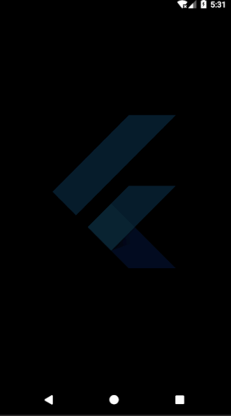 |  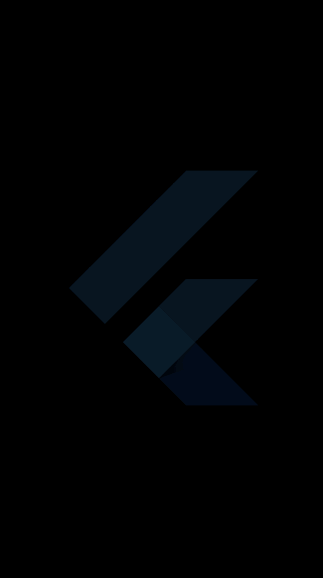  |


### 如何向卡添加滑动动画?

在React Native中，使用`PanResponder`或第三方库 滑动动画。

在Flutter中，要添加滑动动画，请使用[`Dismissible`](https://docs.flutter.io/flutter/widgets/Dismissible-class.html)窗口小部件并嵌套子窗口小部件。

```dart
child: Dismissible(
  key: key,
  onDismissed: (DismissDirection dir) {
    cards.removeLast();
  },
  child: Container(
    ...
  ),
),
```

| Android | iOS |
| :-: | :-: |
|  | 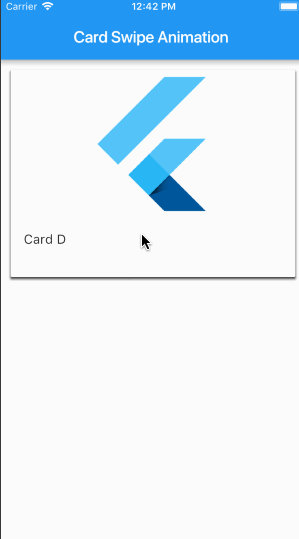 |

## React Native和Flutter Widget等效组件

下表列出了常用的React Native组件，这些组件映射到相应的Flutter窗口小部件和常用窗口小部件属性。

| React Native Component                                       | Flutter Widget                                               | Description                                                  |
| :----------------------------------------------------------- | :----------------------------------------------------------- | :----------------------------------------------------------- |
| [Button](https://facebook.github.io/react-native/docs/button.html) | [Raised Button](https://docs.flutter.io/flutter/material/RaisedButton-class.html) | 一个基本的凸起按钮。                                         |
|                                                              | onPressed [required]                                         | 点击或以其他方式激活按钮时的回调。                           |
|                                                              | Child                                                        | 按钮的标签.                                                  |
|                                                              |                                                              |                                                              |
| [Button](https://facebook.github.io/react-native/docs/button.html) | [Flat Button](https://docs.flutter.io/flutter/material/FlatButton-class.html) | 一个基本的平面按钮。                                         |
|                                                              | onPressed [required]                                         | 点击或以其他方式激活按钮时的回调                             |
|                                                              | Child                                                        | 按钮的标签.                                                  |
|                                                              |                                                              |                                                              |
| [ScrollView](https://facebook.github.io/react-native/docs/scrollview.html) | [ListView](https://docs.flutter.io/flutter/widgets/ListView-class.html) | 可线性排列的小部件可滚动列表                                 |
|                                                              | children                                                     | ( <Widget> [ ]) 要显示的子窗口小部件列表。                   |
|                                                              | controller                                                   | [ [Scroll Controller](https://docs.flutter.io/flutter/widgets/ScrollController-class.html) ] 可用于控制可滚动窗口小部件的对象 |
|                                                              | itemExtent                                                   | [ double ] 如果为非null，则强制子项在滚动方向上具有给定范围。 |
|                                                              | scroll Direction                                             | [ [Axis](https://docs.flutter.io/flutter/painting/Axis-class.html) ] 滚动视图滚动的轴。 |
|                                                              |                                                              |                                                              |
| [FlatList](https://facebook.github.io/react-native/docs/flatlist.html) | [ListView. builder()](https://docs.flutter.io/flutter/widgets/ListView/ListView.builder.html) | 根据需要创建的线性小部件数组的构造函数。                     |
|                                                              | itemBuilder [required]                                       | [[ Indexed Widget Builder](https://docs.flutter.io/flutter/widgets/IndexedWidgetBuilder.html)] 帮助按需建立子项. 只有索引大于或等于零且小于itemCount才会调用此回调。 |
|                                                              | itemCount                                                    | [ int ] 提高了ListView估计最大滚动范围的能力。               |
|                                                              |                                                              |                                                              |
| [Image](https://docs.flutter.io/flutter/widgets/Image-class.html) | [Image](https://facebook.github.io/react-native/docs/image.html) | 显示图像的小部件。                                           |
|                                                              | image [required]                                             | 要显示的图像。                                               |
|                                                              | Image. asset                                                 | 提供了几种构造函数，用于指定图像的各种方式                   |
|                                                              | width, height, color, alignment                              | 图像的样式和布局。                                           |
|                                                              | fit                                                          | 将图像刻入布局期间分配的空间.                                |
|                                                              |                                                              |                                                              |
| [Modal](https://facebook.github.io/react-native/docs/modal.html) | [ModalRoute](https://docs.flutter.io/flutter/widgets/ModalRoute-class.html) | 阻止与先前路由交互的路由.                                    |
|                                                              | animation                                                    | 驱动路线过渡和前一路线前进过渡的动画                         |
|                                                              |                                                              |                                                              |
| [Activity Indicator](https://facebook.github.io/react-native/docs/activityindicator.html) | [Circular Progress Indicator](https://docs.flutter.io/flutter/material/CircularProgressIndicator-class.html) | 显示沿圆圈进度的小部件。                                     |
|                                                              | strokeWidth                                                  | 用于绘制圆的线条的宽度。                                     |
|                                                              | backgroundColor                                              | 进度指示器的背景颜色。默认情况下，当前主题.                  |
|                                                              |                                                              |                                                              |
| [Activity Indicator](https://facebook.github.io/react-native/docs/activityindicator.html) | [Linear Progress Indicator](https://docs.flutter.io/flutter/material/LinearProgressIndicator-class.html) | 显示沿圆圈进度的小部件。                                     |
|                                                              | value                                                        | 此进度指示器的值.                                            |
|                                                              |                                                              |                                                              |
| [Refresh Control](https://facebook.github.io/react-native/docs/refreshcontrol.html) | [Refresh Indicator](https://docs.flutter.io/flutter/material/RefreshIndicator-class.html) | 支持Material“下滑刷新”成语的小部件.                          |
|                                                              | color                                                        | 进度指示器的前景色                                           |
|                                                              | onRefresh                                                    | 当用户拖动刷新指示器足以证明他们希望应用程序刷新时调用的函数. |
|                                                              |                                                              |                                                              |
| [View](https://facebook.github.io/react-native/docs/view.html) | [Container](https://docs.flutter.io/flutter/widgets/Container-class.html) | 围绕子窗口小部件的窗口小部件                                 |
|                                                              |                                                              |                                                              |
| [View](https://facebook.github.io/react-native/docs/view.html) | [Column](https://docs.flutter.io/flutter/widgets/Column-class.html) | 一个窗口小部件，用于在垂直数组中显示其子项                   |
|                                                              |                                                              |                                                              |
| [View](https://facebook.github.io/react-native/docs/view.html) | [Row](https://docs.flutter.io/flutter/widgets/Row-class.html) | 一个小部件，用于在水平数组中显示其子项.                      |
|                                                              |                                                              |                                                              |
| [View](https://facebook.github.io/react-native/docs/view.html) | [Center](https://docs.flutter.io/flutter/widgets/Center-class.html) | A widget that centers its child within itself.               |
|                                                              |                                                              |                                                              |
| [View](https://facebook.github.io/react-native/docs/view.html) | [Padding](https://docs.flutter.io/flutter/widgets/Padding-class.html) | 一个小部件，通过给定的填充来保护其子级。                     |
|                                                              | padding [required]                                           | [ EdgeInsets ] 插入孩子的空间量                              |
|                                                              |                                                              |                                                              |
| [Touchable Opacity](https://facebook.github.io/react-native/docs/touchableopacity.html) | [Gesture Detector](https://docs.flutter.io/flutter/widgets/GestureDetector-class.html) | 检测手势的小部件。                                           |
|                                                              | onTap                                                        | 点击发生时的回调                                             |
|                                                              | onDoubleTap                                                  | 当快速连续两次在同一位置发生敲击时的回调。                   |
|                                                              |                                                              |                                                              |
| [Text Input](https://docs.flutter.io/flutter/services/TextInput-class.html) | [Text Input](https://facebook.github.io/react-native/docs/textinput.html) | 系统文本输入控件的界面。                                     |
|                                                              | controller                                                   | [ [Text Editing Controller](https://docs.flutter.io/flutter/widgets/TextEditingController-class.html) ] 用于访问和修改文本。 |
|                                                              |                                                              |                                                              |
| [Text](https://facebook.github.io/react-native/docs/text.html) | [Text](https://docs.flutter.io/flutter/widgets/Text-class.html) | Text小部件，显示具有单个样式的文本字符串.                    |
|                                                              | data                                                         | [ String ] 要显示的文本。                                    |
|                                                              | textDirection                                                | [ [Text Align](https://docs.flutter.io/flutter/dart-ui/TextAlign-class.html) ] 文本流动的方向. |
|                                                              |                                                              |                                                              |
| [Switch](https://facebook.github.io/react-native/docs/switch.html) | [Switch](https://docs.flutter.io/flutter/material/Switch-class.html) | A material design switch.                                    |
|                                                              | value [required]                                             | [ boolean ] 此开关是打开还是关闭                             |
|                                                              | onChanged [required]                                         | [ callback ] 当用户打开或关闭开关时调用。                    |
|                                                              |                                                              |                                                              |
| [Slider](https://facebook.github.io/react-native/docs/slider.html) | [Slider](https://docs.flutter.io/flutter/material/Slider-class.html) | 用于从一系列值中进行选择.                                    |
|                                                              | value [required]                                             | [ double ] 滑块的当前值.                                     |
|                                                              | onChanged [required]                                         | 当用户为滑块选择新值时调用。                                 |