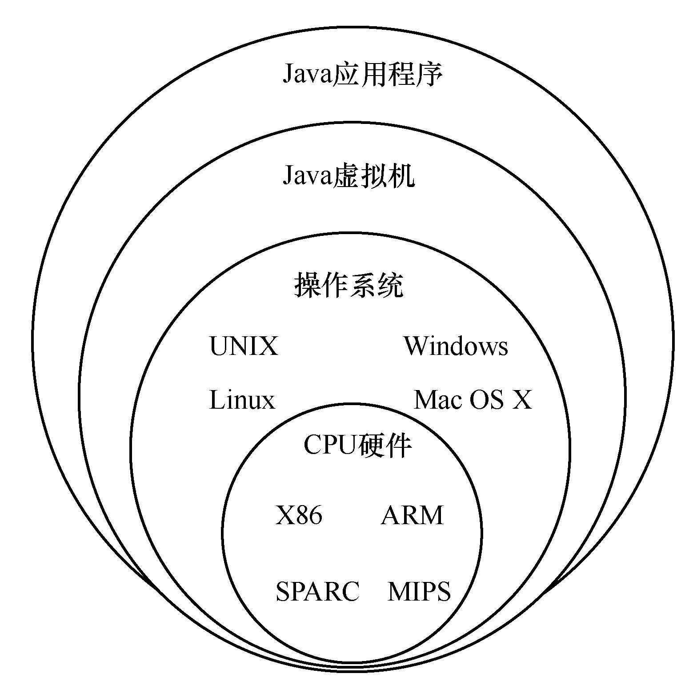

[toc]

### 1.3.2　Java虚拟机概述

Kotlin是一门依赖Java虚拟机运行的计算机语言，因此初学者有必要了解一下Java虚拟机的知识及其运作原理。

Java应用程序能够跨平台运行，主要是通过Java虚拟机实现的。如图1-4所示，不同软硬件平台的Java虚拟机是不同的，Java虚拟机向下是不同的操作系统和CPU硬件，使用或开发时需要下载不同的JRE或JDK版本；Java虚拟机向上是Java应用程序，Java虚拟机屏蔽了不同软硬件平台，Java应用程序不需要作出任何修改，也不需要重新编译就可以直接在其他平台上运行。

<b class="my_markdown">图1-4　Java虚拟机模型</b>

