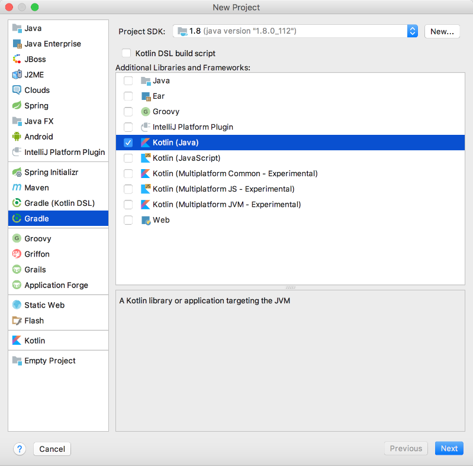

### 12.2.1　Gradle构建方式

在IntelliJ IDEA中依次选择【File】→【New Project】→【Gradle】→【Kotlin (Java)】，新建一个Kotlin Gradle工程，如图12-1所示。生成标准Gradle工程后，在配置文件build.gradle文件的dependencies子目录中添加kotlinx-coroutines-core依赖。


<center class="my_markdown"><b class="my_markdown">图12-1　采用Gradle方式构建项目工程</b></center>

```python
dependencies  {
compile 'org.jetbrains.kotlinx:kotlinx-coroutines-core:0.21'
    //…其他配置
}
```

除此之外，kotlinx-coroutines插件还提供了以下模块。

```python
compile group: 'org.jetbrains.kotlinx', name: 'kotlinx-coroutines-jdk8', version: '0.21'
compile group: 'org.jetbrains.kotlinx', name: 'kotlinx-coroutines-nio', version: '0.21'
compile group: 'org.jetbrains.kotlinx', name: 'kotlinx-coroutines-reactive', version: ' 0.21'
```

Gradle是一个基于JVM的项目自动化构建工具，使用基于Groovy的DSL来声明项目设置，抛弃了传统的基于XML的项目构建方式。当前，Gradle主要支持的语言仅限于Java、Groovy、Kotlin和Scala等JVM系列语言。

