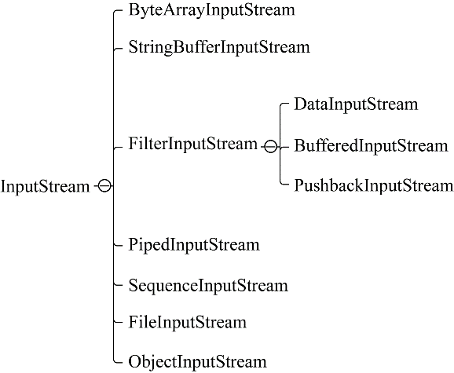

### 13.1.1　字节输入流

InputStream抽象类是所有字节输入流的超类，字节输入流操作的基本单位是字节，其层次结构如图13-1所示。InputStream常见子类有以下几种。

+ ByteArrayInputStream：一种基本的介质流，用于从Byte（字节数组）中读取数据。
+ StringBufferInputStream：一种基本的介质流，用于从StringBuffer（字符数组）中读取数据。
+ PipedInputStream：管道输入流，用于从其他线程共用的管道中读取数据。
+ SequenceInputStream：将两个或多个InputStream对象转变为一个InputStream。
+ FileInputStream：基本的文件输入流，用于从文件中读取数据。

在InputStream的子类中，ObjectInputStream和FilterInputStream的所有子类都属于装饰流。常见的装饰流包括DataInputStream、BufferedInputStream和PushbackInputStream。

+ DataInputStream：一般和DataOutputStream配对使用，提供了大量的读取基本数据类型的方法。
+ BufferedInputStream：将字节读取到缓存区，然后从缓存区读取，从而有效地减少频繁的I/O操作。
+ PushbackInputStream：在读取最后一个字节后将其放回到缓存中。


<center class="my_markdown"><b class="my_markdown">图13-1　字节输入流层次结构</b></center>

例如，下面是一个使用PushbackInputStream进行回退操作的例子。

```python
    @Throws(IOException::class)
    fun main(args: Array<String>) {
        val str = "hello,pushbackInputStream"
        var push: PushbackInputStream? = null
        var bat: ByteArrayInputStream? = null
        bat = ByteArrayInputStream(str.toByteArray())
        push = PushbackInputStream(bat)
        var temp = push.read()
        while (temp != -1) {
            if (temp == ','.toInt()) {
                  push.unread(temp)
                  temp = push.read()
                  print("(回退" + temp.toChar() + ") ")
            } else {
                 print(temp.toChar())
            }
        }
    }
```

