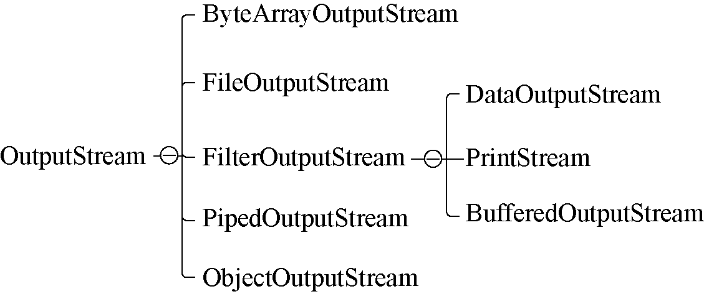

### 13.1.2　字节输出流

OutputStream抽象类是所有输出字节流的父类，字节输出流操作的基本单位是字节，其层次结构及组成如图13-2所示。

<b class="my_markdown">图13-2　字节输出流层次结构</b>

OutputStream的常见子类有以下几种。

+ ByteArrayOutputStream：一种基本介质流，用于向字节数组中写入数据。
+ FileOutputStream：一种基本介质流，用于向本地文件中写入数据。
+ PipedOutputStream：用于向共用的管道中写入数据，任何写入该对象的信息都会被放入对应PipedInputStream对象的缓存中，从而完成线程的通信。

在OutputStream的子类中，ObjectOutputStream和FilterOutputStream的所有子类都属于装饰流。常见的装饰流包括以下几个。

+ DataOutputStream：通常需要与DataInputStream配合使用，提供了大量读写基本数据类型的方法。
+ PrintStream：用于产生具有规则格式的输出信息。
+ BufferedOutputStream：使用该类先把数据写入缓存区，再调用flush方法完成数据的写入操作并清空缓存，该类可以有效地避免频繁的I/O写入数据操作。

