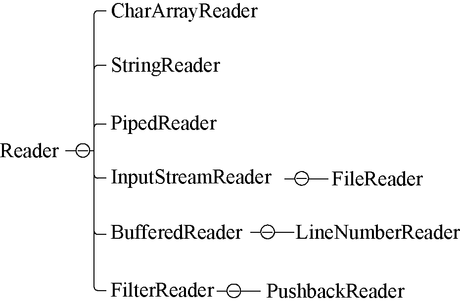

### 13.1.3　字符输入流

Reader抽象类是所有输入字符流的父类，字符流处理的基本单位是16位的Unicode编码，字符输入流的层次结构如图13-3所示。


<center class="my_markdown"><b class="my_markdown">图13-3　字符输入流的层次结构</b></center>

Reader的常见子类有以下几种。

+ CharArrayReader：一种基本的介质类，用于从Char数组读取数据。
+ StringReader：一种基本的介质类，用于从String读取数据。
+ PipedReader：用于向共用的管道中写入字符数据。
+ InputStreamReader：连接字节流和字符流的桥梁，它将字节流转变为字符流，其子类FileReader提供具体的文件读取功能。
+ BufferedReader：一个装饰器类，它和其子类LineNumberReader负责装饰其他Reader对象。
+ FilterReader：所有自定义具体装饰流的父类，其子类PushbackReader用来装饰Reader对象，使用该类会增加一个行号。

例如，下面是使用BufferedReader从缓冲区中读取键盘输入的例子。

```python
fun main(args: Array<String>) {
         val buf = BufferedReader(InputStreamReader(System.`in`))
         var str: String? = null
         println("请输入内容：")
        try {
              str = buf.readLine()
        } catch (e: IOException) {
              e.printStackTrace()
        }
        println("你输入的内容是：" + str!!)
}
```

