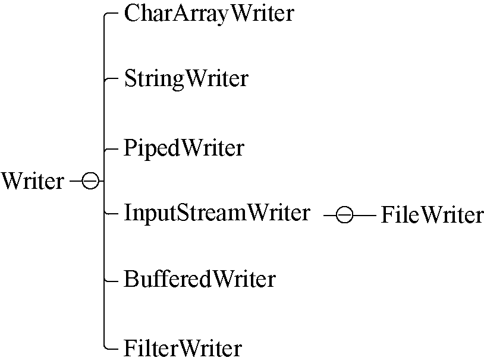

### 13.1.4　字符输出流

Writer抽象类是所有输出字符流的父类，处理的基本单位是字符，字符输出流的层次结构如图13-4所示。


<center class="my_markdown"><b class="my_markdown">图13-4　字符输出流的层次结构</b></center>

Writer的常见子类有以下几种。

+ CharArrayWriter：一种基本的介质流，以字符形式向Char数组写入数据。
+ StringWriter：一种基本的介质流，以字符形式向String中写入数据。
+ PipedWriter：向共用的管道中写入数据。
+ BufferedWriter：一个装饰器类，为Writer提供缓冲功能。
+ OutputStreamWriter：OutputStream到Writer的转换类，其子类FileWriter就是实现该功能的具体类。

例如，下面是使用FileWriter向文件中写入“hello”字符串的实例。

```python
fun main(args: Array<String>) {
         val fileName = "D:" + File.separator + "hello.txt"
         val f = File(fileName)
         try {
               val out = FileWriter(f)
               val str = "hello"
               out.write(str)
               out.close()
        } catch (e: IOException) {
              e.printStackTrace()
        }
    }
```

