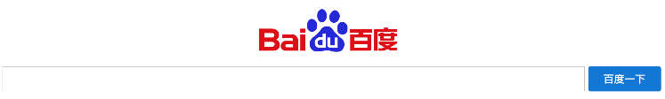
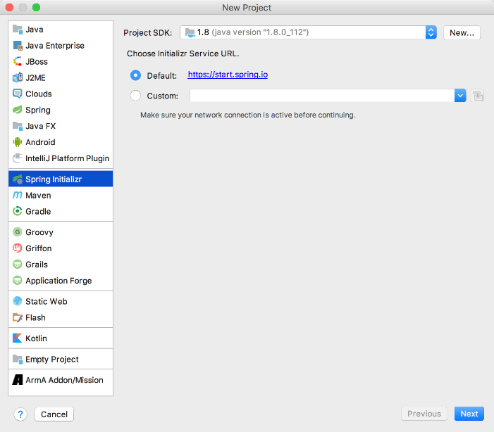
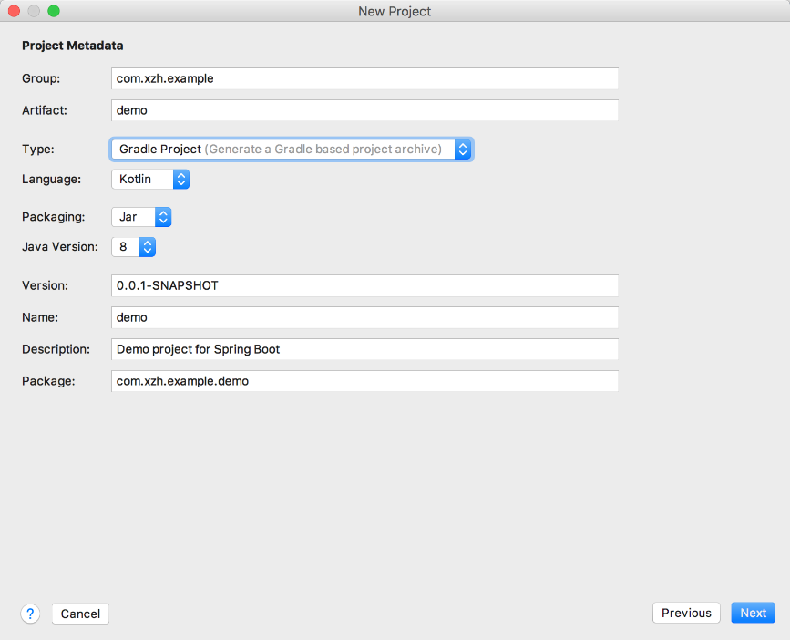
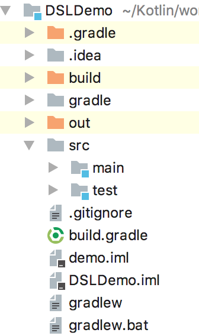

### 14.4.3　kotlinx.html实例

下面以百度首页为例来讲解kotlinx.html，最终效果如图14-1所示。


<center class="my_markdown"><b class="my_markdown">图14-1　kotlinx.html百度首页实例</b></center>

打开Intellij IDEA，选择【Create New Project】新建一个Spring Boot工程，在项目的配置面板选择【Spring Initializr】来配置Spring Boot相关的环境依赖，如图14-2所示。


<center class="my_markdown"><b class="my_markdown">图14-2　新建Spring Boot项目</b></center>

单击【Next】按钮，在Project Metadata配置面板中指定Type选项为【Gradle Project】，Language选项为【Kotlin】，如图14-3所示。


<center class="my_markdown"><b class="my_markdown">图14-3　选择项目构建方式和使用的语言等信息</b></center>

Project Metadata的具体配置如下。

+ Group：对应pom文件中的groupId，项目组织的唯一标识，对应Java的包结构。
+ Artifact：对应pom文件中的artifactId，项目的唯一标识，对应项目名称。
+ Type：工程构建方式，主要提供Maven和Gradle构建方式。
+ Language：开发语言，本项目使用Kotlin开发。
+ Packaging：打包类型，打包成JAR文件。

完整的项目结构如图14-4所示。

要在Spring Boot中使用kotlinx.html相关的功能，还需要添加kotlinx.html相关的配置信息。代码如下。

```python
//…
repositories {
    mavenCentral()
    //新增
    maven { url 'https://jitpack.io' }
    jcenter()   // https://jcenter.bintray.com/ 仓库
```


<center class="my_markdown"><b class="my_markdown">图14-4　项目目录结构</b></center>

```python
    maven { url "https://repo.spring.io/snapshot" }
    maven { url "https://repo.spring.io/milestone" }
}
dependencies {
    //kotlinx_html依赖
    def kotlinx_html_version = "0.6.9"
    compile "org.jetbrains.kotlinx:kotlinx-html-jvm:${kotlinx_html_version}"
    compile "org.jetbrains.kotlinx:kotlinx-html-js:${kotlinx_html_version}"
}
//…
```

如果使用传统的HTML+JavaScript+CSS的方式来实现百度首页的搜索页面，相信对于大多数读者来说并不是什么难事，本书提供一种技术实现。DSL.html页面的代码如下。

```python
<html lang=zh-CN>
<head>
    //省略Head头文件配置
</head>
<body>
<div class="container">
     <div class="margin center">
        
</div>
<form class="form center" >
        <div class="inline  ">
        <input id="wd" class="input center-vertical " >
        <button id="baiduBtn" type="submit" class="btn-primarycenter-vertical btn" >百度一下</button>
        </div>
    </form>
</div>
</body>
</html>
```

在用户单击按钮之后，跳转到百度官网，相关的逻辑处理由JavaScript逻辑代码完成。代码如下。

```python
$(function () {
    $('#baiduBtn').on('click', function () {   //捕捉baiduBtn的单击事件
        var wd = $('#wd').val()
        window.open("https://www.baidu.com/s?wd=" + wd)
    })
})
```

那么使用kotlinx.html框架如何实现上面的页面效果呢？kotlinx.html框架提供的createHTML函数可以创建HTML页面，只需要将传统的HTML页面元素翻译成kotlinx.html能够识别的DSL语言即可。例如，DSL.html文件的内容可以翻译为以下格式。

```python
createHTML().html {
   //省略请求头
   body {
       div(classes = "container") {
          div(classes = "margin center") {
             img {
               src = "https://www.baidu.com/img/bd_logo1.png"
               width = "270"
               height = "129"
                 }
             }
         form(classes = "form center") {
           div(classes = "inline ") {
             input(InputType.text, classes = "input center-vertical" ) {
                     id = "wd"
                     size="100"
                 }
              button(classes = "btn-primary center-vertical btn" ) {
                      id = "baiduBtn"
                      type = ButtonType.submit
                      text("百度一下")
                  }
               }
             }
          }
       }
}
```

目前，大多数浏览器都是支持kotlinx.html的，使用createHTML().html创建的页面可以直接运行在浏览器上。虽然使用DSL风格编写的页面要比原生 HTML更加简洁优雅，但要让前端开发者接受kotlinx.html，还有很长的路要走。

