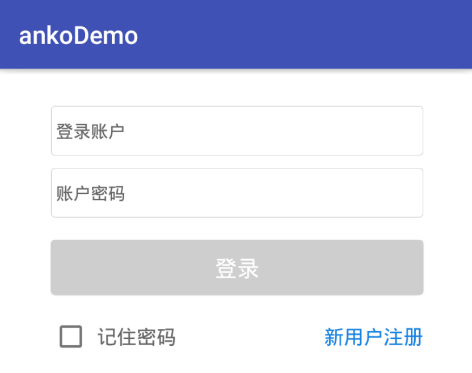
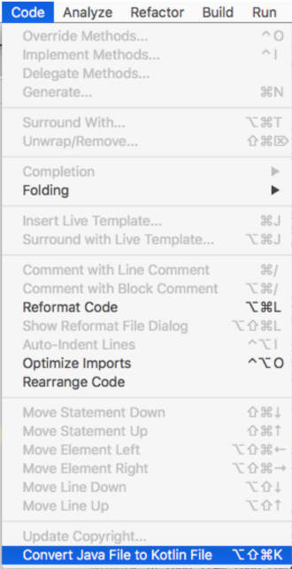

### 14.6.3　Anko使用实例

下面以登录为例来讲解Anko在Android中的应用，如图14-5所示。


<center class="my_markdown"><b class="my_markdown">图14-5　Kotlin与Anko结合的登录界面</b></center>

使用Android Studio新建一个标准的Android工程并添加Kotlin相关的依赖，也可以使用Android Studio提供的Kotlin插件一键生成。项目的构建脚本内容如下。

```python
buildscript {
    ext.kotlin_version = '1.1.51'
    repositories {
        mavenCentral()
    }
    dependencies {
        classpath "org.jetbrains.kotlin:kotlin-gradle-plugin:$kotlin_version"
    }
}
```

在工程的app目录的build.gradle脚本中添加Anko相关的依赖配置。

```python
compile "org.jetbrains.anko:anko-sdk15:0.10.4"  //sdk19、sdk21、sdk23亦可
compile "org.jetbrains.anko:anko-appcompat-v7:0.10.4"
compile "org.jetbrains.anko:anko-design:0.10.4"
compile "org.jetbrains.anko:anko-recyclerview-v7:0.10.4"
```

然后在项目的MainActivity类中的onCreate函数中添加UI展示页面和登录校验逻辑。

```python
override fun onCreate(savedInstanceState: Bundle?) {
          super.onCreate(savedInstanceState)
          LoginUi().setContentView(this@MainActivity)
    }
```

下面是使用Anko实现登录界面的相关代码。该界面主要包含账户和密码两个输入框以及一个登录按钮。

```python
    lateinit var account: EditText      //账户对象
    lateinit var password: EditText     //密码对象
    lateinit var login: Button          //登录按钮对象
    inner class LoginUi : AnkoComponent<MainActivity> {
        override fun createView(ui: AnkoContext<MainActivity>) = with(ui) {
            verticalLayout {
              backgroundColor = context.resources.getColor(android.R.color.white)
                gravity = Gravity.CENTER_HORIZONTAL
                //账户视图
                linearLayout {
                     gravity = Gravity.CENTER_VERTICAL
                     orientation = HORIZONTAL
                     backgroundResource = R.drawable.login_bg
                     account = editText {
                        hint = "登录账户"
                        hintTextColor = Color.parseColor("#666666")
                        textSize = 14f
                        background = null
                    }.lparams {
                        topMargin = dip(5)
                    }
                }.lparams(width = dip(300), height = dip(40)) {
                    topMargin = dip(30)
                }
                //密码视图
                linearLayout {
                    gravity = Gravity.CENTER_VERTICAL
                    orientation = HORIZONTAL
                    backgroundResource = R.drawable.login_bg
                    password = editText {
                        hint = "账户密码"
                        hintTextColor = Color.parseColor("#666666")
                        textSize = 14f
                        background = null
                    }.lparams {
                        topMargin = dip(5)
                    }
                }.lparams {
                    width = dip(300)
                    height = dip(40)
                    topMargin = dip(10)
                }
                //登录按钮视图
                login = button("登录") {
                    gravity = Gravity.CENTER
                    background = resources.getDrawable(R.drawable.login_btn)
                    textColor = Color.parseColor("#ffffff")
                    textSize = 18f
                }.lparams(width = dip(300), height = dip(44)) {
                    topMargin = dip(18)
                }
                linearLayout {
                    orientation = HORIZONTAL
                    gravity = Gravity.CENTER_VERTICAL
                    checkBox("记住密码") {
                        textColor = Color.parseColor("#666666")
                        textSize = 16f
                        leftPadding = dip(5)
                    }
                    textView("新用户注册") {
                        textColor = Color.parseColor("#1783e3")
                        gravity = Gravity.RIGHT
                        textSize = 16f
                    }.lparams(width = matchParent)
                }.lparams(width = dip(300)) {
                    topMargin = dip(18)
                }
            }
        }
    }
```

单击登录按钮后，需要对用户输入的用户名和密码进行简单的空判断和合法性判断。代码如下。

```python
//登录的空判断
login.setOnClickListener(View.OnClickListener {
if (account.text.toString().isNotEmpty() && password.text.toString(). isNotEmpty()){
startActivity<MainActivity>()
} else{
       toast("请输入账户或者密码")
       }                     
         })
```

也许，对于习惯使用XML方式来构建Android界面的读者来说，使用Anko方式构建页面显得有些麻烦。不过与XML构建方式相比，Anko具有以下几个优势。

+ 使用XML方式构建的界面没有空安全。
+ 使用XML方式构建的界面在设备上运行时对CPU和电量损耗更大。
+ 使用XML方式构建的界面往往不能得到很好的重用，即使使用include标签。
+ 使用Anko的优势在于能与Kotlin最大程度地无缝对接，代码更加简洁。

对于初学者来说，还可以使用Anko提供的转换插件Anko Support进行转换，该插件可以很方便地将传统的XML页面布局代码转换为Anko布局代码，如图14-6所示。




<center class="my_markdown"><b class="my_markdown">图14-6　使用插件转换Anko布局</b></center>

当然，在执行登录操作时必然会涉及网络通信，此处以Android开发常用的网络框架OKHttp框架为例，使用之前需要在build.gradle文件中添加相关配置。代码如下。

```python
compile 'com.zhy:okhttputils:2.6.2'
```

然后，使用OkHttpUtils工具类将用户名和密码发送到服务器端，并根据返回的结果进行逻辑处理。代码如下。

```python
fun login(phone: String, pwd: String) {
         //使OkHttpUtils将phone和password发送给服务器
         OkHttpUtils.post().url(LoginURL).addParams("phone", phone)
          .addParams("password", pwd).build().execute(object : StringCallback() {
            //成功回调
            override fun onResponse(response: String?) {
              //登录成功的处理逻辑
            }
            //失败回调
            override fun onError(p0: Request?, e: Exception?) {
             //请求失败的处理逻辑
            }
        })
   }
```

