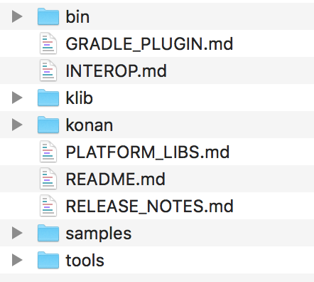
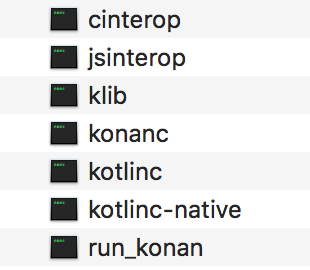

### 16.1.2　Kotlin Native编译器

目前，Kotlin Native主要提供了Mac、Linux和Windows 3个主流平台的编译器，使用该编译器可以很轻松地编译出运行在WebAssembly、iOS、macOS、Windows以及Linux系统上的程序。Kotlin Native支持的平台和版本如表16-1所示。

<center class="my_markdown"><b class="my_markdown">表16-1 Kotlin Native支持平台及其版本</b></center>

| 支持的系统平台 | 支持的版本 | 支持的系统平台 | 支持的版本 |
| :-----  | :-----  | :-----  | :-----  | :-----  | :-----  |
| Windows | x86_64 | iOS | arm64 |
| Linux | x86_64、arm32、MIPS、MIPS小端 | Android | arm32、arm64 |
| macOS | x86_64 | WebAssembly | wasm32 |

编译Kotlin Native项目，首先需要到GitHub上下载Kotlin Native的编译器软件包，在使用前下载对应的平台版本即可，解压下载的Kotlin Native编译器软件包，其目录结构如图16-1所示。


<center class="my_markdown"><b class="my_markdown">图16-1　Kotlin Native编译器目录结构</b></center>

当然，也可以通过克隆Kotlin Native编译器的源码进行编译，编译前需要先到GitHub上下载编译器源码。下载完成后，使用如下命令下载依赖关系。

```python
./gradlew dependencies:update
```

然后，建立编译器和库的关联。

```python
./gradlew bundle
```

构建整个项目可能需要很长的时间。然后，使用以下命令即可编译项目。

```python
./gradlew dist distPlatformLibs
```

到此，就可以得到Kotlin的Native编译器了，它通常位于项目的./dist/bin目录下，打开bin文件可以看到Native编译器的相关信息，它由7个可执行程序构成，如图16-2所示。通过对比发现，Native编译器的目录结构和Kotlin Native官方提供的编译器内容是一样的。然后，我们就可以利用Native编译器编译应用程序了。代码如下。

```python
export PATH=./dist/bin:$PATH
kotlinc hello.kt -o hello
```

如果需要进行优化编译，可以使用-opt参数。

```python
kotlinc hello.kt -o hello -opt
```

如果需要对应用程序进行测试，可以使用类似下面的命令。

```python
./gradlew backend.native:tests:run
```


<center class="my_markdown"><b class="my_markdown">图16-2　Kotlin的Native编译器目录结构</b></center>

在Kotlin Native官方提供的示例中，系统自带了针对不同平台的例子，而且这些例子都是可以直接编译运行的。因为Kotlin Native本身是一个由Gradle构建的项目，所以可以使用IDEA直接打开Kotlin Native目录下的samples文件，IDEA会自动识别该项目。

