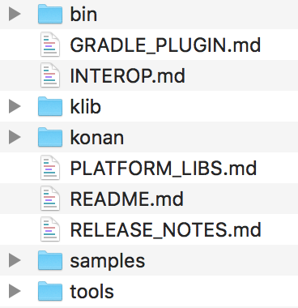

### 16.1.3　编译器konan

打开kotlin-native-macos-0.6文件，其目录结构如图16-3所示，其中，bin目录包含众多与Kotlin Native相关的执行命令，klib目录则主要包含Kotlin标准库的关联元数据文件以及针对各个目标平台的bc文件，konan主要包含编译器依赖的一些JAR包。除此之外，该编译器文件还包含很多已经编译好的例子，可以使用IntelliJ IDEA直接导入。


<center class="my_markdown"><b class="my_markdown">图16-3　Kotlin-native-macos-0.6文件</b></center>

打开Kotlin Native编译器的bin目录可以发现，bin文件主要由cinterop、jsinterop、klib、konanc、kotlinc、kotlinc-native和run_konan共7个可执行文件组成，其中，run_konan是编译器真正的入口。代码如下。

```python
TOOL_NAME="$1"
shift
if [ -z "$JAVACMD" -a -n "$JAVA_HOME" -a -x "$JAVA_HOME/bin/java" ]; then
    JAVACMD="$JAVA_HOME/bin/java"
else
    JAVACMD=java
fi
[ -n "$JAVACMD" ] || JAVACMD=java
//省略部分代码
LIBCLANG_DISABLE_CRASH_RECOVERY=1 \
$TIMECMD "$JAVACMD" "${java_opts[@]}" "${java_args[@]}" -cp "$KONAN_CLASSPATH" "$TOOL_CLASS" "$TOOL_NAME" "${konan_args[@]}"
```

可以发现，Kotlin Native编译器konan的运行环境还是需要JVM环境支持的，但是它生成的机器码的可执行程序不需要JVM环境支持，可以直接运行在对应的平台系统上。

