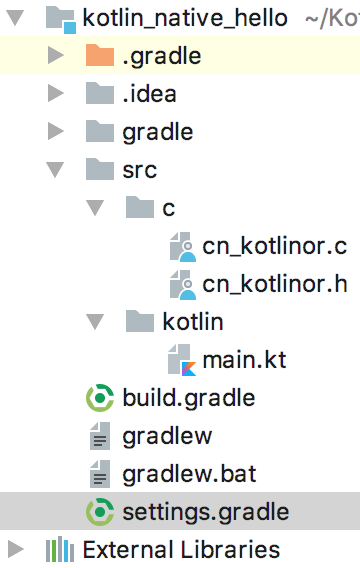

### 16.2.3　编写源代码

接下来，在工程的src目录下新建一个c目录，该目录专门用来存放C代码。首先，创建两个c文件：cn_kotliner.h和cn_kotliner.c，其中，C头文件声明的代码如下。

```python
#ifndef CN_KOTLINER_H
#define CN_KOTLINER_H
void printHello();
int factorial(int n);
#endif
```

在上面的代码中，主要声明了两个函数，打印HelloWorld的printHello函数和用来计算阶乘的factorial函数。cn_kotliner.c的代码如下。

```python
#include "cn_kotliner.h"
#include <stdio.h>
void printHello(){
    printf("[C]HelloWorld\n");
}
int factorial(int n){
      printf("[C]calc factorial: %d\n", n);
      if(n == 0) return 1;
      return n * factorial(n - 1);
}
```

接下来，还需要创建一个Kotlin文件，该文件主要调用C层的代码，实现跨平台调用。该文件的代码如下。

```python
import kotliner.*
fun main(args: Array<String>) {
    printHello()
    (1..5).map(::factorial).forEach(::println)
}
```

代码中，导入的kotliner.*包是C语言代码经过Clang编译后对应C接口的包路径，可以在项目的build.gradle配置文件中的konanInterop中配置这个路径。图16-5所示为Kotlin Native项目目录结构图。


<center class="my_markdown"><b class="my_markdown">图16-5　Kotlin Native项目目录结构</b></center>

