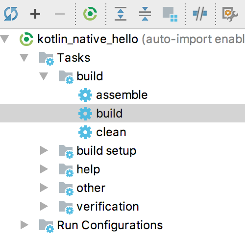

### 16.2.5　编译与执行

接下来，在项目的src/c目录下用命令行编译上面的代码，命令如下。

```python
clang -std=c99 -c cn_kotliner.c -o cn_kotliner.bc -emit-llvm
```

代码中，clang是一个由C++编写的基于LLVM的C/C++/Objective-C/Objective-C++编译器。如果提示找不到clang命令，可以在编译器的dependencies目录中找到相关的内容。当然，还可以使用Shell脚本（kclang.sh）来简化clang编译的命令行输入参数。

```python
#!/usr/bin/env bash clang -std=c99 -c $1 -o $2 -emit-llvm
```

接着把kclang.sh放到C代码目录下，然后使用脚本来编译C代码。代码如下。

```python
kclang.sh cn_kotlinor.c cn_kotlinor.bc
```

通过上面的命令编译之后，将得到一个名为cn_kotlinor.bc的库文件。最后，在执行Gradle构建之前，还需要指定konan编译器主目录。在工程根目录下面新建一个gradle.properties属性配置文件，该文件格式如下。

```python
konan.home=<编译器路径>
#例如： konan.home=/Users/xiangzhihong /kotlin native/kotlin-native-macos-0.5
```

当然，也可以不添加gradle.properties配置文件，那么只需要在编译的时候使用本地的编译器即可。

然后，在IDEA的Gradle工具栏依次单击【Tasks】→【build】执行构建操作，如图16-6所示。项目构建完成后，会在项目的build/konan/bin/目录下面生成一个KotlinorClient.kexe的可执行程序，它可以直接运行在macOS系统上而不再依赖JVM环境。


<center class="my_markdown"><b class="my_markdown">图16-6　使用Gradle工具栏编译项目</b></center>

然后，在命令行中执行KotlinorApp.kexe命令，即可看到输出结果，对应的命令如下。

```python
build/konan/bin/KotlinorApp.kexe
```

可以看到，作为一款致力于跨平台开发的编程语言，Kotlin Native非常注重语言平台的互操作性，可以说，使用Kotlin Native进行跨平台开发的优势是非常明显的。

