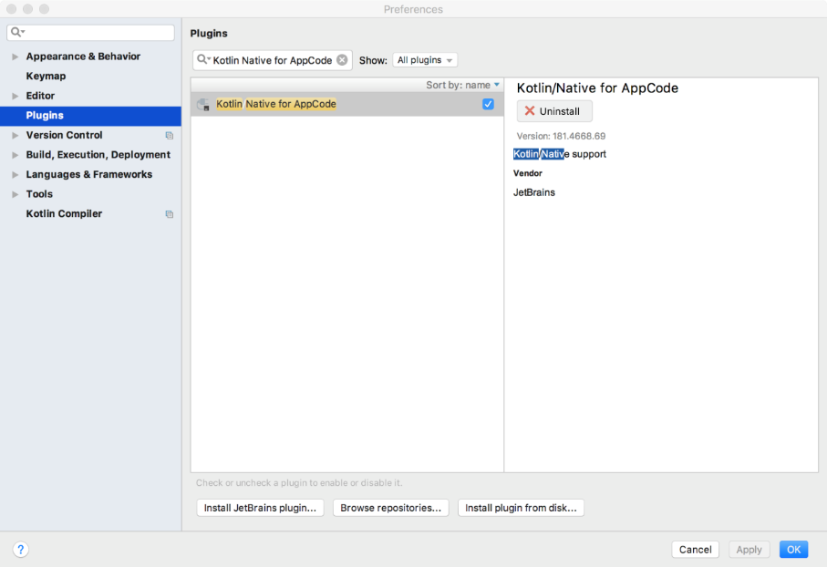
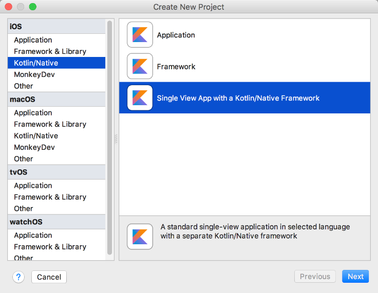
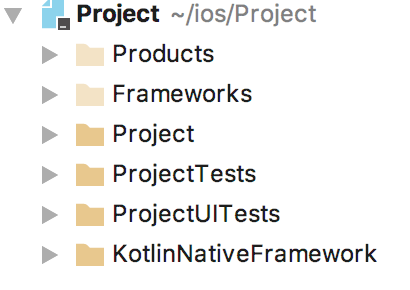
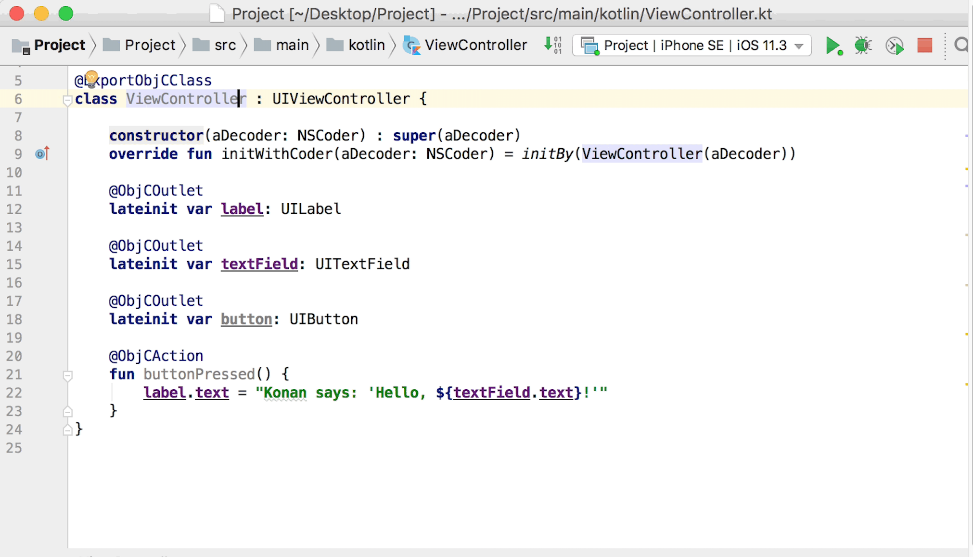

### 16.3.1　创建Kotlin Native项目

Kotlin Native使用Gradle作为默认构建工具。想要在Xcode中编译Kotlin Native项目，需要添加相关的运行脚本，该脚本调用Gradle来构建Kotlin Native工程。当然，也可以借助一些第三方的IDE，如AppCode，使用AppCode之前需要先安装【Kotlin Native for AppCode】插件。


<center class="my_markdown"><b class="my_markdown">图16-7　安装AppCode插件</b></center>

启动AppCode，依次选择【Kotlin/Native】→【Single View APP with a Kotlin/Native Framwork】即可创建iOS应用程序，通过Kotlin/Native方式创建的iOS项目支持使用Kotlin来编写iOS应用程序，如图16-8所示。


<center class="my_markdown"><b class="my_markdown">图16-8　使用Kotlin Native新建iOS应用</b></center>

项目构建完成后可以看到，通过Kotlin/Native方式创建的iOS项目的目录结构如图16-9所示。


<center class="my_markdown"><b class="my_markdown">图16-9　使用Kotlin Native创建的iOS项目结构</b></center>

相比使用Xcode创建的原生iOS项目，通过Kotlin/Native方式创建的iOS项目显然会多出一些配置文件（如Frameworks和KotlinNativeFramework）。文件的具体含义有以下几点。

+ Products：主要用于存放Mac软件开发的可执行文件等，iOS应用开发很少用到这个文件。
+ Frameworks：主要用于存放项目依赖的一些系统库和第三方库。
+ Project：此目录用于存放与项目相关的源码，也是iOS应用开发的核心组成部分。
+ KotlinNativeFramework：用于存放和Kotlin Native相关的库。

此时，只需要单击【Run】按钮即可在iPhone模拟器或者真机中启动应用程序。不过，此时的程序还没有实现任何功能，为了在项目中使用Kotlin来编写iOS应用程序，可以在Kotlin Native项目的Project文件中创建一个Kotlin的文件目录（如src/main/kotlin），然后添加一个ViewController类，如图16-10所示。


<center class="my_markdown"><b class="my_markdown">图16-10　使用AppCode编写Kotlin代码</b></center>

需要注意的是，因为使用AppCode创建的Kotlin Native项目默认没有引入iOS的UIKit.framework系统库，所以在使用iOS的相关库之前需要先进行导入。ViewController类的代码如下。

```python
import kotlinx.cinterop.ExportObjCClass
import kotlinx.cinterop.ObjCAction
import kotlinx.cinterop.ObjCOutlet
import platform.Foundation.NSCoder
import platform.UIKit.*
import kotlinx.cinterop.initBy
@ExportObjCClass
class ViewController: UIViewController {
    constructor(aDecode:NSCoder): super(aDecode)
    override fun initWithCoder(aDecode:NSCoder) =initBy(ViewController(aDecode))
    @ObjCOutlet
    lateinit var label: UILabel
    @ObjCOutlet
    lateinit var textField: UITextField
    @ObjCOutlet
    lateinit var button:UIButton
    @ObjCAction
    fun click(){
        label.text="Hello,${textFiled.text}"
    }
}
```

因为开发者自己定义的文件目录未被标记为根目录，所以它是不会被编译系统识别的，需要将“src/main/kotlin”目录标记为项目源码目录。

