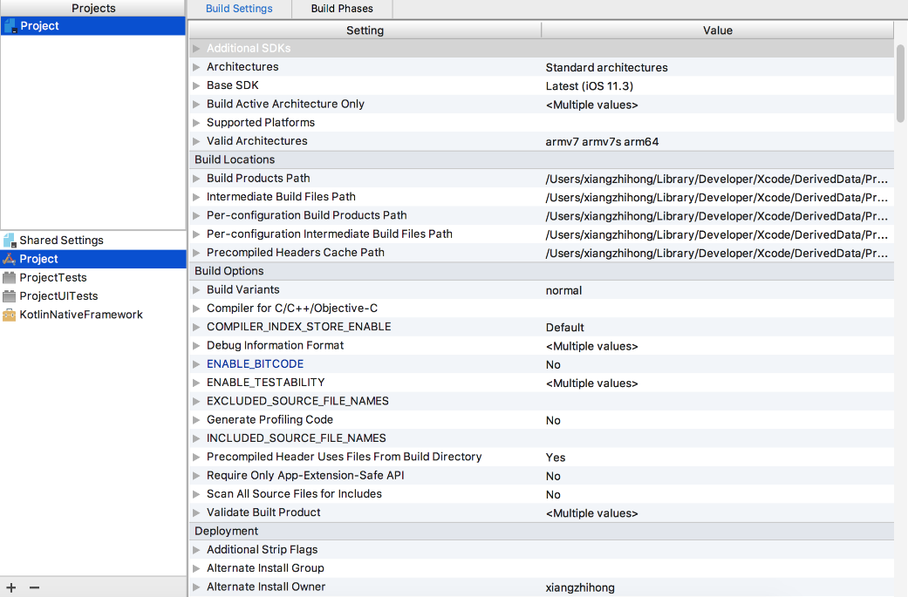
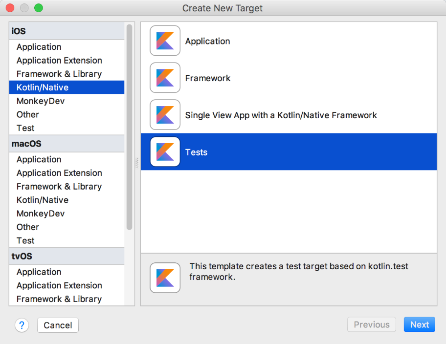
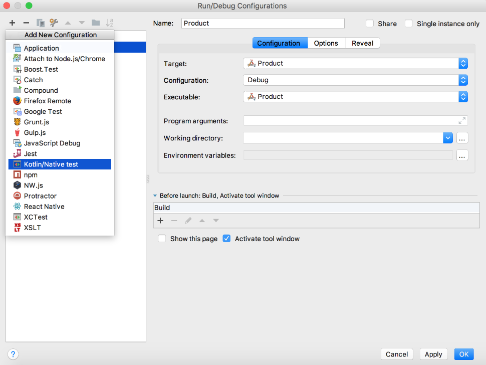

### 16.3.2　Kotlin Native测试

众所周知，AppCode本身就是基于IntelliJ IDEA的Kotlin插件，因此很多支持Kotlin的功能对于Kotlin/Native也同样支持（如代码检查、重构等操作），AppCode的代码提示及重构功能如图16-11所示。

同时，AppCode插件也支持使用kotlin.test框架来编写测试代码。选择【Greate New Target】，依次选中【Kotlin/Native】→【Tests】，然后单击右下角的【Next】按钮，如图16-12所示。

<b class="my_markdown">图16-11　AppCode的代码提示及重构功能</b>

<b class="my_markdown">图16-12　新建Kotlin Native测试</b>

项目构建完成，然后选中【edit configurations...】打开项目配置面板，并选中“Kotlin/Native test”选项来添加测试用例，如图16-13所示。

<b class="my_markdown">图16-13　新建Kotlin Native测试用例</b>

当然，除了上面介绍的功能外，Kotlin Native还支持调用Objective-C标准 API，而且也为此提供了非常便捷的阅读API文档的方法，可以说Kotlin Native是Kotlin多平台的真正魅力之所在。

