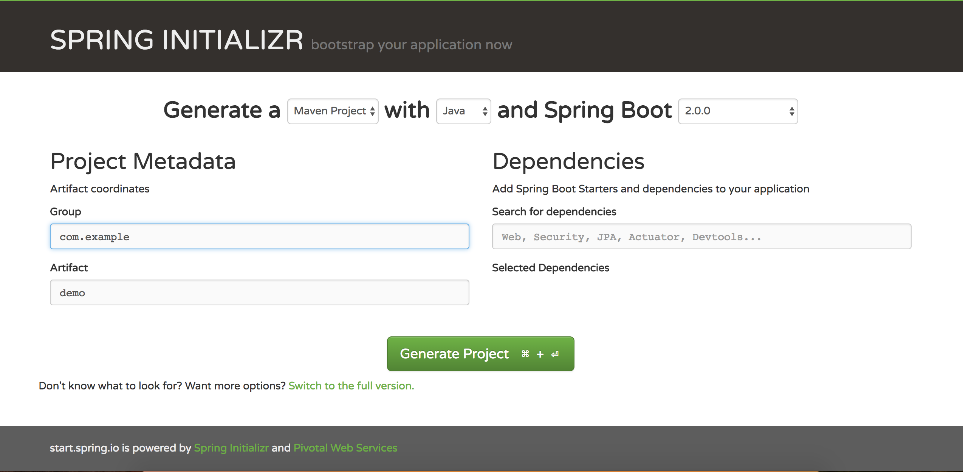
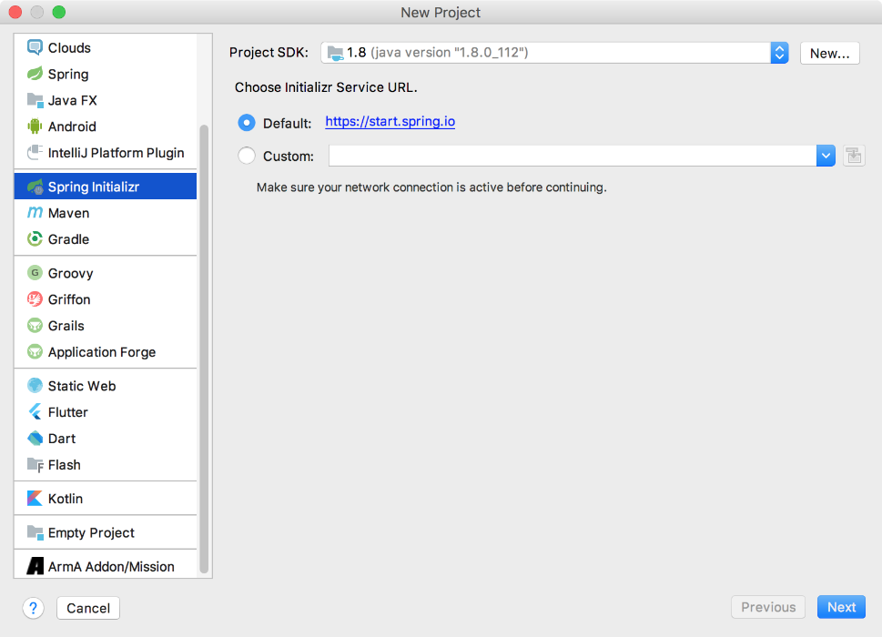
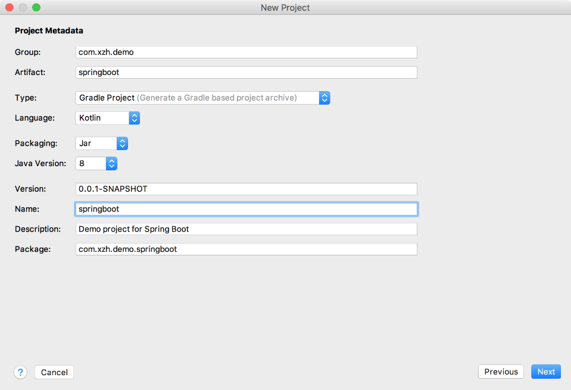
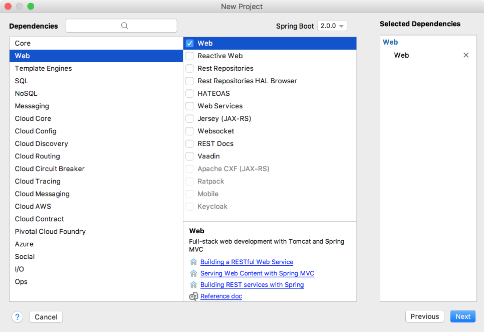
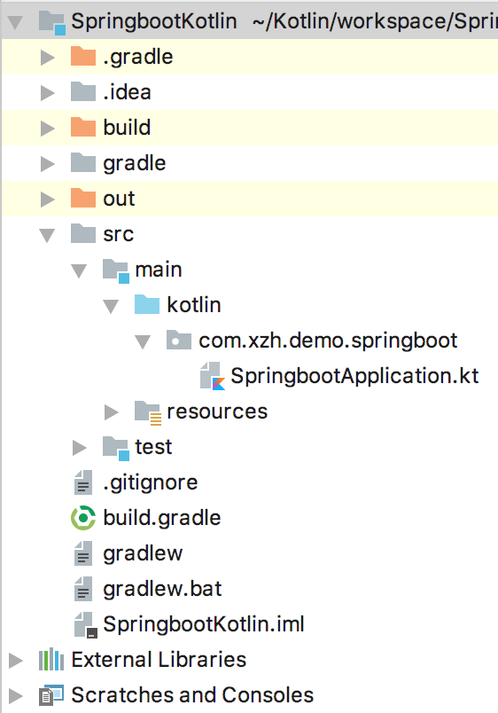

### 17.1.2　创建Spring Boot应用程序

随着Spring Framework 5.0版本加入对Kotlin的支持，使用Spring Boot配合Kotlin来开发服务器成为时下的热点话题。对于不熟悉Spring框架的初学者来说，使用Spring提供的在线生成Spring Boot项目是一个不错的选择，如图17-1所示。在线生成Spring Boot项目时，需要选择程序的构建方式、开发语言和Spring Boot版本等信息，当然还可以通过单击“Switch to the full version”链接来指定额外的信息，比如版本号和基础包名等。


<center class="my_markdown"><b class="my_markdown">图17-1　Spring在线生成项目</b></center>

除此之外，创建Spring Boot项目常见的方式还有集成IDE。目前，主流的Java Web开发工具都集成了对Spring Boot的支持，使用IntelliJ IDEA和Eclipse可以很方便地新建Spring Boot项目。

打开IntelliJ IDEA，依次选择【File】→【New】→【Project】→【Spring Initializr】来新建Spring Boot项目，如图17-2所示。

单击【Next】按钮，在Project Metadata面板配置必要的参数，如图17-3所示。此处采用Gradle方式来构建Spring Boot项目，这种方式主要有以下几个优势。

+ Gradle抛弃了Maven的基于XML的烦琐配置。
+ Gradle采用了领域特定语言Groovy来进行配置，简化了构建代码的结构，可读性更高。

尽管如此，Gradle也并非十全十美，如Gradle并没有Maven这样的依赖管理功能。为此，Gradle插件提供了很多常用的Spring及其相关依赖来模拟依赖管理功能。遗憾的是，build.gradle并没有为各项依赖指定版本。所以，可以选择自己熟悉的方式来构建项目。


<center class="my_markdown"><b class="my_markdown">图17-2　Spring Initializr方式构建项目</b></center>


<center class="my_markdown"><b class="my_markdown">图17-3　Spring Boot参数配置</b></center>

单击【Next】按钮，选择需要导入的Spring Boot组件，系统会自动添加相关的依赖，如果需要连接数据库还应配置SQL属性，如图17-4所示。


<center class="my_markdown"><b class="my_markdown">图17-4　选择Spring Boot依赖的组件</b></center>

完整的工程目录如图17-5所示。


<center class="my_markdown"><b class="my_markdown">图17-5　Spring Boot项目结构</b></center>

新建的Spring Boot项目基本没有代码，主要是项目初始化构成中的一些配置文件，除了一些空目录之外，还有以下几个文件需要注意。

+ build.gradle：采用Gradle方式构建项目的说明文件，如果选择Maven方式构建项目，则对应生成pom.xml文件。
+ Application.java：一个带有main()方法的入口类，用于引导启动应用程序。
+ ApplicationTests.java：一个空的JUnit测试类，它默认加载了一个Spring应用程序的上下文。
+ application.properties：一个空的properties文件，可以根据需要添加配置属性。

除此之外，在Spring Boot项目中，resource也是非常重要的，resource主要用于存放与项目有关的资源文件，如在static目录中存放与应用程序相关的JavaScript、样式表、图片等静态内容，在templates中存放页面模板。

Spring Boot提供了Maven和Gradle两种方式来构建应用程序，其中，采用Maven方式构建的项目会自动生成一个pom.xml配置文件，项目所需要的依赖都可以写在这个文件中。如果采用Gradle方式来构建Spring Boot项目，则系统会自动生成一个build.gradle配置文件，该配置文件的部分内容如下。

```python
buildscript {
     ext {
        kotlinVersion = '1.2.20'
        springBootVersion = '2.0.0.RELEASE'
    }
    repositories {
        mavenCentral()
    }
    dependencies {
        classpath("org.springframework.boot:spring-boot-gradle-plugin:${springB-
ootVersion}")
        classpath("org.jetbrains.kotlin:kotlin-gradle-plugin:${kotlinVersion}")
        classpath("org.jetbrains.kotlin:kotlin-allopen:${kotlinVersion}")
    }
}
apply plugin: 'kotlin'
apply plugin: 'kotlin-spring'
apply plugin: 'eclipse'
apply plugin: 'org.springframework.boot'
apply plugin: 'io.spring.dependency-management'
          …//省略其他配置
dependencies {
    compile('org.springframework.boot:spring-boot-starter-web')
    compile('com.fasterxml.jackson.module:jackson-module-kotlin')
    compile("org.jetbrains.kotlin:kotlin-stdlib-jdk8")
    compile("org.jetbrains.kotlin:kotlin-reflect")
    testCompile('org.springframework.boot:spring-boot-starter-test')
}
```

build.gradle配置文件有一些常用的配置。

+ spring- boot- starter- actuator：Spring Boot正确启动的监控组件。
+ spring- boot- starter- data-jpa：Spring Boot JPA启动器。
+ spring- boot- starter- freemarker：FreeMarker模板引擎的启动程序。
+ kotlin- stdlib-jre8：基于JRE 8的Kotlin标准库。
+ kotlin-reflect：Kotlin的反射库。
+ spring- boot- devtools：Spring Boot的开发者工具。
+ spring- boot- starter-test：Spring Boot的测试启动程序。

